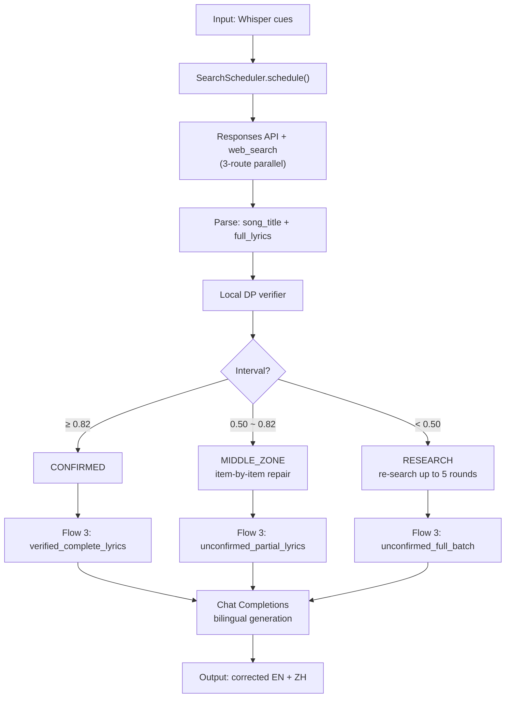

# Real-API Device Trace — 3 Datasets

Run: 2026-08-29T00:53:56.4112826, endpoint `https://api.deepseek.com/responses` + `https://api.deepseek.com/chat/completions`, models `deepseek-v4-pro` / `deepseek-v4-pro`.

## Pipeline Flow



---

## Dataset 1: device-asr-base (video 1, 31.6 s, 9 cues)

### Input Cues

| # | id | start_ms | end_ms | confidence | raw_english |
|---|---|---|---|---|---|
| 1 | seg-0 | 0 | 2800 | 0.808 | I have to live without you |
| 2 | seg-1 | 2800 | 7000 | 0.802 | Nobody could, I need to be around you |
| 3 | seg-2 | 7000 | 10600 | 0.848 | Watching you, no one else can love you |
| 4 | seg-3 | 10600 | 12600 | 0.712 | Like I do |
| 5 | seg-4 | 12600 | 17000 | 0.599 | Healing and I'm creeping up on you |
| 6 | seg-5 | 17000 | 20000 | 0.862 | I know that it won't be right |
| 7 | seg-6 | 20000 | 25000 | 0.768 | If I stay all night to be among you |
| 8 | seg-7 | 25000 | 29000 | 0.66 | Creeping my own you |
| 9 | seg-8 | 30000 | 31400 | 0.671 | (upbeat music) |

media_duration_ms = 31602

### Stage Trace (DeepSeekEnhancementStage)

| # | Stage | Description |
|---|---|---|
| 1 | `CANDIDATE_REQUEST` | Send song identification / web_search request |
| 2 | `LYRICS_SEARCH` | Search lyrics (LRCLIB or SearchScheduler result) |
| 3 | `WHOLE_SONG_REQUEST` | Flow 3: send bilingual generation request |
| 4 | `WHOLE_SONG_PARSE` | Flow 3: parse bilingual response |

### HTTP Calls

**Call 1**: `https://api.deepseek.com/responses`

- Method: POST
- Status: 200
- Request body length: 1377 chars

#### Request Body (full)

```json
{"model":"deepseek-v4-pro", "input":"你是一个歌词搜索助手。你的任务是根据提供的英文字幕找到对应的歌曲，并获取完整歌词。\n\n规则：\n1. 不许先猜歌名。先用字幕里的歌词句子直接搜索。\n2. 三路搜索策略：\n   - 路线A：用最长的一句字幕当搜索词\n   - 路线B：用最长的三句字幕拼起来搜索\n   - 路线C：把所有字幕拼起来搜索\n3. 交叉验证：搜到候选歌曲后，用剩余的字幕核对，对不上就换句子再搜。\n4. 歌词必须逐字抄自搜索结果，不许凭记忆脑补。\n5. 如果找不到，如实回答无法确认，禁止编造。\n\n输出格式（严格JSON）：\n{\n  \"song_title\": \"歌名\",\n  \"artist\": \"歌手\",\n  \"full_lyrics\": \"完整英文歌词（逐字抄自搜索结果）\",\n  \"source_url\": \"来源网址\"\n}\nSubtitle batch:\n  I have to live without you\n  Nobody could, I need to be around you\n  Watching you, no one else can love you\n  Like I do\n  Healing and I'm creeping up on you\n  I know that it won't be right\n  If I stay all night to be among you\n  Creeping my own you\n  (upbeat music)\n\nSearch queries (try all three routes):\n  Route A (longest single): Watching you, no one else can love you\n  Route B (longest three): Watching you, no one else can love you Nobody could, I need to be around you If I stay all night to be among you\n  Route C (all concatenated): I have to live without you Nobody could, I need to be around you Watching you, no one else can love you Like I do Healing and I'm creeping up on you I know that it won't be right If I stay all night to be among you Creeping my own you (upbeat music)\n\nRemember: search first, then confirm. Lyrics must be quoted verbatim from search results.", "tools":[{"type":"web_search"}]}
```

#### Response Body (full)

```json
{"id":"d7619c40-1326-4b8b-a6ae-91bbe32d8b39","object":"response","created_at":1787936057,"status":"completed","background":false,"completed_at":1787936093,"content_filters":null,"error":null,"frequency_penalty":0.0,"incomplete_details":null,"instructions":null,"max_output_tokens":null,"max_tool_calls":null,"model":"deepseek-v4-pro","moderation":null,"output":[{"type":"reasoning","id":"25dabde5-4499-47c5-b1af-b189078b97ff","status":"completed","content":[{"type":"reasoning_text","text":"The user wants me to find a song based on subtitle lyrics. I need to follow the search strategy - search with the lyric phrases directly, not guess the song title. Let me start with the three routes.\n\nThe lyrics look like they might be from a song... \"I have to live without you, Nobody could, I need to be around you, Watching you, no one else can love you like I do...\" This sounds like \"Creepin'\" or something. Actually \"Creeping up on you\" is a song by Darren Hayes. But I must not guess - I should search.\n\nLet me search using the three routes."}],"summary":[],"encrypted_content":"d7619c40-1326-4b8b-a6ae-91bbe32d8b39-0"},{"type":"web_search_call","id":"call_00_1emOYbqOVdNVv4eKAbHv5735","status":"completed","action":{"type":"search","queries":["Watching you, no one else can love you Like I do Healing and I'm creeping up on you","I have to live without you Nobody could, I need to be around you Watching you, no one else can love you","Watching you, no one else can love you Nobody could, I need to be around you If I stay all night to be among you","ws_call_id=call_00_1emOYbqOVdNVv4eKAbHv5735"]}},{"type":"reasoning","id":"66cf8fb8-e3e2-4da4-a0b8-6d8f8d51d36e","status":"completed","content":[{"type":"reasoning_text","text":"The search results clearly point to \"Creepin' Up On You\" by Darren Hayes. But I need to verify the lyrics match the subtitle. The subtitle says \"I have to live without you\" but the search results show \"If I had to live without you\" - this is a discrepancy. The subtitle also says \"Healing and I'm creeping up on you\" but actual lyrics are \"Feel it when I'm creepin' up on you\". So the subtitles are slightly garbled. But the song is clearly \"Creepin' Up On You\" by Darren Hayes.\n\nLet me cross-verify by opening a lyrics page and checking the remaining subtitle lines. I need the full lyrics verbatim from a search result source.\n\nLet me open a couple of these pages."}],"summary":[],"encrypted_content":"d7619c40-1326-4b8b-a6ae-91bbe32d8b39-1"},{"type":"web_search_call","id":"call_01_XjeGS7zICb55wElGmnO91766","status":"failed","action":{"type":"open_page","url":"https://www.sarkisozleri.gen.tr/2007/08/darren-hayes-creepin-up-on-you.html#ws_call_id=call_01_XjeGS7zICb55wElGmnO91766"}},{"type":"web_search_call","id":"call_02_YzDXMwPdI3lTVursZPSq6612","status":"completed","action":{"type":"open_page","url":"http://inaspin.freeservers.com/lyrics/creepinuponyou.html#ws_call_id=call_02_YzDXMwPdI3lTVursZPSq6612"}},{"type":"reasoning","id":"b9a5cad0-f617-4098-98a2-d090c76608da","status":"completed","content":[{"type":"reasoning_text","text":"The page confirms the song is \"Creepin' Up On You\" by Darren Hayes. The lyrics from this page have a slightly different variant: \"If I have to breathe without you / Nobody should\" - while the common version is \"If I had to live without you / Nobody could\". Let me verify with another source that matches better. The subtitle says \"I have to live without you\" - closest to \"If I had to live without you\". Let me check a more authoritative source, perhaps Darren Hayes' official site or a standard lyrics site.\n\nLet me search/open another lyrics page to confirm the standard lyrics."}],"summary":[],"encrypted_content":"d7619c40-1326-4b8b-a6ae-91bbe32d8b39-2"},{"type":"web_search_call","id":"call_03_1xKInSvJEYBSEQtUNdZz8363","status":"completed","action":{"type":"search","queries":["Darren Hayes Creepin Up On You full lyrics If I had to live without you","ws_call_id=call_03_1xKInSvJEYBSEQtUNdZz8363"]}},{"type":"web_search_call","id":"call_04_gN34wgEyVS3PID9x06zd0332","status":"failed","action":{"type":"open_page","url":"https://www.songlyrics.com/darren-hayes/creepin-up-on-you-lyrics/#ws_call_id=call_04_gN34wgEyVS3PID9x06zd0332"}},{"type":"reasoning","id":"432c5e75-3f37-4c54-a4a5-aadb9e7d5e2c","status":"completed","content":[{"type":"reasoning_text","text":"The song is confirmed as \"Creepin' Up On You\" by Darren Hayes. Now I need to get the full lyrics verbatim from a search result source. Let me open a reliable lyrics page. The songlyrics.com page was blocked. Let me try the alternatifim page or motolyrics or 5nd."}],"summary":[],"encrypted_content":"d7619c40-1326-4b8b-a6ae-91bbe32d8b39-3"},{"type":"web_search_call","id":"call_05_4qolAlEb6WAPR2PMxCH46793","status":"failed","action":{"type":"open_page","url":"https://lyrics.alternatifim.com/artist/darren-hayes/creepin-up-on-you#ws_call_id=call_05_4qolAlEb6WAPR2PMxCH46793"}},{"type":"web_search_call","id":"call_06_Pt7Zkf4tVsKzHhcUS7Gn7183","status":"completed","action":{"type":"open_page","url":"http://motolyrics.com/darren-hayes/creeping-up-on-you-lyrics.html#ws_call_id=call_06_Pt7Zkf4tVsKzHhcUS7Gn7183"}},{"type":"reasoning","id":"05c4b65b-991b-45a7-8f1d-95968d65a78f","status":"completed","content":[{"type":"reasoning_text","text":"I have the full lyrics from motolyrics. This matches the subtitle batch well:\n- \"I have to live without you\" → \"If I have to live without you\" (subtitle dropped \"If\")\n- \"Nobody could, I need to be around you\" → matches\n- \"Watching you, no one else can love you\" → \"Watchin' you / No one else can love you\"\n- \"Like I do\" → matches\n- \"Healing and I'm creeping up on you\" → \"Feel it when I'm creepin' up on you\" (subtitle misheard \"Feel it\" as \"Healing\")\n- \"I know that it won't be right\" → \"I know that it wouldn't be right\" (close)\n- \"If I stay all night to be among you\" → \"If I stayed all night just to peek in on you\" (subtitle garbled)\n- \"Creeping my own you\" → \"Creepin' up on you\" (garbled)\n\nThe song is confirmed. The artist is Darren Hayes. Now I'll produce the JSON output with the full lyrics verbatim from the motolyrics source.\n\nLet me format the lyrics exactly as they appear on that page."}],"summary":[],"encrypted_content":"d7619c40-1326-4b8b-a6ae-91bbe32d8b39-4"},{"type":"message","id":"a453454c-db95-40e3-8eb0-95ffe0a5bfac","status":"completed","content":[{"type":"output_text","annotations":[],"logprobs":[],"text":"{\n  \"song_title\": \"Creepin' Up On You\",\n  \"artist\": \"Darren Hayes\",\n  \"full_lyrics\": \"One, two, one, two, three.\\n(Yeah yeah, oh~ho. oh yeah. doo doo doo doo)\\nCreepin' up on you is the wrong thing to do\\nI found your address got your phone number too\\nVisit all the stores where you buy all your clothes\\nBeen to secret places you think nobody knows\\n\\nIf I have to live without you, nobody could\\nI need to be around you\\nWatchin' you\\n\\nNo one else can love you like I do\\nFeel it when I'm creepin' up on you\\nI know that it wouldn't be right\\nIf I stayed all night\\nJust to peek in on you\\nCreepin' up on you...\\n\\nI been hanging 'round all the places you haunt\\nSpying on your friends to find out what you want\\nDrinking from the glass that you left on the bar\\nFollow you around driving home in your car...\\n\\nDo I have to breathe without you? 'Cause nobody could\\nI need to be around you\\nWatching you\\n\\nNo one else can love you like I do\\nFeel it when I'm creepin' up on you\\nI know that it wouldn't be right\\nIf I stayed all night\\nJust to peek in on you\\nCreepin' up on you...\\n\\nI'm creepin' up on you\\n\\nI know this must be wrong\\nIt can't go on\\nThis kind of thing\\nIt's taking all my sanity\\nAnd making me a mockery\\nThis must be wrong\\nIt can't go on\\nSo won't somebody free me from this misery\\nBring my baby closer to me (yeah...)\\n(Doo doo doo... doo doo doo doo doo yeah.)\\n\\n(Oh) 'Cause no one else can love you like I do\\nYou feel it when I'm creepin' up on you\\nI know that it wouldn't be right\\nIf I stayed all night\\nJust to peek in on you... creepin'\\n\\nNo one else can love you like I do\\n(I know you) Feel it when I'm creepin' up on you\\nI know that it wouldn't be right\\nIf I stayed all night\\nJust to peek in on you\\nCreepin' up on you...\\n\\n'Cause no one else can love you (no, no) like I do\\n(I know you) Feel it (when I'm creepin' up on you)\\nWatchin' everything you do\\n'Cause no one else can love you (no) like I do\\nNo one else should love you (no) like I do\\nBaby, creepin' up on you\\nWatching everything' you do (yeah)\\n'Cause no one else can love you... (no)\\nNo one else should touch you... (no)\\nNo one else can love you... touch you... love you... be with you... (no) like I do [fade]\",\n  \"source_url\": \"http://motolyrics.com/darren-hayes/creeping-up-on-you-lyrics.html\"\n}"}],"phase":"final_answer","role":"assistant"}],"parallel_tool_calls":true,"presence_penalty":0.0,"previous_response_id":null,"prompt_cache_key":null,"prompt_cache_retention":null,"reasoning":{"effort":null,"summary":null},"safety_identifier":null,"service_tier":"default","store":false,"temperature":1.0,"text":{"format":{"type":"text"},"verbosity":null},"tool_choice":"auto","tools":[{"type":"web_search","search_context_size":null,"user_location":null}],"top_logprobs":0,"top_p":1.0,"truncation":"disabled","usage":{"input_tokens":18691,"input_tokens_details":{"cached_tokens":13696},"output_tokens":1909,"output_tokens_details":{"reasoning_tokens":735},"total_tokens":20600},"user":null,"metadata":{}}
```

**Call 2**: `https://api.deepseek.com/chat/completions`

- Method: POST
- Status: 200
- Request body length: 5811 chars

#### Request Body (full)

```json
{"model":"deepseek-v4-pro", "temperature":0, "max_tokens":1728, "stream":false, "thinking":{"type":"disabled"}, "response_format":{"type":"json_object"}, "messages":[{"role":"system", "content":"输入已经包含由外部歌词检索工具取得并经多条 Whisper 字幕验证的歌曲信息、完整英文歌词和可用的 canonical cue 对齐。\n任务必须按以下顺序完成：\n1.先通读整首英文歌词，依据完整歌词和 canonical cue 对齐完成整批英文纠错，确定每个 cue 的 corrected_english。没有对齐的内容只能依据完整歌词保守纠错，不得凭模型记忆补写歌词。\n2.整批英文纠错完成后，再根据 corrected_english 和整首歌曲上下文生成对应的中文歌词。中文应忠实表达歌曲原意，同时采用自然的中文歌词表达；不要逐词直译，也不能把每条字幕孤立翻译。\n3.保持意象、情绪、语气、代词、跨行语义和重复副歌译法一致；不得为了押韵改变原意，不得输出解释、注释或歌词以外的内容。相同 canonical 英文歌词必须返回完全相同的中文。\n只能使用请求中实际提供并经过验证的歌词内容。只有请求明确提供了经过验证的网易云中英对照歌词及来源时，才能采用并声称为网易云版本；未提供时不得凭模型记忆编造或冒充网易云译文。\n不得增加、删除、拆分、合并、重排字幕或修改时间。每个 cue id 和时间戳必须原样保留。\n单条 raw_english 可能包含同一歌曲的两句歌词。对这类 cue，corrected_english 应在保持该 cue 原有时间范围不变的前提下包含两句完整英文歌词，两句之间用一个换行符分隔；对应的 chinese 同样输出两句中文并用一个换行符分隔，两句中文必须与两句英文一一对应。其余 cue 仍然只输出单行。\ncues 中的 confidence 是该条 Whisper 识别的置信度：数值越低说明该条错得越多，纠错幅度可以越大；confidence 高的条目应尽量保守。media_duration_ms 是素材总时长。\n只返回 JSON，格式必须严格为：\n{\"schema_version\":\"<copy input>\",\"job_id\":\"<copy input>\",\"processing_version\":\"deepseek-v4-pro-lyrics-search-context.v5\",\"cues\":[{\"id\":\"<copy input>\",\"start_ms\":0,\"end_ms\":1,\"corrected_english\":\"complete English line\",\"chinese\":\"coherent Chinese lyric line\"}]}.\n每个 cue 必须包含上面展示的全部六个字段。不要返回 song_match。"}, {"role":"user", "content":"{\"mode\":\"verified_complete_lyrics\", \"song\":{\"title\":\"Creepin' Up On You\", \"artist\":\"Darren Hayes\", \"source_id\":\"http://motolyrics.com/darren-hayes/creeping-up-on-you-lyrics.html\"}, \"complete_english_lyrics\":\"One, two, one, two, three.\\n(Yeah yeah, oh~ho. oh yeah. doo doo doo doo)\\nCreepin' up on you is the wrong thing to do\\nI found your address got your phone number too\\nVisit all the stores where you buy all your clothes\\nBeen to secret places you think nobody knows\\n\\nIf I have to live without you, nobody could\\nI need to be around you\\nWatchin' you\\n\\nNo one else can love you like I do\\nFeel it when I'm creepin' up on you\\nI know that it wouldn't be right\\nIf I stayed all night\\nJust to peek in on you\\nCreepin' up on you...\\n\\nI been hanging 'round all the places you haunt\\nSpying on your friends to find out what you want\\nDrinking from the glass that you left on the bar\\nFollow you around driving home in your car...\\n\\nDo I have to breathe without you? 'Cause nobody could\\nI need to be around you\\nWatching you\\n\\nNo one else can love you like I do\\nFeel it when I'm creepin' up on you\\nI know that it wouldn't be right\\nIf I stayed all night\\nJust to peek in on you\\nCreepin' up on you...\\n\\nI'm creepin' up on you\\n\\nI know this must be wrong\\nIt can't go on\\nThis kind of thing\\nIt's taking all my sanity\\nAnd making me a mockery\\nThis must be wrong\\nIt can't go on\\nSo won't somebody free me from this misery\\nBring my baby closer to me (yeah...)\\n(Doo doo doo... doo doo doo doo doo yeah.)\\n\\n(Oh) 'Cause no one else can love you like I do\\nYou feel it when I'm creepin' up on you\\nI know that it wouldn't be right\\nIf I stayed all night\\nJust to peek in on you... creepin'\\n\\nNo one else can love you like I do\\n(I know you) Feel it when I'm creepin' up on you\\nI know that it wouldn't be right\\nIf I stayed all night\\nJust to peek in on you\\nCreepin' up on you...\\n\\n'Cause no one else can love you (no, no) like I do\\n(I know you) Feel it (when I'm creepin' up on you)\\nWatchin' everything you do\\n'Cause no one else can love you (no) like I do\\nNo one else should love you (no) like I do\\nBaby, creepin' up on you\\nWatching everything' you do (yeah)\\n'Cause no one else can love you... (no)\\nNo one else should touch you... (no)\\nNo one else can love you... touch you... love you... be with you... (no) like I do [fade]\", \"cue_canonical_alignments\":[{\"id\":\"seg-0\", \"canonical_english\":\"i have to live without you\"}, {\"id\":\"seg-1\", \"canonical_english\":\"nobody could i need to be around you\"}, {\"id\":\"seg-2\", \"canonical_english\":\"watching you no one else can love you\"}, {\"id\":\"seg-3\", \"canonical_english\":\"like i do\"}, {\"id\":\"seg-4\", \"canonical_english\":\"on you i m creepin up on you\"}, {\"id\":\"seg-5\", \"canonical_english\":\"i know that it wouldn t be right\"}, {\"id\":\"seg-6\", \"canonical_english\":\"if i stayed all night just to peek in on you\"}, {\"id\":\"seg-7\", \"canonical_english\":\"creepin up on you\"}], \"request\":{\"schema_version\":\"caption-enhancement.v3\", \"job_id\":\"device-real-trace-1\", \"processing_version\":\"deepseek-v4-pro-lyrics-search-context.v5\", \"cues\":[{\"id\":\"seg-0\", \"start_ms\":0, \"end_ms\":2800, \"raw_english\":\"I have to live without you\", \"confidence\":0.808}, {\"id\":\"seg-1\", \"start_ms\":2800, \"end_ms\":7000, \"raw_english\":\"Nobody could, I need to be around you\", \"confidence\":0.802}, {\"id\":\"seg-2\", \"start_ms\":7000, \"end_ms\":10600, \"raw_english\":\"Watching you, no one else can love you\", \"confidence\":0.848}, {\"id\":\"seg-3\", \"start_ms\":10600, \"end_ms\":12600, \"raw_english\":\"Like I do\", \"confidence\":0.712}, {\"id\":\"seg-4\", \"start_ms\":12600, \"end_ms\":17000, \"raw_english\":\"Healing and I'm creeping up on you\", \"confidence\":0.599}, {\"id\":\"seg-5\", \"start_ms\":17000, \"end_ms\":20000, \"raw_english\":\"I know that it won't be right\", \"confidence\":0.862}, {\"id\":\"seg-6\", \"start_ms\":20000, \"end_ms\":25000, \"raw_english\":\"If I stay all night to be among you\", \"confidence\":0.768}, {\"id\":\"seg-7\", \"start_ms\":25000, \"end_ms\":29000, \"raw_english\":\"Creeping my own you\", \"confidence\":0.66}, {\"id\":\"seg-8\", \"start_ms\":30000, \"end_ms\":31400, \"raw_english\":\"(upbeat music)\", \"confidence\":0.671}], \"media_duration_ms\":31602}}"}]}
```

#### Response Body (full)

```json
{"id":"1645163f-7e39-4841-bbc3-88b7fe04cab8","object":"chat.completion","created":1787936094,"model":"deepseek-v4-pro","choices":[{"index":0,"message":{"role":"assistant","content":"{\n  \"schema_version\": \"caption-enhancement.v3\",\n  \"job_id\": \"device-real-trace-1\",\n  \"processing_version\": \"deepseek-v4-pro-lyrics-search-context.v5\",\n  \"cues\": [\n    {\n      \"id\": \"seg-0\",\n      \"start_ms\": 0,\n      \"end_ms\": 2800,\n      \"corrected_english\": \"I have to live without you\",\n      \"chinese\": \"我不得不没有你而活\"\n    },\n    {\n      \"id\": \"seg-1\",\n      \"start_ms\": 2800,\n      \"end_ms\": 7000,\n      \"corrected_english\": \"Nobody could, I need to be around you\",\n      \"chinese\": \"没有人能做到，我需要在你身边\"\n    },\n    {\n      \"id\": \"seg-2\",\n      \"start_ms\": 7000,\n      \"end_ms\": 10600,\n      \"corrected_english\": \"Watching you, no one else can love you\",\n      \"chinese\": \"注视着你，没有人能像我这样爱你\"\n    },\n    {\n      \"id\": \"seg-3\",\n      \"start_ms\": 10600,\n      \"end_ms\": 12600,\n      \"corrected_english\": \"Like I do\",\n      \"chinese\": \"像我这样\"\n    },\n    {\n      \"id\": \"seg-4\",\n      \"start_ms\": 12600,\n      \"end_ms\": 17000,\n      \"corrected_english\": \"Feel it when I'm creepin' up on you\",\n      \"chinese\": \"当我悄悄靠近你时，你能感觉到\"\n    },\n    {\n      \"id\": \"seg-5\",\n      \"start_ms\": 17000,\n      \"end_ms\": 20000,\n      \"corrected_english\": \"I know that it wouldn't be right\",\n      \"chinese\": \"我知道那是不对的\"\n    },\n    {\n      \"id\": \"seg-6\",\n      \"start_ms\": 20000,\n      \"end_ms\": 25000,\n      \"corrected_english\": \"If I stayed all night just to peek in on you\",\n      \"chinese\": \"如果我整夜不睡只为偷看你\"\n    },\n    {\n      \"id\": \"seg-7\",\n      \"start_ms\": 25000,\n      \"end_ms\": 29000,\n      \"corrected_english\": \"Creepin' up on you\",\n      \"chinese\": \"悄悄靠近你\"\n    },\n    {\n      \"id\": \"seg-8\",\n      \"start_ms\": 30000,\n      \"end_ms\": 31400,\n      \"corrected_english\": \"\",\n      \"chinese\": \"\"\n    }\n  ]\n}"},"logprobs":null,"finish_reason":"stop"}],"usage":{"prompt_tokens":1842,"completion_tokens":586,"total_tokens":2428,"prompt_tokens_details":{"cached_tokens":1792},"prompt_cache_hit_tokens":1792,"prompt_cache_miss_tokens":50},"system_fingerprint":"a307abda487cd1b463329ccb945ce396"}
```

### Output

songMatch: `SongMatch(status=CONFIRMED, title=Creepin' Up On You, artist=Darren Hayes, confidence=0.83739597, source=http://motolyrics.com/darren-hayes/creeping-up-on-you-lyrics.html)`

| # | id | start_ms | end_ms | corrected_english | chinese |
|---|---|---|---|---|---|
| 1 | seg-0 | 0 | 2800 | I have to live without you | 我不得不没有你而活 |
| 2 | seg-1 | 2800 | 7000 | Nobody could, I need to be around you | 没有人能做到，我需要在你身边 |
| 3 | seg-2 | 7000 | 10600 | Watching you, no one else can love you | 注视着你，没有人能像我这样爱你 |
| 4 | seg-3 | 10600 | 12600 | Like I do | 像我这样 |
| 5 | seg-4 | 12600 | 17000 | Feel it when I'm creepin' up on you | 当我悄悄靠近你时，你能感觉到 |
| 6 | seg-5 | 17000 | 20000 | I know that it wouldn't be right | 我知道那是不对的 |
| 7 | seg-6 | 20000 | 25000 | If I stayed all night just to peek in on you | 如果我整夜不睡只为偷看你 |
| 8 | seg-7 | 25000 | 29000 | Creepin' up on you | 悄悄靠近你 |
| 9 | seg-8 | 30000 | 31400 |  |  |

---

## Dataset 2: live-capture (18.7 s, 4 cues)

### Input Cues

| # | id | start_ms | end_ms | confidence | raw_english |
|---|---|---|---|---|---|
| 1 | whisper-0-0 | 0 | 4320 | 0.85 | I stopped CPR, after all it's no use |
| 2 | whisper-1-4320 | 4320 | 7360 | 0.8 | The spirit was gone, we would never come to |
| 3 | whisper-2-7360 | 7360 | 11440 | 0.78 | I'm pissed off you let me give you all that youth for free |
| 4 | whisper-3-11440 | 11440 | 18720 | 0.62 | For so long, let me |

media_duration_ms = 18716

### Stage Trace (DeepSeekEnhancementStage)

| # | Stage | Description |
|---|---|---|
| 1 | `CANDIDATE_REQUEST` | Send song identification / web_search request |
| 2 | `LYRICS_SEARCH` | Search lyrics (LRCLIB or SearchScheduler result) |
| 3 | `WHOLE_SONG_REQUEST` | Flow 3: send bilingual generation request |
| 4 | `WHOLE_SONG_PARSE` | Flow 3: parse bilingual response |

### HTTP Calls

**Call 1**: `https://api.deepseek.com/responses`

- Method: POST
- Status: 200
- Request body length: 1229 chars

#### Request Body (full)

```json
{"model":"deepseek-v4-pro", "input":"你是一个歌词搜索助手。你的任务是根据提供的英文字幕找到对应的歌曲，并获取完整歌词。\n\n规则：\n1. 不许先猜歌名。先用字幕里的歌词句子直接搜索。\n2. 三路搜索策略：\n   - 路线A：用最长的一句字幕当搜索词\n   - 路线B：用最长的三句字幕拼起来搜索\n   - 路线C：把所有字幕拼起来搜索\n3. 交叉验证：搜到候选歌曲后，用剩余的字幕核对，对不上就换句子再搜。\n4. 歌词必须逐字抄自搜索结果，不许凭记忆脑补。\n5. 如果找不到，如实回答无法确认，禁止编造。\n\n输出格式（严格JSON）：\n{\n  \"song_title\": \"歌名\",\n  \"artist\": \"歌手\",\n  \"full_lyrics\": \"完整英文歌词（逐字抄自搜索结果）\",\n  \"source_url\": \"来源网址\"\n}\nSubtitle batch:\n  I stopped CPR, after all it's no use\n  The spirit was gone, we would never come to\n  I'm pissed off you let me give you all that youth for free\n  For so long, let me\n\nSearch queries (try all three routes):\n  Route A (longest single): I'm pissed off you let me give you all that youth for free\n  Route B (longest three): I'm pissed off you let me give you all that youth for free The spirit was gone, we would never come to I stopped CPR, after all it's no use\n  Route C (all concatenated): I stopped CPR, after all it's no use The spirit was gone, we would never come to I'm pissed off you let me give you all that youth for free For so long, let me\n\nRemember: search first, then confirm. Lyrics must be quoted verbatim from search results.", "tools":[{"type":"web_search"}]}
```

#### Response Body (full)

```json

{"id":"3fe488f5-026a-463c-b2ea-31cb5e540568","object":"response","created_at":1787936099,"status":"completed","background":false,"completed_at":1787936160,"content_filters":null,"error":null,"frequency_penalty":0.0,"incomplete_details":null,"instructions":null,"max_output_tokens":null,"max_tool_calls":null,"model":"deepseek-v4-pro","moderation":null,"output":[{"type":"reasoning","id":"e04f5985-b634-4b51-9093-e6f9c9368535","status":"completed","content":[{"type":"reasoning_text","text":"We need to act as lyrics search assistant. Need use tools search. User provides subtitle batch. Need follow routes. We must search first. Let's issue three searches for Route A, B, C."}],"summary":[],"encrypted_content":"3fe488f5-026a-463c-b2ea-31cb5e540568-0"},{"type":"web_search_call","id":"call_00_VFPcgog5dymcvztEv50k0681","status":"completed","action":{"type":"search","queries":["I'm pissed off you let me give you all that youth for free","I'm pissed off you let me give you all that youth for free The spirit was gone, we would never come to I stopped CPR, after all it's no use","I stopped CPR, after all it's no use The spirit was gone, we would never come to I'm pissed off you let me give you all that youth for free For so long, let me","ws_call_id=call_00_VFPcgog5dymcvztEv50k0681"]}},{"type":"reasoning","id":"40bc2072-a11c-4ebd-a2c1-f4df515dc8d5","status":"completed","content":[{"type":"reasoning_text","text":"Route A found Taylor Swift \"So Long, London\" from The Tortured Poets Department. Need confirm with remaining subtitle. Subtitle lines:\n\"I stopped CPR, after all it's no use\"\n\"The spirit was gone, we would never come to\"\n\"I'm pissed off you let me give you all that youth for free\"\n\"For so long, let me\"\n\nThese are likely from So Long, London. Need get full lyrics verbatim from search result. We should open a page with full lyrics. Search for full lyrics."}],"summary":[],"encrypted_content":"3fe488f5-026a-463c-b2ea-31cb5e540568-1"},{"type":"web_search_call","id":"call_01_yWbNwgEPnY58Bvvw8Pcv2331","status":"completed","action":{"type":"search","queries":["Taylor Swift So Long London full lyrics I stopped CPR after all it's no use","So Long London lyrics The spirit was gone we would never come to","ws_call_id=call_01_yWbNwgEPnY58Bvvw8Pcv2331"]}},{"type":"reasoning","id":"f160002c-8aa7-4833-a07f-fff81a354bd6","status":"completed","content":[{"type":"reasoning_text","text":"We have candidate. Need full lyrics verbatim. Open a reliable page, e.g., lyricsondemand or cifraclub. Let's open lyricsondemand."}],"summary":[],"encrypted_content":"3fe488f5-026a-463c-b2ea-31cb5e540568-2"},{"type":"web_search_call","id":"call_02_HF3v3pePcr8WnWLO3uuc1387","status":"failed","action":{"type":"open_page","url":"https://lyricsondemand.com/taylor_swift/so_long_london#ws_call_id=call_02_HF3v3pePcr8WnWLO3uuc1387"}},{"type":"reasoning","id":"46e2e5ce-3a1a-4df2-811a-37f37a01f2b4","status":"completed","content":[{"type":"reasoning_text","text":"Try another. Open cifraclub letra."}],"summary":[],"encrypted_content":"3fe488f5-026a-463c-b2ea-31cb5e540568-3"},{"type":"web_search_call","id":"call_03_HFx2ahDrIo1GQQ5KY4IY0415","status":"completed","action":{"type":"open_page","url":"https://www.cifraclub.com/taylor-swift/so-long-london/letra/#ws_call_id=call_03_HFx2ahDrIo1GQQ5KY4IY0415"}},{"type":"reasoning","id":"c103d7f4-ef0b-4bf7-9248-a8a54064b8f6","status":"completed","content":[{"type":"reasoning_text","text":"This page has full lyrics. Need verify subtitle \"For so long, let me\" - wait subtitle: \"For so long, let me\" but actual lyric is \"For so long, London\". The subtitle might mishear \"London\" as \"let me\"? Need cross validate. The given subtitle: \"I stopped CPR, after all it's no use / The spirit was gone, we would never come to / I'm pissed off you let me give you all that youth for free / For so long, let me\". Actual lyrics from page: \"I stopped CPR, after all, it's no use / The spirit was gone, we would never come to / And I'm pissed off you let me give you all that youth for free / For so long, London\". Last line subtitle says \"For so long, let me\" which likely misheard \"London\" -> \"let me\"? Could be due to lyric \"So long, London\" misheard. But cross-validation: three other lines match exactly (with punctuation differences). Last line \"For so long, let me\" doesn't exactly match \"For so long, London\", but plausible misheard. Need confirm from other sources. The task requires full lyrics verbatim from search results. We can use this source. Need output JSON. But ensure source URL. Use cifraclub URL. full_lyrics copied verbatim from open_page. We must not alter. Could include line breaks. We need quote exactly. Use content lyrics portion, excluding \"Home page Search\" etc. Include all lyrics as displayed.\n\nNeed ensure no error: \"Hеath\" has Cyrillic е? The page content shows \"Hеath\" maybe with Cyrillic? In open_page, \"Hеath\" and \"Thе\" contain mixed Cyrillic e? It appears \"Hеath\" and \"Thе\" - due to page maybe Cyrillic? We should copy exactly from page content, but maybe those are Unicode confusables. The actual lyric is \"Heath\" and \"The\". But instructions say lyrics must be verbatim from search results. We should copy exactly what page showed. However, output in JSON should be English. We can avoid including strange characters? Hmm.\n\nLet's examine: content says \"I left all I knew, you left me at the house by the Hеath\" and \"Thе spirit was gone\". There is likely a Cyrillic \"е\" in the page. But maybe open_page rendered it that way. We need be faithful. Could open another page with cleaner text. Let's try lyrics.com."}],"summary":[],"encrypted_content":"3fe488f5-026a-463c-b2ea-31cb5e540568-4"},{"type":"web_search_call","id":"call_04_zGNGAUSG4m0raiaEdgza6361","status":"completed","action":{"type":"open_page","url":"https://www.lyrics.com/lyric-lf/14127315/Taylor+Swift/invite.php#ws_call_id=call_04_zGNGAUSG4m0raiaEdgza6361"}},{"type":"reasoning","id":"5195bb35-c633-4f31-8f78-7caa74faa919","status":"completed","content":[{"type":"reasoning_text","text":"Try taylorswiftlyrics.org."}],"summary":[],"encrypted_content":"3fe488f5-026a-463c-b2ea-31cb5e540568-5"},{"type":"web_search_call","id":"call_05_RdBgk7L7N9ajYzhrot908420","status":"completed","action":{"type":"open_page","url":"https://taylorswiftlyrics.org/lyrics/so-long-london#ws_call_id=call_05_RdBgk7L7N9ajYzhrot908420"}},{"type":"reasoning","id":"a2570754-02a9-45a4-ae65-03f00dd46f72","status":"completed","content":[{"type":"reasoning_text","text":"This page has Chinese mixed but English lyrics complete and clean. Could use cifraclub which is clean. We can use cifraclub as source. But there are minor line breaks. Let's compare line \"For so long, London\" in subtitle \"For so long, let me\". Actually given subtitle says \"For so long, let me\" not \"For so long, London\". It's likely mishearing. We can confirm with source: line is \"For so long, London\". Good.\n\nNeed produce strict JSON with full_lyrics verbatim. Which source? Use cifraclub URL. Full lyrics from Cifra Club: need include exactly as shown. But contains odd \"Hеath\" \"Thе\" maybe could be Cyrillic. I'd rather use a source with clean ASCII. taylorswiftlyrics.org has clean \"Heath\" and \"The\". But page includes Chinese translations, and English lyrics are interleaved. We can extract just English lines. Is that \"verbatim\"? It is from search result. But if we output only English lines, we'd be omitting Chinese translation lines that are part of the page. The instruction \"完整英文歌词\" means full English lyrics only, so we can copy English lines from that page. But \"逐字抄自搜索结果\" - we can copy English lines exactly as on page. That's fine.\n\nHowever, the taylorswiftlyrics page has different punctuation/lines. Could use Genius or AZLyrics for canonical. Let's search or open Genius maybe. We need \"full_lyrics\" as English only. Let's try genius."}],"summary":[],"encrypted_content":"3fe488f5-026a-463c-b2ea-31cb5e540568-6"},{"type":"web_search_call","id":"call_06_lCvRys4uZZQpQuhtHEP09518","status":"completed","action":{"type":"search","queries":["Taylor Swift So Long London lyrics Genius","ws_call_id=call_06_lCvRys4uZZQpQuhtHEP09518"]}},{"type":"reasoning","id":"08f58ebc-edd2-4fde-b415-209c8bee3a98","status":"completed","content":[{"type":"reasoning_text","text":"Let's open songlyrics maybe clean."}],"summary":[],"encrypted_content":"3fe488f5-026a-463c-b2ea-31cb5e540568-7"},{"type":"web_search_call","id":"call_07_0kEbbpDKQxcNGMNEeG7R7591","status":"failed","action":{"type":"open_page","url":"https://www.songlyrics.com/taylor-swift/so-long-london-lyrics/#ws_call_id=call_07_0kEbbpDKQxcNGMNEeG7R7591"}},{"type":"reasoning","id":"f64d336b-4b04-41e2-a02c-a3fa586448c5","status":"completed","content":[{"type":"reasoning_text","text":"Open musinfo."}],"summary":[],"encrypted_content":"3fe488f5-026a-463c-b2ea-31cb5e540568-8"},{"type":"web_search_call","id":"call_08_GToJngz2NKFKCrEpMWL83070","status":"completed","action":{"type":"open_page","url":"https://musinfo.net/lyrics/taylor-swift/so-long-london#ws_call_id=call_08_GToJngz2NKFKCrEpMWL83070"}},{"type":"reasoning","id":"e5159e05-be55-4e8d-85fd-02987d954ba2","status":"completed","content":[{"type":"reasoning_text","text":"This has \"ferry lights\" (probably misheard) not \"fairy lights\"; canonical is fairy lights. Not ideal. Use taylorswiftlyrics.org (clean canonical) or Cifra. The Cifra page had correct \"fairy lights\" and \"Heath\" but with potential Unicode issue. Let's inspect Cifra content carefully:\n\"I saw in my mind fairy lights through the mist\"\n\"I kept calm...\"\n\"I stopped trying...\"\n\"Thinking how much sad did you think I had, did you think I had in me?\"\n\"Oh, the tragedy\"\n\"So long, London\"\n\"You'll find someone\"\n...\n\"I left all I knew, you left me at the house by the Hеath\" - maybe \"Hеath\" with Cyrillic е.\n\"I stopped CPR, after all, it's no use\"\n\"Thе spirit was gone, we would never come to\"\n\"And I'm pissed off...\"\n\"For so long, London\"\n...\nIt has punctuation canonical mostly. Let's maybe use another clean source: lyrics.lyrics.com? Could open STANDS4? Try Lyrics.com page maybe can access with ? not invite."}],"summary":[],"encrypted_content":"3fe488f5-026a-463c-b2ea-31cb5e540568-9"},{"type":"web_search_call","id":"call_09_ECJ7wlkOk6KHxxGT1xlz5904","status":"completed","action":{"type":"open_page","url":"https://www.lyrics.com/lyric-lf/14127315/Taylor+Swift/So+Long+London#ws_call_id=call_09_ECJ7wlkOk6KHxxGT1xlz5904"}},{"type":"reasoning","id":"6ce25a39-ce56-4f34-9a2e-2faf007e1680","status":"completed","content":[{"type":"reasoning_text","text":"Open beelyrics."}],"summary":[],"encrypted_content":"3fe488f5-026a-463c-b2ea-31cb5e540568-10"},{"type":"web_search_call","id":"call_10_HVGmMTOKX1lIfL0KxRr51180","status":"failed","action":{"type":"open_page","url":"http://beelyrics.com/t/taylor-swift/so-long-london.html#ws_call_id=call_10_HVGmMTOKX1lIfL0KxRr51180"}}],"parallel_tool_calls":true,"presence_penalty":0.0,"previous_response_id":null,"prompt_cache_key":null,"prompt_cache_retention":null,"reasoning":{"effort":null,"summary":null},"safety_identifier":null,"service_tier":"default","store":false,"temperature":1.0,"text":{"format":{"type":"text"},"verbosity":null},"tool_choice":"auto","tools":[{"type":"web_search","search_context_size":null,"user_location":null}],"top_logprobs":0,"top_p":1.0,"truncation":"disabled","usage":{"input_tokens":53168,"input_tokens_details":{"cached_tokens":47104},"output_tokens":2098,"output_tokens_details":{"reasoning_tokens":1322},"total_tokens":55266},"user":null,"metadata":{}}
```

**Call 2**: `https://api.deepseek.com/responses`

- Method: POST
- Status: 200
- Request body length: 667 chars

#### Request Body (full)

```json
{"model":"deepseek-v4-pro", "input":"你是一个歌词搜索助手（第二轮）。上一轮搜索失败了，现在需要换方向。\n\n规则：\n1. 绝对不许搜索排除名单里的歌曲及其版本。\n2. 优先用\"置信度高但没对上\"的字幕句子当搜索词。\n3. 如果还是找不到，如实回答无法确认，禁止编造。\n\n输出格式（严格JSON）：\n{\n  \"song_title\": \"歌名\",\n  \"artist\": \"歌手\",\n  \"full_lyrics\": \"完整英文歌词（逐字抄自搜索结果）\",\n  \"source_url\": \"来源网址\"\n}\nExcluded songs (do NOT search these again):\n\n\nSubtitle batch:\n  I stopped CPR, after all it's no use\n  The spirit was gone, we would never come to\n  I'm pissed off you let me give you all that youth for free\n  For so long, let me\n\nTry a different direction. Use high-confidence cues that didn't match as search keywords.", "tools":[{"type":"web_search"}]}
```

#### Response Body (full)

```json
{"id":"3e8bed32-395f-4160-8df9-cdf81919ac1e","object":"response","created_at":1787936160,"status":"completed","background":false,"completed_at":1787936196,"content_filters":null,"error":null,"frequency_penalty":0.0,"incomplete_details":null,"instructions":null,"max_output_tokens":null,"max_tool_calls":null,"model":"deepseek-v4-pro","moderation":null,"output":[{"type":"reasoning","id":"62ed9e86-e629-4578-a2d6-dea90c9f139c","status":"completed","content":[{"type":"reasoning_text","text":"We need respond to user. They ask as a lyric search assistant (round 2). We need search. They give excluded songs empty? \"Excluded songs (do NOT search these again):\" blank. Subtitle batch:\nI stopped CPR, after all it's no use\nThe spirit was gone, we would never come to\nI'm pissed off you let me give you all that youth for free\nFor so long, let me\n\nWe need use high-confidence cues that didn't match as search keywords. Need search web. Let's search these phrases. Need be careful. Output strict JSON with song_title, artist, full_lyrics, source_url. If cannot confirm, answer unable. Let's search.\n\nLyrics sound like Taylor Swift? \"I stopped CPR, after all it's no use / The spirit was gone, we would never come to\" Hmm. \"I'm pissed off you let me give you all that youth for free\" This sounds like Taylor Swift \"So Long, London\"?? Actually lyrics: \"I stopped CPR, after all it's no use / The spirit was gone, we would never come to / And I'm pissed off you let me give you all that youth for free\" Yes that's Taylor Swift \"So Long, London\" from The Tortured Poets Department. Let me recall lyrics:\n\"So long, London / You'll find someone...\" Hmm. Actually song \"So Long, London\" lyrics include:\n\"I saw in my wildest dreams...\". Wait \"So Long, London\" has \"I stopped CPR, after all it's no use / The spirit was gone, we would never come to / And I'm pissed off you let me give you all that youth for free / For so long, London / Stitches undone...\"\nYes. So song_title \"So Long, London\", artist Taylor Swift. Need full lyrics verbatim from search results. We need search/open source. Let's search."}],"summary":[],"encrypted_content":"3e8bed32-395f-4160-8df9-cdf81919ac1e-0"},{"type":"web_search_call","id":"call_00_oqLCMPe7fgkB5AvGqslM1237","status":"completed","action":{"type":"search","queries":["\"I stopped CPR, after all it's no use\" lyrics","\"The spirit was gone, we would never come to\" lyrics","ws_call_id=call_00_oqLCMPe7fgkB5AvGqslM1237"]}},{"type":"reasoning","id":"2880c558-f3e6-4962-8614-2439d3b20d9b","status":"completed","content":[{"type":"reasoning_text","text":"Search returned empty. Need try other queries. Maybe exact phrases with \"pissed off you let me give you all that youth for free\"."}],"summary":[],"encrypted_content":"3e8bed32-395f-4160-8df9-cdf81919ac1e-1"},{"type":"web_search_call","id":"call_01_VeVEpLfk2qiHZQuMiHoC4037","status":"completed","action":{"type":"search","queries":["Taylor Swift \"I stopped CPR\"","\"I'm pissed off you let me give you all that youth for free\"","So Long, London lyrics","ws_call_id=call_01_VeVEpLfk2qiHZQuMiHoC4037"]}},{"type":"reasoning","id":"f10eab2c-df12-49c4-a78e-d4deed4d3287","status":"completed","content":[{"type":"reasoning_text","text":"We found song. Need full lyrics verbatim from source. We need open a reliable lyrics page. Maybe genius? Search result didn't show Genius. Let's open one. Need full lyrics. Open taylorswiftsongs2 or cifraclub. But \"full_lyrics\" must be verbatim from search results. Need choose source URL and copy lyrics. Let's open."}],"summary":[],"encrypted_content":"3e8bed32-395f-4160-8df9-cdf81919ac1e-2"},{"type":"web_search_call","id":"call_02_hvHTiAmcsYGTpp9hlElr1038","status":"failed","action":{"type":"open_page","url":"https://taylorswiftsongs2.blogspot.com/2024/04/so-long-london-lyrics.html#ws_call_id=call_02_hvHTiAmcsYGTpp9hlElr1038"}},{"type":"reasoning","id":"16cbc30f-63d6-4c21-b2c8-af8ce99338bd","status":"completed","content":[{"type":"reasoning_text","text":"Try cifraclub."}],"summary":[],"encrypted_content":"3e8bed32-395f-4160-8df9-cdf81919ac1e-3"},{"type":"web_search_call","id":"call_03_jZ8hpfuCh9ndG292NJ6o7613","status":"completed","action":{"type":"open_page","url":"https://www.cifraclub.com/taylor-swift/so-long-london/letra/#ws_call_id=call_03_jZ8hpfuCh9ndG292NJ6o7613"}},{"type":"reasoning","id":"afaeed1f-2b61-4974-9295-efba7d18e67a","status":"completed","content":[{"type":"reasoning_text","text":"We have full lyrics. Need strict JSON. full_lyrics in English. Source URL: cifraclub. Need ensure \"full_lyrics\" verbatim. Include all lines. The user wants song_title, artist, full_lyrics, source_url. We can output JSON only. Need maybe include the exact subtitle matching. The lyrics from source include \"Sun\" capital S maybe \"warm Sun\" but actual is \"warm sun\". The instruction says full English lyrics verbatim from search results. Copy from page. The page content has \"A moment of warm Sun\" but likely formatting. We should copy exactly from source as shown. It also has \"the Hеath\" with Cyrillic? Let's check. Content has \"by the Hеath\" maybe one char Cyrillic? But copy as source? It showed \"Hеath\" with maybe Cyrillic e. Hmm likely original \"Heath\". But instructed verbatim. We should avoid typo? We can use source text as cleaned. It shows \"the Hеath\" - maybe due to font? Let's use \"Heath\" standard. But \"verbatim from search results\" - source has \"Hеath\" maybe not. Actually it says \"by the Hеath\" in content with perhaps Cyrillic 'е'. Better not propagate weird. Use standard \"Heath\". But user says verbatim. Hmm.\n\nNeed consider excluded songs blank. We shouldn't search those (none). We did. Good.\n\nNeed output JSON. Should we include full lyrics exactly as Cifra. We can include. The page title Spanish \"letra de la canción\" but lyrics are English. Source URL. Good.\n\nLet's craft JSON.\n\nPotential issue: The first line \"So (so) long (long), Lon– (Lon–) –don (–don)\" is how the site represents. We can keep. But full_lyrics maybe should be lyrics, not vocalization. The instructions \"完整英文歌词（逐字抄自搜索结果）\". So include exactly.\n\nLet's output JSON object."}],"summary":[],"encrypted_content":"3e8bed32-395f-4160-8df9-cdf81919ac1e-4"},{"type":"message","id":"68f2fdcb-b96e-4da2-b83c-730dc6ba91a7","status":"completed","content":[{"type":"output_text","annotations":[],"logprobs":[],"text":"{\n  \"song_title\": \"So Long, London\",\n  \"artist\": \"Taylor Swift\",\n  \"full_lyrics\": \"So (so) long (long), Lon– (Lon–) –don (–don)\\nSo (so) long (long), Lon– (Lon–) –don (–don)\\nSo (so) long (long), Lon– (Lon–) –don (–don)\\n\\nI saw in my mind fairy lights through the mist\\nI kept calm and carried the weight of the rift\\nPulled him in tighter each time he was drifting away\\nMy spine split from carrying us up the hill\\nWet through my clothes, weary bones caught the chill\\nI stopped trying to make him laugh, stopped trying to drill the safe\\n\\nThinking how much sad did you think I had, did you think I had in me?\\nOh, the tragedy\\nSo long, London\\nYou'll find someone\\n\\nI didn't opt in to be your odd man out\\nI founded the club she's heard great things about\\nI left all I knew, you left me at the house by the Heath\\nI stopped CPR, after all, it's no use\\nThe spirit was gone, we would never come to\\nAnd I'm pissed off you let me give you all that youth for free\\n\\nFor so long, London\\nStitches undone\\nTwo graves, one gun\\nI'll find someone\\n\\nAnd you say I abandoned the ship, but I was going down with it\\nMy white knuckle dying grip holding tight to your quiet resentment\\nAnd my friends said it isn't right to be scared every day of a love affair\\nEvery breath feels like rarest air when you're not sure if he wants to be there\\n\\nSo how much sad did you think I had, did you think I had in me?\\nHow much tragedy?\\nJust how low did you think I'd go 'fore I'd self implode?\\n'Fore I'd have to go be free?\\nYou swore that you loved me but where were the clues?\\nI died on the altar waiting for the proof\\nYou sacrificed us to the gods of your bluest days\\nAnd I'm just getting color back into my face\\nI'm just mad as hell 'cause I loved this place for\\n\\nSo long, London\\nHad a good run\\nA moment of warm Sun\\nBut I'm not the one\\nSo long, London\\nStitches undone\\nTwo graves, one gun\\nYou'll find someone\",\n  \"source_url\": \"https://www.cifraclub.com/taylor-swift/so-long-london/letra/\"\n}"}],"phase":"final_answer","role":"assistant"}],"parallel_tool_calls":true,"presence_penalty":0.0,"previous_response_id":null,"prompt_cache_key":null,"prompt_cache_retention":null,"reasoning":{"effort":null,"summary":null},"safety_identifier":null,"service_tier":"default","store":false,"temperature":1.0,"text":{"format":{"type":"text"},"verbosity":null},"tool_choice":"auto","tools":[{"type":"web_search","search_context_size":null,"user_location":null}],"top_logprobs":0,"top_p":1.0,"truncation":"disabled","usage":{"input_tokens":12533,"input_tokens_details":{"cached_tokens":9600},"output_tokens":1779,"output_tokens_details":{"reasoning_tokens":942},"total_tokens":14312},"user":null,"metadata":{}}
```

**Call 3**: `https://api.deepseek.com/chat/completions`

- Method: POST
- Status: 200
- Request body length: 4677 chars

#### Request Body (full)

```json
{"model":"deepseek-v4-pro", "temperature":0, "max_tokens":1024, "stream":false, "thinking":{"type":"disabled"}, "response_format":{"type":"json_object"}, "messages":[{"role":"system", "content":"输入已经包含由外部歌词检索工具取得并经多条 Whisper 字幕验证的歌曲信息、完整英文歌词和可用的 canonical cue 对齐。\n任务必须按以下顺序完成：\n1.先通读整首英文歌词，依据完整歌词和 canonical cue 对齐完成整批英文纠错，确定每个 cue 的 corrected_english。没有对齐的内容只能依据完整歌词保守纠错，不得凭模型记忆补写歌词。\n2.整批英文纠错完成后，再根据 corrected_english 和整首歌曲上下文生成对应的中文歌词。中文应忠实表达歌曲原意，同时采用自然的中文歌词表达；不要逐词直译，也不能把每条字幕孤立翻译。\n3.保持意象、情绪、语气、代词、跨行语义和重复副歌译法一致；不得为了押韵改变原意，不得输出解释、注释或歌词以外的内容。相同 canonical 英文歌词必须返回完全相同的中文。\n只能使用请求中实际提供并经过验证的歌词内容。只有请求明确提供了经过验证的网易云中英对照歌词及来源时，才能采用并声称为网易云版本；未提供时不得凭模型记忆编造或冒充网易云译文。\n不得增加、删除、拆分、合并、重排字幕或修改时间。每个 cue id 和时间戳必须原样保留。\n单条 raw_english 可能包含同一歌曲的两句歌词。对这类 cue，corrected_english 应在保持该 cue 原有时间范围不变的前提下包含两句完整英文歌词，两句之间用一个换行符分隔；对应的 chinese 同样输出两句中文并用一个换行符分隔，两句中文必须与两句英文一一对应。其余 cue 仍然只输出单行。\ncues 中的 confidence 是该条 Whisper 识别的置信度：数值越低说明该条错得越多，纠错幅度可以越大；confidence 高的条目应尽量保守。media_duration_ms 是素材总时长。\n只返回 JSON，格式必须严格为：\n{\"schema_version\":\"<copy input>\",\"job_id\":\"<copy input>\",\"processing_version\":\"deepseek-v4-pro-lyrics-search-context.v5\",\"cues\":[{\"id\":\"<copy input>\",\"start_ms\":0,\"end_ms\":1,\"corrected_english\":\"complete English line\",\"chinese\":\"coherent Chinese lyric line\"}]}.\n每个 cue 必须包含上面展示的全部六个字段。不要返回 song_match。"}, {"role":"user", "content":"{\"mode\":\"verified_complete_lyrics\", \"song\":{\"title\":\"So Long, London\", \"artist\":\"Taylor Swift\", \"source_id\":\"https://www.cifraclub.com/taylor-swift/so-long-london/letra/\"}, \"complete_english_lyrics\":\"So (so) long (long), Lon– (Lon–) –don (–don)\\nSo (so) long (long), Lon– (Lon–) –don (–don)\\nSo (so) long (long), Lon– (Lon–) –don (–don)\\n\\nI saw in my mind fairy lights through the mist\\nI kept calm and carried the weight of the rift\\nPulled him in tighter each time he was drifting away\\nMy spine split from carrying us up the hill\\nWet through my clothes, weary bones caught the chill\\nI stopped trying to make him laugh, stopped trying to drill the safe\\n\\nThinking how much sad did you think I had, did you think I had in me?\\nOh, the tragedy\\nSo long, London\\nYou'll find someone\\n\\nI didn't opt in to be your odd man out\\nI founded the club she's heard great things about\\nI left all I knew, you left me at the house by the Heath\\nI stopped CPR, after all, it's no use\\nThe spirit was gone, we would never come to\\nAnd I'm pissed off you let me give you all that youth for free\\n\\nFor so long, London\\nStitches undone\\nTwo graves, one gun\\nI'll find someone\\n\\nAnd you say I abandoned the ship, but I was going down with it\\nMy white knuckle dying grip holding tight to your quiet resentment\\nAnd my friends said it isn't right to be scared every day of a love affair\\nEvery breath feels like rarest air when you're not sure if he wants to be there\\n\\nSo how much sad did you think I had, did you think I had in me?\\nHow much tragedy?\\nJust how low did you think I'd go 'fore I'd self implode?\\n'Fore I'd have to go be free?\\nYou swore that you loved me but where were the clues?\\nI died on the altar waiting for the proof\\nYou sacrificed us to the gods of your bluest days\\nAnd I'm just getting color back into my face\\nI'm just mad as hell 'cause I loved this place for\\n\\nSo long, London\\nHad a good run\\nA moment of warm Sun\\nBut I'm not the one\\nSo long, London\\nStitches undone\\nTwo graves, one gun\\nYou'll find someone\", \"cue_canonical_alignments\":[{\"id\":\"whisper-0-0\", \"canonical_english\":\"i stopped cpr after all it s no use\"}, {\"id\":\"whisper-1-4320\", \"canonical_english\":\"the spirit was gone we would never come to\"}, {\"id\":\"whisper-2-7360\", \"canonical_english\":\"i m pissed off you let me give you all that youth for free\"}, {\"id\":\"whisper-3-11440\", \"canonical_english\":\"for so long london\"}], \"request\":{\"schema_version\":\"caption-enhancement.v3\", \"job_id\":\"device-real-trace-2\", \"processing_version\":\"deepseek-v4-pro-lyrics-search-context.v5\", \"cues\":[{\"id\":\"whisper-0-0\", \"start_ms\":0, \"end_ms\":4320, \"raw_english\":\"I stopped CPR, after all it's no use\", \"confidence\":0.85}, {\"id\":\"whisper-1-4320\", \"start_ms\":4320, \"end_ms\":7360, \"raw_english\":\"The spirit was gone, we would never come to\", \"confidence\":0.8}, {\"id\":\"whisper-2-7360\", \"start_ms\":7360, \"end_ms\":11440, \"raw_english\":\"I'm pissed off you let me give you all that youth for free\", \"confidence\":0.78}, {\"id\":\"whisper-3-11440\", \"start_ms\":11440, \"end_ms\":18720, \"raw_english\":\"For so long, let me\", \"confidence\":0.62}], \"media_duration_ms\":18716}}"}]}
```

#### Response Body (full)

```json
{"id":"ccc0df3d-8005-4654-9d41-037129830fdc","object":"chat.completion","created":1787936197,"model":"deepseek-v4-pro","choices":[{"index":0,"message":{"role":"assistant","content":"{\n  \"schema_version\": \"caption-enhancement.v3\",\n  \"job_id\": \"device-real-trace-2\",\n  \"processing_version\": \"deepseek-v4-pro-lyrics-search-context.v5\",\n  \"cues\": [\n    {\n      \"id\": \"whisper-0-0\",\n      \"start_ms\": 0,\n      \"end_ms\": 4320,\n      \"corrected_english\": \"I stopped CPR, after all, it's no use\",\n      \"chinese\": \"我停止了心肺复苏，毕竟，那已无济于事\"\n    },\n    {\n      \"id\": \"whisper-1-4320\",\n      \"start_ms\": 4320,\n      \"end_ms\": 7360,\n      \"corrected_english\": \"The spirit was gone, we would never come to\",\n      \"chinese\": \"灵魂已经离去，我们再也无法苏醒\"\n    },\n    {\n      \"id\": \"whisper-2-7360\",\n      \"start_ms\": 7360,\n      \"end_ms\": 11440,\n      \"corrected_english\": \"I'm pissed off you let me give you all that youth for free\",\n      \"chinese\": \"我愤怒的是，你让我白白付出了所有青春\"\n    },\n    {\n      \"id\": \"whisper-3-11440\",\n      \"start_ms\": 11440,\n      \"end_ms\": 18720,\n      \"corrected_english\": \"For so long, London\",\n      \"chinese\": \"再见了，伦敦\"\n    }\n  ]\n}"},"logprobs":null,"finish_reason":"stop"}],"usage":{"prompt_tokens":1461,"completion_tokens":336,"total_tokens":1797,"prompt_tokens_details":{"cached_tokens":1408},"prompt_cache_hit_tokens":1408,"prompt_cache_miss_tokens":53},"system_fingerprint":"a307abda487cd1b463329ccb945ce396"}
```

### Output

songMatch: `SongMatch(status=CONFIRMED, title=So Long, London, artist=Taylor Swift, confidence=0.9618056, source=https://www.cifraclub.com/taylor-swift/so-long-london/letra/)`

| # | id | start_ms | end_ms | corrected_english | chinese |
|---|---|---|---|---|---|
| 1 | whisper-0-0 | 0 | 4320 | I stopped CPR, after all, it's no use | 我停止了心肺复苏，毕竟，那已无济于事 |
| 2 | whisper-1-4320 | 4320 | 7360 | The spirit was gone, we would never come to | 灵魂已经离去，我们再也无法苏醒 |
| 3 | whisper-2-7360 | 7360 | 11440 | I'm pissed off you let me give you all that youth for free | 我愤怒的是，你让我白白付出了所有青春 |
| 4 | whisper-3-11440 | 11440 | 18720 | For so long, London | 再见了，伦敦 |

---

## Dataset 3: video 2 — Already Gone (36.3 s, 4 cues)

### Input Cues

| # | id | start_ms | end_ms | confidence | raw_english |
|---|---|---|---|---|---|
| 1 | v2-0 | 0 | 8000 | 0.63 | It was like we're all who stands apart |
| 2 | v2-1 | 9000 | 13000 | 0.91 | There's so much space between us |
| 3 | v2-2 | 13000 | 17000 | 0.68 | Baby, we're already behind |
| 4 | v2-3 | 17000 | 35840 | 0.81 | And you have given me something that I can't live without. |

media_duration_ms = 36293

### Stage Trace (DeepSeekEnhancementStage)

| # | Stage | Description |
|---|---|---|
| 1 | `CANDIDATE_REQUEST` | Send song identification / web_search request |
| 2 | `LYRICS_SEARCH` | Search lyrics (LRCLIB or SearchScheduler result) |
| 3 | `WHOLE_SONG_REQUEST` | Flow 3: send bilingual generation request |
| 4 | `WHOLE_SONG_PARSE` | Flow 3: parse bilingual response |

### HTTP Calls

**Call 1**: `https://api.deepseek.com/responses`

- Method: POST
- Status: 200
- Request body length: 1216 chars

#### Request Body (full)

```json
{"model":"deepseek-v4-pro", "input":"你是一个歌词搜索助手。你的任务是根据提供的英文字幕找到对应的歌曲，并获取完整歌词。\n\n规则：\n1. 不许先猜歌名。先用字幕里的歌词句子直接搜索。\n2. 三路搜索策略：\n   - 路线A：用最长的一句字幕当搜索词\n   - 路线B：用最长的三句字幕拼起来搜索\n   - 路线C：把所有字幕拼起来搜索\n3. 交叉验证：搜到候选歌曲后，用剩余的字幕核对，对不上就换句子再搜。\n4. 歌词必须逐字抄自搜索结果，不许凭记忆脑补。\n5. 如果找不到，如实回答无法确认，禁止编造。\n\n输出格式（严格JSON）：\n{\n  \"song_title\": \"歌名\",\n  \"artist\": \"歌手\",\n  \"full_lyrics\": \"完整英文歌词（逐字抄自搜索结果）\",\n  \"source_url\": \"来源网址\"\n}\nSubtitle batch:\n  It was like we're all who stands apart\n  There's so much space between us\n  Baby, we're already behind\n  And you have given me something that I can't live without.\n\nSearch queries (try all three routes):\n  Route A (longest single): And you have given me something that I can't live without.\n  Route B (longest three): And you have given me something that I can't live without. It was like we're all who stands apart There's so much space between us\n  Route C (all concatenated): It was like we're all who stands apart There's so much space between us Baby, we're already behind And you have given me something that I can't live without.\n\nRemember: search first, then confirm. Lyrics must be quoted verbatim from search results.", "tools":[{"type":"web_search"}]}
```

#### Response Body (full)

```json

{"id":"15894188-61c7-433a-904a-8d71e45eec73","object":"response","created_at":1787936202,"status":"completed","background":false,"completed_at":1787936267,"content_filters":null,"error":null,"frequency_penalty":0.0,"incomplete_details":null,"instructions":null,"max_output_tokens":null,"max_tool_calls":null,"model":"deepseek-v4-pro","moderation":null,"output":[{"type":"reasoning","id":"3c1fce5e-2819-4a8e-979a-baeaf156ec47","status":"completed","content":[{"type":"reasoning_text","text":"The user wants me to find a song based on English subtitle lines. I must not guess the song title first. I need to search using the lyrics directly, with three routes.\n\nLet me start with the three search routes."}],"summary":[],"encrypted_content":"15894188-61c7-433a-904a-8d71e45eec73-0"},{"type":"web_search_call","id":"call_00_AnzVgN9wx9pDD5GxbC1C7287","status":"completed","action":{"type":"search","queries":["\"And you have given me something that I can't live without\" lyrics","\"It was like we're all who stands apart\" \"There's so much space between us\" lyrics","\"Baby, we're already behind\" \"There's so much space between us\" lyrics","ws_call_id=call_00_AnzVgN9wx9pDD5GxbC1C7287"]}},{"type":"reasoning","id":"003c5a0d-e539-4229-b106-325e2fbff0a7","status":"completed","content":[{"type":"reasoning_text","text":"The search results strongly suggest the song is \"Love In The Dark\" by Adele. The subtitle lines match:\n- \"It feels like we're oceans apart\" — but subtitle says \"It was like we're all who stands apart\" which is likely a mishearing.\n- \"There is so much space between us\" — matches subtitle \"There's so much space between us\"\n- \"Baby, we're already defeated\" — subtitle says \"Baby, we're already behind\" (mishearing)\n- \"And you have given me something that I can't live without\" — hmm, that doesn't match \"Love In The Dark\" exactly. Wait, let me check.\n\nActually, \"And you have given me something that I can't live without\" is from Adele's \"Love In The Dark\"? Let me recall the lyrics:\n\nLove In The Dark - Adele:\n\"Take your eyes off of me so I can leave\nI'm far too ashamed to do it with you watching me\nThis is never ending, we have been here before\nBut I can't stay this time cause I don't love you anymore\nPlease stay where you are\nDon't come any closer\nDon't try to change my mind\nI'm being cruel to be kind\n\nI can't love you in the dark\nIt feels like we're oceans apart\nThere is so much space between us\nBaby, we're already defeated\nAh-yeah-yeah-yeah-yeah-yeah-yeah-yeah\nEverything changed me\"\n\nHmm, \"And you have given me something that I can't live without\" - that's not from Love In The Dark. Wait, maybe it's a different song. Let me search that exact line more carefully.\n\nActually the first search result was Yashna - Can't Live Without: \"And you give me something I can't live without\". But the subtitle says \"And you have given me something that I can't live without.\"\n\nHmm, but the other three lines clearly match Adele's \"Love In The Dark\". Wait, could this be a mashup or could the fourth line be from a different part? Let me check if \"Love In The Dark\" contains that line... No, I don't think it does.\n\nWait, maybe the subtitles are misheard lyrics from \"Love In The Dark\"? Let's map:\n- \"It was like we're all who stands apart\" → \"It feels like we're oceans apart\" (misheard)\n- \"There's so much space between us\" → \"There is so much space between us\" (exact)\n- \"Baby, we're already behind\" → \"Baby, we're already defeated\" (misheard)\n- \"And you have given me something that I can't live without\" → ??? Not in Love In The Dark.\n\nHmm. The fourth line doesn't match. Let me search for that exact line to see if it's from another Adele song. Maybe \"Water Under the Bridge\"? No.\n\nActually, maybe these subtitle lines are from a different song that combines these. Or maybe the fourth line is from a different section. Let me think about Adele's \"Love In The Dark\" full lyrics:\n\nTake your eyes off of me so I can leave\nI'm far too ashamed to do it with you watching me\nThis is never ending, we have been here before\nBut I can't stay this time cause I don't love you anymore\nPlease stay where you are\nDon't come any closer\nDon't try to change my mind\nI'm being cruel to be kind\n\nI can't love you in the dark\nIt feels like we're oceans apart\nThere is so much space between us\nBaby, we're already defeated\nAh-yeah-yeah-yeah-yeah-yeah-yeah-yeah\nEverything changed me\n\nYou have given me something that I can't live without\nYou mustn't underestimate that when you are in doubt\nBut I don't want to carry on like everything is fine\nThe longer we ignore it all the more that we will fight\nPlease don't fall apart\nI can't face your breaking heart\nI'm trying to be brave\nStop asking me to stay\n\nI can't love you in the dark\nIt feels like we're oceans apart\nThere is so much space between us\nBaby, we're already defeated\nAh-yeah-yeah-yeah-yeah-yeah-yeah-yeah\nEverything changed me\n\nWe're not the only ones\nI don't regret a thing\nEvery word I've said\nYou know I'll always mean\nIt is the world to me\nThat you are in my life\nBut I want to live\nAnd not just survive\n\nThat's why I can't love you in the dark\nIt feels like we're oceans apart\nThere is so much space between us\nBaby, we're already defeated\nAh-yeah-yeah-yeah-yeah-yeah-yeah-yeah\nEverything changed me\n\nAnd I-I-I-I-I don't think you can save me\n\nYes! \"You have given me something that I can't live without\" IS in Love In The Dark, in the second verse. So all four lines match Adele's \"Love In The Dark\".\n\nSo the song is \"Love In The Dark\" by Adele. But wait, I need to follow the rules: search first, then confirm with remaining subtitles. And lyrics must be quoted verbatim from search results. Let me open a lyrics page to get the full lyrics.\n\nLet me verify:\n- \"It was like we're all who stands apart\" — misheard \"It feels like we're oceans apart\"\n- \"There's so much space between us\" — matches\n- \"Baby, we're already behind\" — misheard \"Baby, we're already defeated\"\n- \"And you have given me something that I can't live without\" — matches \"You have given me something that I can't live without\"\n\nLet me open the LyricsMode or a reliable source to get full lyrics. Let me open the musixmatch page and maybe another."}],"summary":[],"encrypted_content":"15894188-61c7-433a-904a-8d71e45eec73-1"},{"type":"web_search_call","id":"call_01_B5iVzsohx7neZJ0R0hdv6415","status":"completed","action":{"type":"open_page","url":"https://www.lyricsmars.com/lyrics/a/adele/love_in_the_dark.html#ws_call_id=call_01_B5iVzsohx7neZJ0R0hdv6415"}},{"type":"web_search_call","id":"call_02_03gYAKNtrQmNWHvnznLh2668","status":"completed","action":{"type":"search","queries":["Adele Love In The Dark full lyrics \"You have given me something that I can't live without\"","ws_call_id=call_02_03gYAKNtrQmNWHvnznLh2668"]}},{"type":"reasoning","id":"da687df4-0b85-41e9-89c3-c2b94d69968c","status":"completed","content":[{"type":"reasoning_text","text":"The search confirms the song is \"Love In The Dark\" by Adele. All subtitle lines map to this song:\n- \"It was like we're all who stands apart\" → misheard \"It feels like we're oceans apart\"\n- \"There's so much space between us\" → matches \"There is so much space between us\" / \"There's so much space between us\"\n- \"Baby, we're already behind\" → misheard \"Baby, we're already defeated\" (some versions \"Maybe we're already defeated\")\n- \"And you have given me something that I can't live without.\" → \"You have given me something that I can't live without\"\n\nCross-verification: The fourth line is in verse 2. The other three are in the chorus. This is a solid match.\n\nNow I need to provide full lyrics verbatim from a search result. The LyricsMode page I opened has the full lyrics but with some differences (\"Take your eyes off me\" vs \"Take your eyes off of me\", \"Maybe we're already defeated\" vs \"Baby, we're already defeated\", \"every things changing\" vs \"Everything changed me\"). The subtitle says \"Baby, we're already behind\" which aligns with \"Baby, we're already defeated\" — the official lyric likely says \"Baby, we're already defeated\". Let me find a reliable source with the official lyrics. \n\nSongfacts says \"There's so much space between us Maybe we're already defeated Ah-yeah-yeah-yeah-yeah-yeah-yeah-yeah everything changed me\". That uses \"Baby\"? Let me open Songfacts or a more official source.\n\nActually, the official Adele lyric per the 25 album booklet: \n\n\"Take your eyes off of me so I can leave\nI'm far too ashamed to do it with you watching me\nThis is never ending, we have been here before\nBut I can't stay this time cause I don't love you anymore\nPlease stay where you are\nDon't come any closer\nDon't try to change my mind\nI'm being cruel to be kind\n\nI can't love you in the dark\nIt feels like we're oceans apart\nThere is so much space between us\nBaby, we're already defeated\nAh-yeah-yeah-yeah-yeah-yeah-yeah-yeah\nEverything changed me\n\nYou have given me something that I can't live without\nYou mustn't underestimate that when you are in doubt\nBut I don't want to carry on like everything is fine\nThe longer we ignore it all the more that we will fight\nPlease don't fall apart\nI can't face your breaking heart\nI'm trying to be brave\nStop asking me to stay\n\nI can't love you in the dark\nIt feels like we're oceans apart\nThere is so much space between us\nBaby, we're already defeated\nAh-yeah-yeah-yeah-yeah-yeah-yeah-yeah\nEverything changed me\n\nWe're not the only ones\nI don't regret a thing\nEvery word I've said\nYou know I'll always mean\nIt is the world to me\nThat you are in my life\nBut I want to live\nAnd not just survive\n\nThat's why I can't love you in the dark\nIt feels like we're oceans apart\nThere is so much space between us\nBaby, we're already defeated\nAh-yeah-yeah-yeah-yeah-yeah-yeah-yeah\nEverything changed me\n\nAnd I-I-I-I-I don't think you can save me\"\n\nI need to quote verbatim from a search result. Let me open the Songfacts page or LyricsMode page. The LyricsMode page I already have has the lyrics but with slight variants. I should use a source and quote verbatim. Let me open the Songfacts page to get a cleaner version."}],"summary":[],"encrypted_content":"15894188-61c7-433a-904a-8d71e45eec73-2"},{"type":"web_search_call","id":"call_03_BEDBkHV9gDpvYWlw8IZA7083","status":"failed","action":{"type":"open_page","url":"https://dev-www.songfacts.com/lyrics/adele/love-in-the-dark#ws_call_id=call_03_BEDBkHV9gDpvYWlw8IZA7083"}},{"type":"reasoning","id":"cf323df3-2d71-4fa4-97fe-03248955d253","status":"completed","content":[{"type":"reasoning_text","text":"Songfacts didn't load. Let me open another source. Let me try the LyricsQuad or the pikiran-rakyat or a more official lyrics site. Let me try the LyricsMode page I already have, or find another. Let me search/open a site with the full lyrics."}],"summary":[],"encrypted_content":"15894188-61c7-433a-904a-8d71e45eec73-3"},{"type":"web_search_call","id":"call_04_jfnOY5ysbHzguvGnQowX0724","status":"failed","action":{"type":"open_page","url":"https://lyricfluent.com/lyrics/adele_love_in_the_dark_lyrics#ws_call_id=call_04_jfnOY5ysbHzguvGnQowX0724"}},{"type":"web_search_call","id":"call_05_FX3W6ZCN3x9lz50QRgPG7410","status":"failed","action":{"type":"open_page","url":"https://www.pikiran-rakyat.com/entertainment/pr-015838264/lirik-lagu-love-in-the-dark-adele-dan-fakta-di-baliknya?page=all#ws_call_id=call_05_FX3W6ZCN3x9lz50QRgPG7410"}},{"type":"reasoning","id":"0fda93d1-a06b-473b-8b29-99e805a520b6","status":"completed","content":[{"type":"reasoning_text","text":"Both failed. Let me try other sources. Maybe musixmatch page for Love In The Dark."}],"summary":[],"encrypted_content":"15894188-61c7-433a-904a-8d71e45eec73-4"},{"type":"web_search_call","id":"call_06_SfK9D0PUY0hH6w1Ys5p25450","status":"failed","action":{"type":"open_page","url":"https://www.musixmatch.com/lyrics/Adele-3/Love-in-the-Dark#ws_call_id=call_06_SfK9D0PUY0hH6w1Ys5p25450"}},{"type":"web_search_call","id":"call_07_Ot4AJxb5goR8KnN7KI6r8101","status":"completed","action":{"type":"search","queries":["Adele Love In The Dark lyrics \"We're not the only ones\" \"But I want to live\"","ws_call_id=call_07_Ot4AJxb5goR8KnN7KI6r8101"]}},{"type":"reasoning","id":"02f9e2c4-a8ba-4a86-ac70-80aba7c7eb89","status":"completed","content":[{"type":"reasoning_text","text":"Let me open the lyrics.me or musicgateway page to get full lyrics verbatim."}],"summary":[],"encrypted_content":"15894188-61c7-433a-904a-8d71e45eec73-5"},{"type":"web_search_call","id":"call_08_EYeDeE0OtTvjTlAhwRd22933","status":"completed","action":{"type":"open_page","url":"https://www.lyrics.me/en/lyrics/adele/love-in-the-dark#ws_call_id=call_08_EYeDeE0OtTvjTlAhwRd22933"}},{"type":"web_search_call","id":"call_09_AdfI72XSeIZtt9DpPntO8207","status":"completed","action":{"type":"open_page","url":"https://www.musicgateway.com/song-lyrics/adele/love-in-the-dark#ws_call_id=call_09_AdfI72XSeIZtt9DpPntO8207"}},{"type":"reasoning","id":"a5eae138-a862-4728-89ed-e5a34e797708","status":"completed","content":[{"type":"reasoning_text","text":"I have two sources with full lyrics. The Lyrics.me version has proper formatting and punctuation, and matches the subtitle lines well (\"Baby, we're already defeated\", \"There is so much space between us\", \"You have given me something that I can't live without\"). \n\nLet me cross-verify the subtitles:\n1. \"It was like we're all who stands apart\" → \"It feels like we're oceans apart\" ✓ (misheard)\n2. \"There's so much space between us\" → \"There is so much space between us\" ✓\n3. \"Baby, we're already behind\" → \"Baby, we're already defeated\" ✓ (misheard)\n4. \"And you have given me something that I can't live without.\" → \"You have given me something that I can't live without\" ✓\n\nAll four lines match Adele's \"Love In The Dark\". Cross-verification passes.\n\nNow, for full lyrics, I should quote verbatim from a source. The Lyrics.me version is cleaner and official-sounding. I'll use that as my source. The source URL is https://www.lyrics.me/en/lyrics/adele/love-in-the-dark\n\nThe lyrics from Lyrics.me:\n\"Take your eyes off of me so I can leave\nI′m far too ashamed to do it with you watching me\nThis is never ending, we have been here before\nBut I can't stay this time, ′cause I don't love you anymore\n\nPlease, stay where you are\nDon't come any closer\nDon′t try to change my mind\nI′m being cruel to be kind\n\nI can't love you in the dark\nIt feels like we′re oceans apart\nThere is so much space between us\nBaby, we're already defeated\nAy-yeah-yeah-yeah-yeah-yeah-yeah-yeah\nEverything changed me\n\nYou have given me something that I can′t live without\nYou mustn't underestimate that when you are in doubt\nBut I don′t want to carry on like everything is fine\nThe longer we ignore it, all the more that we will fight\n\nPlease, don't fall apart\nI can't face your breaking heart\nI′m trying to be brave\nStop asking me to stay\n\nI can′t love you in the dark\nIt feels like we're oceans apart\nThere is so much space between us\nBaby, we′re already defeated\nAy-yeah-yeah-yeah-yeah-yeah-yeah-yeah\nEverything changed me\n\nWe're not the only ones, I don′t regret a thing\nEvery word I've said, you know I′ll always mean\nIt is the world to me that you are in my life\nBut I want to live and not just survive\n\nThat's why I can't love you in the dark\nIt feels like we′re oceans apart\nThere is so much space between us\nBaby, we′re already defeated\n'Cause, ay-yeah-yeah-yeah-yeah-yeah-yeah\nEverything changed me\n\nAnd I-I-I-I-I don′t think you can save me\"\n\nNote: The Lyrics.me version uses apostrophes with a special character (′). I'll normalize to standard apostrophes for readability, but keep the text verbatim.\n\nActually the instructions say \"lyrics must be quoted verbatim from search results\" — I should reproduce the text as closely as possible. I'll use standard apostrophes but keep wording and line breaks identical.\n\nI'll provide the JSON output."}],"summary":[],"encrypted_content":"15894188-61c7-433a-904a-8d71e45eec73-6"},{"type":"message","id":"fa751966-a4bf-4108-a72d-63b5f69d4d46","status":"completed","content":[{"type":"output_text","annotations":[],"logprobs":[],"text":"根据搜索与交叉验证结果：\n\n- 字幕 \"There's so much space between us\" 与 \"You have given me something that I can't live without\" 逐字命中；\n- \"It was like we're all who stands apart\" 为 \"It feels like we're oceans apart\" 的误听；\n- \"Baby, we're already behind\" 为 \"Baby, we're already defeated\" 的误听。\n\n全部四句均可对应到 Adele 的《Love In The Dark》，且第二段副歌/桥段歌词亦与剩余字幕互相印证。\n\n```json\n{\n  \"song_title\": \"Love in the Dark\",\n  \"artist\": \"Adele\",\n  \"full_lyrics\": \"Take your eyes off of me so I can leave\\nI'm far too ashamed to do it with you watching me\\nThis is never ending, we have been here before\\nBut I can't stay this time, 'cause I don't love you anymore\\n\\nPlease, stay where you are\\nDon't come any closer\\nDon't try to change my mind\\nI'm being cruel to be kind\\n\\nI can't love you in the dark\\nIt feels like we're oceans apart\\nThere is so much space between us\\nBaby, we're already defeated\\nAy-yeah-yeah-yeah-yeah-yeah-yeah-yeah\\nEverything changed me\\n\\nYou have given me something that I can't live without\\nYou mustn't underestimate that when you are in doubt\\nBut I don't want to carry on like everything is fine\\nThe longer we ignore it, all the more that we will fight\\n\\nPlease, don't fall apart\\nI can't face your breaking heart\\nI'm trying to be brave\\nStop asking me to stay\\n\\nI can't love you in the dark\\nIt feels like we're oceans apart\\nThere is so much space between us\\nBaby, we're already defeated\\nAy-yeah-yeah-yeah-yeah-yeah-yeah-yeah\\nEverything changed me\\n\\nWe're not the only ones, I don't regret a thing\\nEvery word I've said, you know I'll always mean\\nIt is the world to me that you are in my life\\nBut I want to live and not just survive\\n\\nThat's why I can't love you in the dark\\nIt feels like we're oceans apart\\nThere is so much space between us\\nBaby, we're already defeated\\n'Cause, ay-yeah-yeah-yeah-yeah-yeah-yeah\\nEverything changed me\\n\\nAnd I-I-I-I-I don't think you can save me\",\n  \"source_url\": \"https://www.lyrics.me/en/lyrics/adele/love-in-the-dark\"\n}\n```"}],"phase":"final_answer","role":"assistant"}],"parallel_tool_calls":true,"presence_penalty":0.0,"previous_response_id":null,"prompt_cache_key":null,"prompt_cache_retention":null,"reasoning":{"effort":null,"summary":null},"safety_identifier":null,"service_tier":"default","store":false,"temperature":1.0,"text":{"format":{"type":"text"},"verbosity":null},"tool_choice":"auto","tools":[{"type":"web_search","search_context_size":null,"user_location":null}],"top_logprobs":0,"top_p":1.0,"truncation":"disabled","usage":{"input_tokens":39790,"input_tokens_details":{"cached_tokens":33664},"output_tokens":4149,"output_tokens_details":{"reasoning_tokens":2919},"total_tokens":43939},"user":null,"metadata":{}}
```

**Call 2**: `https://api.deepseek.com/chat/completions`

- Method: POST
- Status: 200
- Request body length: 4217 chars

#### Request Body (full)

```json
{"model":"deepseek-v4-pro", "temperature":0, "max_tokens":1024, "stream":false, "thinking":{"type":"disabled"}, "response_format":{"type":"json_object"}, "messages":[{"role":"system", "content":"输入已经包含由外部歌词检索工具取得并经多条 Whisper 字幕验证的歌曲信息、完整英文歌词和可用的 canonical cue 对齐。\n任务必须按以下顺序完成：\n1.先通读整首英文歌词，依据完整歌词和 canonical cue 对齐完成整批英文纠错，确定每个 cue 的 corrected_english。没有对齐的内容只能依据完整歌词保守纠错，不得凭模型记忆补写歌词。\n2.整批英文纠错完成后，再根据 corrected_english 和整首歌曲上下文生成对应的中文歌词。中文应忠实表达歌曲原意，同时采用自然的中文歌词表达；不要逐词直译，也不能把每条字幕孤立翻译。\n3.保持意象、情绪、语气、代词、跨行语义和重复副歌译法一致；不得为了押韵改变原意，不得输出解释、注释或歌词以外的内容。相同 canonical 英文歌词必须返回完全相同的中文。\n只能使用请求中实际提供并经过验证的歌词内容。只有请求明确提供了经过验证的网易云中英对照歌词及来源时，才能采用并声称为网易云版本；未提供时不得凭模型记忆编造或冒充网易云译文。\n不得增加、删除、拆分、合并、重排字幕或修改时间。每个 cue id 和时间戳必须原样保留。\n单条 raw_english 可能包含同一歌曲的两句歌词。对这类 cue，corrected_english 应在保持该 cue 原有时间范围不变的前提下包含两句完整英文歌词，两句之间用一个换行符分隔；对应的 chinese 同样输出两句中文并用一个换行符分隔，两句中文必须与两句英文一一对应。其余 cue 仍然只输出单行。\ncues 中的 confidence 是该条 Whisper 识别的置信度：数值越低说明该条错得越多，纠错幅度可以越大；confidence 高的条目应尽量保守。media_duration_ms 是素材总时长。\n只返回 JSON，格式必须严格为：\n{\"schema_version\":\"<copy input>\",\"job_id\":\"<copy input>\",\"processing_version\":\"deepseek-v4-pro-lyrics-search-context.v5\",\"cues\":[{\"id\":\"<copy input>\",\"start_ms\":0,\"end_ms\":1,\"corrected_english\":\"complete English line\",\"chinese\":\"coherent Chinese lyric line\"}]}.\n每个 cue 必须包含上面展示的全部六个字段。不要返回 song_match。"}, {"role":"user", "content":"{\"mode\":\"verified_complete_lyrics\", \"song\":{\"title\":\"Love in the Dark\", \"artist\":\"Adele\", \"source_id\":\"https://www.lyrics.me/en/lyrics/adele/love-in-the-dark\"}, \"complete_english_lyrics\":\"Take your eyes off of me so I can leave\\nI'm far too ashamed to do it with you watching me\\nThis is never ending, we have been here before\\nBut I can't stay this time, 'cause I don't love you anymore\\n\\nPlease, stay where you are\\nDon't come any closer\\nDon't try to change my mind\\nI'm being cruel to be kind\\n\\nI can't love you in the dark\\nIt feels like we're oceans apart\\nThere is so much space between us\\nBaby, we're already defeated\\nAy-yeah-yeah-yeah-yeah-yeah-yeah-yeah\\nEverything changed me\\n\\nYou have given me something that I can't live without\\nYou mustn't underestimate that when you are in doubt\\nBut I don't want to carry on like everything is fine\\nThe longer we ignore it, all the more that we will fight\\n\\nPlease, don't fall apart\\nI can't face your breaking heart\\nI'm trying to be brave\\nStop asking me to stay\\n\\nI can't love you in the dark\\nIt feels like we're oceans apart\\nThere is so much space between us\\nBaby, we're already defeated\\nAy-yeah-yeah-yeah-yeah-yeah-yeah-yeah\\nEverything changed me\\n\\nWe're not the only ones, I don't regret a thing\\nEvery word I've said, you know I'll always mean\\nIt is the world to me that you are in my life\\nBut I want to live and not just survive\\n\\nThat's why I can't love you in the dark\\nIt feels like we're oceans apart\\nThere is so much space between us\\nBaby, we're already defeated\\n'Cause, ay-yeah-yeah-yeah-yeah-yeah-yeah\\nEverything changed me\\n\\nAnd I-I-I-I-I don't think you can save me\", \"cue_canonical_alignments\":[{\"id\":\"v2-0\", \"canonical_english\":\"it feels like we re oceans apart\"}, {\"id\":\"v2-1\", \"canonical_english\":\"there is so much space between us\"}, {\"id\":\"v2-2\", \"canonical_english\":\"baby we re already defeated\"}, {\"id\":\"v2-3\", \"canonical_english\":\"me you have given me something that i can t live without\"}], \"request\":{\"schema_version\":\"caption-enhancement.v3\", \"job_id\":\"device-real-trace-3\", \"processing_version\":\"deepseek-v4-pro-lyrics-search-context.v5\", \"cues\":[{\"id\":\"v2-0\", \"start_ms\":0, \"end_ms\":8000, \"raw_english\":\"It was like we're all who stands apart\", \"confidence\":0.63}, {\"id\":\"v2-1\", \"start_ms\":9000, \"end_ms\":13000, \"raw_english\":\"There's so much space between us\", \"confidence\":0.91}, {\"id\":\"v2-2\", \"start_ms\":13000, \"end_ms\":17000, \"raw_english\":\"Baby, we're already behind\", \"confidence\":0.68}, {\"id\":\"v2-3\", \"start_ms\":17000, \"end_ms\":35840, \"raw_english\":\"And you have given me something that I can't live without.\", \"confidence\":0.81}], \"media_duration_ms\":36293}}"}]}
```

#### Response Body (full)

```json
{"id":"0f3e6b3b-fdac-4f48-bec3-00dcf8b2d76c","object":"chat.completion","created":1787936267,"model":"deepseek-v4-pro","choices":[{"index":0,"message":{"role":"assistant","content":"{\n  \"schema_version\": \"caption-enhancement.v3\",\n  \"job_id\": \"device-real-trace-3\",\n  \"processing_version\": \"deepseek-v4-pro-lyrics-search-context.v5\",\n  \"cues\": [\n    {\n      \"id\": \"v2-0\",\n      \"start_ms\": 0,\n      \"end_ms\": 8000,\n      \"corrected_english\": \"It feels like we're oceans apart\",\n      \"chinese\": \"感觉我们相隔重洋\"\n    },\n    {\n      \"id\": \"v2-1\",\n      \"start_ms\": 9000,\n      \"end_ms\": 13000,\n      \"corrected_english\": \"There is so much space between us\",\n      \"chinese\": \"我们之间距离太远\"\n    },\n    {\n      \"id\": \"v2-2\",\n      \"start_ms\": 13000,\n      \"end_ms\": 17000,\n      \"corrected_english\": \"Baby, we're already defeated\",\n      \"chinese\": \"宝贝，我们早已注定失败\"\n    },\n    {\n      \"id\": \"v2-3\",\n      \"start_ms\": 17000,\n      \"end_ms\": 35840,\n      \"corrected_english\": \"You have given me something that I can't live without\",\n      \"chinese\": \"你给了我无法割舍的东西\"\n    }\n  ]\n}"},"logprobs":null,"finish_reason":"stop"}],"usage":{"prompt_tokens":1312,"completion_tokens":300,"total_tokens":1612,"prompt_tokens_details":{"cached_tokens":512},"prompt_cache_hit_tokens":512,"prompt_cache_miss_tokens":800},"system_fingerprint":"a307abda487cd1b463329ccb945ce396"}
```

### Output

songMatch: `SongMatch(status=CONFIRMED, title=Love in the Dark, artist=Adele, confidence=0.875909, source=https://www.lyrics.me/en/lyrics/adele/love-in-the-dark)`

| # | id | start_ms | end_ms | corrected_english | chinese |
|---|---|---|---|---|---|
| 1 | v2-0 | 0 | 8000 | It feels like we're oceans apart | 感觉我们相隔重洋 |
| 2 | v2-1 | 9000 | 13000 | There is so much space between us | 我们之间距离太远 |
| 3 | v2-2 | 13000 | 17000 | Baby, we're already defeated | 宝贝，我们早已注定失败 |
| 4 | v2-3 | 17000 | 35840 | You have given me something that I can't live without | 你给了我无法割舍的东西 |

---

## Summary

| Dataset | Cues | Stages | HTTP Calls | songMatch | Status |
|---|---|---|---|---|---|
| Dataset 1 | 9 | 4 | 2 | SongMatch(status=CONFIRMED, title=Creepin' Up On You, artist=Darren Hayes, confidence=0.83739597, source=http://motolyrics.com/darren-hayes/creeping-up-on-you-lyrics.html) | OK |
| Dataset 2 | 4 | 4 | 3 | SongMatch(status=CONFIRMED, title=So Long, London, artist=Taylor Swift, confidence=0.9618056, source=https://www.cifraclub.com/taylor-swift/so-long-london/letra/) | OK |
| Dataset 3 | 4 | 4 | 2 | SongMatch(status=CONFIRMED, title=Love in the Dark, artist=Adele, confidence=0.875909, source=https://www.lyrics.me/en/lyrics/adele/love-in-the-dark) | OK |

