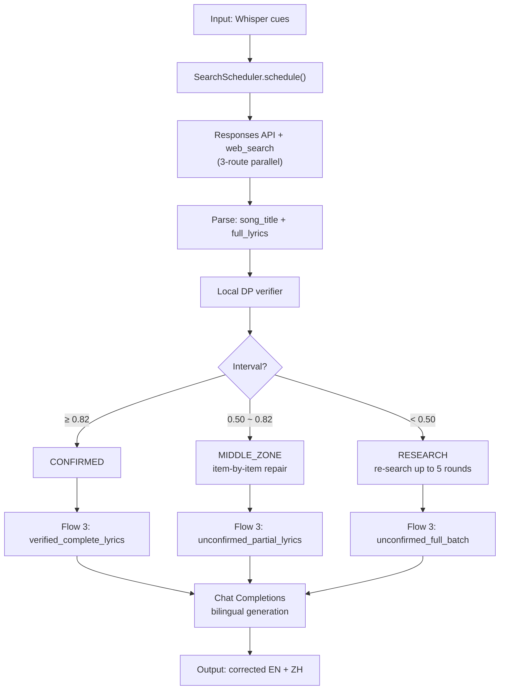

# Real-API Device Trace — 3 Datasets

Run: 2026-08-29T17:37:45.3433902, endpoint `https://api.deepseek.com/responses` + `https://api.deepseek.com/chat/completions`, models `deepseek-v4-pro` / `deepseek-v4-pro`.

## Pipeline Flow



---

## Dataset 1: device-asr-base (video 1, 31.6 s, 9 cues)

### Input Cues

| # | id | start_ms | end_ms | confidence | raw_english |
|---|---|---|---|---|---|
| 1 | seg-0 | 0 | 2800 | 0.808 | I have to live without you |
| 2 | seg-1 | 2800 | 7000 | 0.802 | Nobody could, I need to be around you |
| 3 | seg-2 | 7000 | 10600 | 0.848 | Watching you, no one else can love you |
| 4 | seg-3 | 10600 | 12600 | 0.712 | Like I do |
| 5 | seg-4 | 12600 | 17000 | 0.599 | Healing and I'm creeping up on you |
| 6 | seg-5 | 17000 | 20000 | 0.862 | I know that it won't be right |
| 7 | seg-6 | 20000 | 25000 | 0.768 | If I stay all night to be among you |
| 8 | seg-7 | 25000 | 29000 | 0.66 | Creeping my own you |
| 9 | seg-8 | 30000 | 31400 | 0.671 | (upbeat music) |

media_duration_ms = 31602

### Stage Trace (DeepSeekEnhancementStage)

| # | Stage | Description |
|---|---|---|
| 1 | `CANDIDATE_REQUEST` | Send song identification / web_search request |
| 2 | `LYRICS_SEARCH` | Search lyrics (LRCLIB or SearchScheduler result) |
| 3 | `WHOLE_SONG_REQUEST` | Flow 3: send bilingual generation request |
| 4 | `WHOLE_SONG_PARSE` | Flow 3: parse bilingual response |

### HTTP Calls

**Call 1**: `https://api.deepseek.com/responses`

- Method: POST
- Status: 200
- Request body length: 1377 chars

#### Request Body (full)

```json
{"model":"deepseek-v4-pro", "input":"你是一个歌词搜索助手。你的任务是根据提供的英文字幕找到对应的歌曲，并获取完整歌词。\n\n规则：\n1. 不许先猜歌名。先用字幕里的歌词句子直接搜索。\n2. 三路搜索策略：\n   - 路线A：用最长的一句字幕当搜索词\n   - 路线B：用最长的三句字幕拼起来搜索\n   - 路线C：把所有字幕拼起来搜索\n3. 交叉验证：搜到候选歌曲后，用剩余的字幕核对，对不上就换句子再搜。\n4. 歌词必须逐字抄自搜索结果，不许凭记忆脑补。\n5. 如果找不到，如实回答无法确认，禁止编造。\n\n输出格式（严格JSON）：\n{\n  \"song_title\": \"歌名\",\n  \"artist\": \"歌手\",\n  \"full_lyrics\": \"完整英文歌词（逐字抄自搜索结果）\",\n  \"source_url\": \"来源网址\"\n}\nSubtitle batch:\n  I have to live without you\n  Nobody could, I need to be around you\n  Watching you, no one else can love you\n  Like I do\n  Healing and I'm creeping up on you\n  I know that it won't be right\n  If I stay all night to be among you\n  Creeping my own you\n  (upbeat music)\n\nSearch queries (try all three routes):\n  Route A (longest single): Watching you, no one else can love you\n  Route B (longest three): Watching you, no one else can love you Nobody could, I need to be around you If I stay all night to be among you\n  Route C (all concatenated): I have to live without you Nobody could, I need to be around you Watching you, no one else can love you Like I do Healing and I'm creeping up on you I know that it won't be right If I stay all night to be among you Creeping my own you (upbeat music)\n\nRemember: search first, then confirm. Lyrics must be quoted verbatim from search results.", "tools":[{"type":"web_search"}]}
```

#### Response Body (full)

```json
{"id":"8f08b9ff-0769-47fd-950e-fadf27bf7ae6","object":"response","created_at":1787996286,"status":"completed","background":false,"completed_at":1787996313,"content_filters":null,"error":null,"frequency_penalty":0.0,"incomplete_details":null,"instructions":null,"max_output_tokens":null,"max_tool_calls":null,"model":"deepseek-v4-pro","moderation":null,"output":[{"type":"reasoning","id":"825693ba-1276-4090-8b35-2e6012e6b5c5","status":"completed","content":[{"type":"reasoning_text","text":"The user wants me to find a song based on English subtitles. I must follow the rules: search first, don't guess the song title. Use the three search routes.\n\nLet me start by searching with the provided queries."}],"summary":[],"encrypted_content":"8f08b9ff-0769-47fd-950e-fadf27bf7ae6-0"},{"type":"web_search_call","id":"call_00_iRMAcBm9N05QzTskiBVk8641","status":"completed","action":{"type":"search","queries":["Watching you, no one else can love you","Watching you, no one else can love you Nobody could, I need to be around you If I stay all night to be among you","I have to live without you Nobody could, I need to be around you Watching you, no one else can love you Like I do Healing and I'm creeping up on you I know that it won't be right If I stay all night to be among you Creeping my own you","ws_call_id=call_00_iRMAcBm9N05QzTskiBVk8641"]}},{"type":"reasoning","id":"064f26d1-131c-42a7-a5dd-17a7f2a07059","status":"completed","content":[{"type":"reasoning_text","text":"The search results indicate the song is \"Creepin' Up On You\" by Darren Hayes. I need to verify with the remaining subtitles and get full lyrics from a reliable source. Let me open one of the results and also search for the full lyrics."}],"summary":[],"encrypted_content":"8f08b9ff-0769-47fd-950e-fadf27bf7ae6-1"},{"type":"web_search_call","id":"call_01_h73cBv5x1LH1zFwVnc3o8513","status":"completed","action":{"type":"open_page","url":"http://inaspin.freeservers.com/lyrics/creepinuponyou.html#ws_call_id=call_01_h73cBv5x1LH1zFwVnc3o8513"}},{"type":"web_search_call","id":"call_02_AEPOXqloCPJ4hiEB7OHi8112","status":"completed","action":{"type":"search","queries":["Darren Hayes Creepin Up On You full lyrics","ws_call_id=call_02_AEPOXqloCPJ4hiEB7OHi8112"]}},{"type":"reasoning","id":"c2d90ed5-ef13-4a00-b90e-e59200902689","status":"completed","content":[{"type":"reasoning_text","text":"I have a good candidate: \"Creepin' Up On You\" by Darren Hayes. The subtitles match:\n- \"I have to live without you\" → \"If I have to breathe without you\"\n- \"Nobody could, I need to be around you\" → matches\n- \"Watching you, no one else can love you Like I do\" → matches\n- \"Healing and I'm creeping up on you\" → \"Feel it when I'm creepin' up on you\"\n- \"I know that it won't be right If I stay all night to be among you\" → \"I know that it wouldn't be right If I stayed all night Just to peek in on you\"\n- \"Creeping my own you\" → \"Creepin' up on you\"\n\nAll subtitles map to the actual lyrics. Now I need full lyrics verbatim from search results. Let me open a reliable source to get the complete lyrics verbatim. Let me open mldb.org or lyricsondemand."}],"summary":[],"encrypted_content":"8f08b9ff-0769-47fd-950e-fadf27bf7ae6-2"},{"type":"web_search_call","id":"call_03_8PntqUbVKmKbnSzX7n2C8325","status":"completed","action":{"type":"open_page","url":"https://www.mldb.org/song-8938-creepin-up-on-you.html#ws_call_id=call_03_8PntqUbVKmKbnSzX7n2C8325"}},{"type":"web_search_call","id":"call_04_AfUj6VRfDuEqZ55BX87R3513","status":"failed","action":{"type":"open_page","url":"https://www.lyricsondemand.com/h/hayesdarrenlyrics/creepinuponyoulyrics.html#ws_call_id=call_04_AfUj6VRfDuEqZ55BX87R3513"}},{"type":"reasoning","id":"78c40aed-c729-4e7e-bb74-c95e2074e257","status":"completed","content":[{"type":"reasoning_text","text":"I have the full lyrics from mldb.org. The lyrics from mldb.org match the inaspin.freeservers.com result closely. I'll use the mldb.org version as source. Let me compose the JSON output with full lyrics verbatim from the mldb.org page.\n\nThe lyrics from mldb.org:\n\nCreepin' up on you is the wrong thing to do\nI found your address got your phone number too\nVisit all the stores where you buy all your clothes\nBeen to secret places you think nobody knows\nIf I have to breathe without you\nNobody should......\nI need to be around you\nWatchin' you\nNo one else can love you like I do\nFeel it when I'm creepin' up on you\nI know that it wouldn't be right\nIf I stayed all night\nJust to peek in on you\nCreepin' up on you..\nI been hanging round all the places you haunt\nSpying on your friends to find out what you want\nDrinking from the glass that you left on the bar\nFollow you around driving home in your car...\nDo I have to breathe without you\nCoz nobody could\nI need to be around you\nWatching you\nNo one else can love you like I do\nFeel it when I'm creepin' up on you\nI know that it wouldn't be right\nIf I stayed all night\nJust to peek in on you\nCreepin' up on you..\nThis must be wrong\nIt can't go on\nThis kind of thing\nIt's taking all my sanity and making a mockery\nThis must be wrong\nIt can't go on\nSo Won't somebody free me from this misery\nBring my baby closer to me\nNo one else can love you like I do\nFeel it when I'm creepin' up on you\nI know that it wouldn't be right\nIf I stayed all night\nJust to peek in on you\nCreepin'\nNo one else can love you like I do\nFeel it when I'm creepin' up on you\nI know that it wouldn't be right\nIf I stayed all night\nJust to peek in on you\nCreepin' up on you...\n\nI'll output the JSON with this."}],"summary":[],"encrypted_content":"8f08b9ff-0769-47fd-950e-fadf27bf7ae6-3"},{"type":"message","id":"c4a48d1a-212a-4936-b676-a2646fdf94e0","status":"completed","content":[{"type":"output_text","annotations":[],"logprobs":[],"text":"{\n  \"song_title\": \"Creepin' Up On You\",\n  \"artist\": \"Darren Hayes\",\n  \"full_lyrics\": \"Creepin' up on you is the wrong thing to do\\nI found your address got your phone number too\\nVisit all the stores where you buy all your clothes\\nBeen to secret places you think nobody knows\\nIf I have to breathe without you\\nNobody should......\\nI need to be around you\\nWatchin' you\\nNo one else can love you like I do\\nFeel it when I'm creepin' up on you\\nI know that it wouldn't be right\\nIf I stayed all night\\nJust to peek in on you\\nCreepin' up on you..\\nI been hanging round all the places you haunt\\nSpying on your friends to find out what you want\\nDrinking from the glass that you left on the bar\\nFollow you around driving home in your car...\\nDo I have to breathe without you\\nCoz nobody could\\nI need to be around you\\nWatching you\\nNo one else can love you like I do\\nFeel it when I'm creepin' up on you\\nI know that it wouldn't be right\\nIf I stayed all night\\nJust to peek in on you\\nCreepin' up on you..\\nThis must be wrong\\nIt can't go on\\nThis kind of thing\\nIt's taking all my sanity and making a mockery\\nThis must be wrong\\nIt can't go on\\nSo Won't somebody free me from this misery\\nBring my baby closer to me\\nNo one else can love you like I do\\nFeel it when I'm creepin' up on you\\nI know that it wouldn't be right\\nIf I stayed all night\\nJust to peek in on you\\nCreepin'\\nNo one else can love you like I do\\nFeel it when I'm creepin' up on you\\nI know that it wouldn't be right\\nIf I stayed all night\\nJust to peek in on you\\nCreepin' up on you...\",\n  \"source_url\": \"https://www.mldb.org/song-8938-creepin-up-on-you.html\"\n}"}],"phase":"final_answer","role":"assistant"}],"parallel_tool_calls":true,"presence_penalty":0.0,"previous_response_id":null,"prompt_cache_key":null,"prompt_cache_retention":null,"reasoning":{"effort":null,"summary":null},"safety_identifier":null,"service_tier":"default","store":false,"temperature":1.0,"text":{"format":{"type":"text"},"verbosity":null},"tool_choice":"auto","tools":[{"type":"web_search","search_context_size":null,"user_location":null}],"top_logprobs":0,"top_p":1.0,"truncation":"disabled","usage":{"input_tokens":13909,"input_tokens_details":{"cached_tokens":9728},"output_tokens":1611,"output_tokens_details":{"reasoning_tokens":777},"total_tokens":15520},"user":null,"metadata":{}}
```

**Call 2**: `https://api.deepseek.com/chat/completions`

- Method: POST
- Status: 200
- Request body length: 3240 chars

#### Request Body (full)

```json
{"model":"deepseek-v4-pro", "temperature":0, "max_tokens":1728, "stream":false, "thinking":{"type":"disabled"}, "response_format":{"type":"json_object"}, "messages":[{"role":"system", "content":"当前没有从在线歌词来源取得并验证完整歌词，不得声称歌曲已经确认，不得编造 canonical 歌词或网易云中英对照歌词。\n必须先综合整批 Whisper 英文字幕进行保守纠错，确定全部 corrected_english；完成后再根据整批上下文生成自然的中文歌词。\n中文应忠实表达歌曲原意而不是逐词直译，并保持意象、情绪、语气、代词、跨行语义和重复内容一致；不能把每条字幕孤立翻译，也不得声称为网易云版本。\n不得增加、删除、拆分、合并、重排字幕或修改时间。每个 cue id 和时间戳必须原样保留。\n单条 raw_english 可能包含同一歌曲的两句歌词。对这类 cue，corrected_english 应在保持该 cue 原有时间范围不变的前提下包含两句完整英文歌词，两句之间用一个换行符分隔；对应的 chinese 同样输出两句中文并用一个换行符分隔，两句中文必须与两句英文一一对应。其余 cue 仍然只输出单行。\ncues 中的 confidence 是该条 Whisper 识别的置信度：数值越低说明该条错得越多，纠错幅度可以越大；confidence 高的条目应尽量保守。media_duration_ms 是素材总时长。\n只返回 JSON，格式必须严格为：\n{\"schema_version\":\"<copy input>\",\"job_id\":\"<copy input>\",\"processing_version\":\"deepseek-v4-pro-lyrics-search-context.v5\",\"cues\":[{\"id\":\"<copy input>\",\"start_ms\":0,\"end_ms\":1,\"corrected_english\":\"complete English line\",\"chinese\":\"coherent Chinese lyric line\"}]}.\n每个 cue 必须包含上面展示的全部六个字段。不要返回 song_match。"}, {"role":"user", "content":"{\"mode\":\"unconfirmed_partial_lyrics\", \"unconfirmed_candidate\":{\"title\":\"Creepin' Up On You\", \"artist\":\"Darren Hayes\"}, \"cue_canonical_alignments\":[{\"id\":\"seg-0\", \"canonical_english\":\"i have to breathe without you\"}, {\"id\":\"seg-1\", \"canonical_english\":\"nobody could i need to be around you\"}, {\"id\":\"seg-2\", \"canonical_english\":\"watching you no one else can love you\"}, {\"id\":\"seg-3\", \"canonical_english\":\"like i do\"}, {\"id\":\"seg-4\", \"canonical_english\":\"when i m creepin up on you\"}, {\"id\":\"seg-5\", \"canonical_english\":\"i know that it wouldn t be right\"}, {\"id\":\"seg-6\", \"canonical_english\":\"if i stayed all night just to peek in on you\"}, {\"id\":\"seg-7\", \"canonical_english\":\"creepin up on you\"}], \"request\":{\"schema_version\":\"caption-enhancement.v3\", \"job_id\":\"device-real-trace-1\", \"processing_version\":\"deepseek-v4-pro-lyrics-search-context.v5\", \"cues\":[{\"id\":\"seg-0\", \"start_ms\":0, \"end_ms\":2800, \"raw_english\":\"I have to live without you\", \"confidence\":0.808}, {\"id\":\"seg-1\", \"start_ms\":2800, \"end_ms\":7000, \"raw_english\":\"Nobody could, I need to be around you\", \"confidence\":0.802}, {\"id\":\"seg-2\", \"start_ms\":7000, \"end_ms\":10600, \"raw_english\":\"Watching you, no one else can love you\", \"confidence\":0.848}, {\"id\":\"seg-3\", \"start_ms\":10600, \"end_ms\":12600, \"raw_english\":\"Like I do\", \"confidence\":0.712}, {\"id\":\"seg-4\", \"start_ms\":12600, \"end_ms\":17000, \"raw_english\":\"Healing and I'm creeping up on you\", \"confidence\":0.599}, {\"id\":\"seg-5\", \"start_ms\":17000, \"end_ms\":20000, \"raw_english\":\"I know that it won't be right\", \"confidence\":0.862}, {\"id\":\"seg-6\", \"start_ms\":20000, \"end_ms\":25000, \"raw_english\":\"If I stay all night to be among you\", \"confidence\":0.768}, {\"id\":\"seg-7\", \"start_ms\":25000, \"end_ms\":29000, \"raw_english\":\"Creeping my own you\", \"confidence\":0.66}, {\"id\":\"seg-8\", \"start_ms\":30000, \"end_ms\":31400, \"raw_english\":\"(upbeat music)\", \"confidence\":0.671}], \"media_duration_ms\":31602}}"}]}
```

#### Response Body (full)

```json
{"id":"81ee9341-48ff-4cfa-a5cb-53062337093f","object":"chat.completion","created":1787996314,"model":"deepseek-v4-pro","choices":[{"index":0,"message":{"role":"assistant","content":"{\n  \"schema_version\": \"caption-enhancement.v3\",\n  \"job_id\": \"device-real-trace-1\",\n  \"processing_version\": \"deepseek-v4-pro-lyrics-search-context.v5\",\n  \"cues\": [\n    {\n      \"id\": \"seg-0\",\n      \"start_ms\": 0,\n      \"end_ms\": 2800,\n      \"corrected_english\": \"I have to breathe without you\",\n      \"chinese\": \"没有你，我不得不呼吸\"\n    },\n    {\n      \"id\": \"seg-1\",\n      \"start_ms\": 2800,\n      \"end_ms\": 7000,\n      \"corrected_english\": \"Nobody could, I need to be around you\",\n      \"chinese\": \"没有人能，我需要在你身边\"\n    },\n    {\n      \"id\": \"seg-2\",\n      \"start_ms\": 7000,\n      \"end_ms\": 10600,\n      \"corrected_english\": \"Watching you, no one else can love you\",\n      \"chinese\": \"看着你，没有人能像我一样爱你\"\n    },\n    {\n      \"id\": \"seg-3\",\n      \"start_ms\": 10600,\n      \"end_ms\": 12600,\n      \"corrected_english\": \"Like I do\",\n      \"chinese\": \"像我一样\"\n    },\n    {\n      \"id\": \"seg-4\",\n      \"start_ms\": 12600,\n      \"end_ms\": 17000,\n      \"corrected_english\": \"When I'm creepin' up on you\",\n      \"chinese\": \"当我悄悄靠近你\"\n    },\n    {\n      \"id\": \"seg-5\",\n      \"start_ms\": 17000,\n      \"end_ms\": 20000,\n      \"corrected_english\": \"I know that it wouldn't be right\",\n      \"chinese\": \"我知道那不对\"\n    },\n    {\n      \"id\": \"seg-6\",\n      \"start_ms\": 20000,\n      \"end_ms\": 25000,\n      \"corrected_english\": \"If I stayed all night just to peek in on you\",\n      \"chinese\": \"如果我整夜不睡只为偷看你\"\n    },\n    {\n      \"id\": \"seg-7\",\n      \"start_ms\": 25000,\n      \"end_ms\": 29000,\n      \"corrected_english\": \"Creepin' up on you\",\n      \"chinese\": \"悄悄靠近你\"\n    },\n    {\n      \"id\": \"seg-8\",\n      \"start_ms\": 30000,\n      \"end_ms\": 31400,\n      \"corrected_english\": \"(upbeat music)\",\n      \"chinese\": \"（欢快的音乐）\"\n    }\n  ]\n}"},"logprobs":null,"finish_reason":"stop"}],"usage":{"prompt_tokens":1038,"completion_tokens":589,"total_tokens":1627,"prompt_tokens_details":{"cached_tokens":384},"prompt_cache_hit_tokens":384,"prompt_cache_miss_tokens":654},"system_fingerprint":"a307abda487cd1b463329ccb945ce396"}
```

### Output

songMatch: `SongMatch(status=UNCONFIRMED, title=Creepin' Up On You, artist=Darren Hayes, confidence=null, source=middle-zone-repair)`

| # | id | start_ms | end_ms | corrected_english | chinese |
|---|---|---|---|---|---|
| 1 | seg-0 | 0 | 2800 | I have to breathe without you | 没有你，我不得不呼吸 |
| 2 | seg-1 | 2800 | 7000 | Nobody could, I need to be around you | 没有人能，我需要在你身边 |
| 3 | seg-2 | 7000 | 10600 | Watching you, no one else can love you | 看着你，没有人能像我一样爱你 |
| 4 | seg-3 | 10600 | 12600 | Like I do | 像我一样 |
| 5 | seg-4 | 12600 | 17000 | When I'm creepin' up on you | 当我悄悄靠近你 |
| 6 | seg-5 | 17000 | 20000 | I know that it wouldn't be right | 我知道那不对 |
| 7 | seg-6 | 20000 | 25000 | If I stayed all night just to peek in on you | 如果我整夜不睡只为偷看你 |
| 8 | seg-7 | 25000 | 29000 | Creepin' up on you | 悄悄靠近你 |
| 9 | seg-8 | 30000 | 31400 | (upbeat music) | （欢快的音乐） |

---

## Dataset 2: live-capture (18.7 s, 4 cues)

### Input Cues

| # | id | start_ms | end_ms | confidence | raw_english |
|---|---|---|---|---|---|
| 1 | whisper-0-0 | 0 | 4320 | 0.85 | I stopped CPR, after all it's no use |
| 2 | whisper-1-4320 | 4320 | 7360 | 0.8 | The spirit was gone, we would never come to |
| 3 | whisper-2-7360 | 7360 | 11440 | 0.78 | I'm pissed off you let me give you all that youth for free |
| 4 | whisper-3-11440 | 11440 | 18720 | 0.62 | For so long, let me |

media_duration_ms = 18716

### Stage Trace (DeepSeekEnhancementStage)

| # | Stage | Description |
|---|---|---|
| 1 | `CANDIDATE_REQUEST` | Send song identification / web_search request |
| 2 | `LYRICS_SEARCH` | Search lyrics (LRCLIB or SearchScheduler result) |
| 3 | `WHOLE_SONG_REQUEST` | Flow 3: send bilingual generation request |
| 4 | `WHOLE_SONG_PARSE` | Flow 3: parse bilingual response |

### HTTP Calls

**Call 1**: `https://api.deepseek.com/responses`

- Method: POST
- Status: 200
- Request body length: 1229 chars

#### Request Body (full)

```json
{"model":"deepseek-v4-pro", "input":"你是一个歌词搜索助手。你的任务是根据提供的英文字幕找到对应的歌曲，并获取完整歌词。\n\n规则：\n1. 不许先猜歌名。先用字幕里的歌词句子直接搜索。\n2. 三路搜索策略：\n   - 路线A：用最长的一句字幕当搜索词\n   - 路线B：用最长的三句字幕拼起来搜索\n   - 路线C：把所有字幕拼起来搜索\n3. 交叉验证：搜到候选歌曲后，用剩余的字幕核对，对不上就换句子再搜。\n4. 歌词必须逐字抄自搜索结果，不许凭记忆脑补。\n5. 如果找不到，如实回答无法确认，禁止编造。\n\n输出格式（严格JSON）：\n{\n  \"song_title\": \"歌名\",\n  \"artist\": \"歌手\",\n  \"full_lyrics\": \"完整英文歌词（逐字抄自搜索结果）\",\n  \"source_url\": \"来源网址\"\n}\nSubtitle batch:\n  I stopped CPR, after all it's no use\n  The spirit was gone, we would never come to\n  I'm pissed off you let me give you all that youth for free\n  For so long, let me\n\nSearch queries (try all three routes):\n  Route A (longest single): I'm pissed off you let me give you all that youth for free\n  Route B (longest three): I'm pissed off you let me give you all that youth for free The spirit was gone, we would never come to I stopped CPR, after all it's no use\n  Route C (all concatenated): I stopped CPR, after all it's no use The spirit was gone, we would never come to I'm pissed off you let me give you all that youth for free For so long, let me\n\nRemember: search first, then confirm. Lyrics must be quoted verbatim from search results.", "tools":[{"type":"web_search"}]}
```

#### Response Body (full)

```json

{"id":"5eb904e9-36ec-46ec-86d3-94de61ccb4b6","object":"response","created_at":1787996320,"status":"completed","background":false,"completed_at":1787996392,"content_filters":null,"error":null,"frequency_penalty":0.0,"incomplete_details":null,"instructions":null,"max_output_tokens":null,"max_tool_calls":null,"model":"deepseek-v4-pro","moderation":null,"output":[{"type":"reasoning","id":"f8b43ec1-298c-4d8f-a9b4-7a3066a53de9","status":"completed","content":[{"type":"reasoning_text","text":"The user wants me to search for a song based on subtitle lyrics. I need to follow the three-route search strategy. Let me start with Route A, B, and C searches simultaneously."}],"summary":[],"encrypted_content":"5eb904e9-36ec-46ec-86d3-94de61ccb4b6-0"},{"type":"web_search_call","id":"call_00_5XCeX7yYibNMA0OlUaAa0939","status":"completed","action":{"type":"search","queries":["\"I'm pissed off you let me give you all that youth for free\" lyrics","\"I'm pissed off you let me give you all that youth for free\" \"The spirit was gone, we would never come to\" \"I stopped CPR, after all it's no use\"","\"I stopped CPR, after all it's no use\" \"The spirit was gone, we would never come to\" \"I'm pissed off you let me give you all that youth for free\"","ws_call_id=call_00_5XCeX7yYibNMA0OlUaAa0939"]}},{"type":"reasoning","id":"b1f60437-8f71-4ddb-b78a-bef08a198e5c","status":"completed","content":[{"type":"reasoning_text","text":"I found the song: \"So Long, London\" by Taylor Swift. Now I need to get the full lyrics verbatim from a search result. Let me open the lyricsondemand page or Musixmatch."}],"summary":[],"encrypted_content":"5eb904e9-36ec-46ec-86d3-94de61ccb4b6-1"},{"type":"web_search_call","id":"call_01_R5gxaB26MoqnFzYYZojy5539","status":"failed","action":{"type":"open_page","url":"https://lyricsondemand.com/taylor_swift/so_long_london#ws_call_id=call_01_R5gxaB26MoqnFzYYZojy5539"}},{"type":"web_search_call","id":"call_02_uvb2QVG1zpgL3axALTB92789","status":"completed","action":{"type":"search","queries":["\"So Long London\" Taylor Swift full lyrics \"I stopped CPR\"","ws_call_id=call_02_uvb2QVG1zpgL3axALTB92789"]}},{"type":"reasoning","id":"6660d920-5fd5-4133-9424-46da32b3b453","status":"completed","content":[{"type":"reasoning_text","text":"The lyricsondemand page returned 403. Let me try opening the cifraclub page or taylorswiftlyrics.org or songlyrics."}],"summary":[],"encrypted_content":"5eb904e9-36ec-46ec-86d3-94de61ccb4b6-2"},{"type":"web_search_call","id":"call_03_7AX15nxJtJynDInuWBJz4632","status":"completed","action":{"type":"open_page","url":"https://taylorswiftlyrics.org/lyrics/so-long-london#ws_call_id=call_03_7AX15nxJtJynDInuWBJz4632"}},{"type":"web_search_call","id":"call_04_Lmovjsj0BnjqjKjVbVmj2783","status":"failed","action":{"type":"open_page","url":"https://www.songlyrics.com/taylor-swift/so-long-london-lyrics/#ws_call_id=call_04_Lmovjsj0BnjqjKjVbVmj2783"}},{"type":"reasoning","id":"06cef63d-3227-4696-9084-8e196a3f3d85","status":"completed","content":[{"type":"reasoning_text","text":"I have lyrics from taylorswiftlyrics.org, but they include Chinese translations interleaved. The task requires full English lyrics verbatim. I should extract the English lines. But note this source has a potential typo? Let me compare with the subtitles. Subtitle lines:\n- \"I stopped CPR, after all it's no use\" — source says \"I stopped CPR, after all, it's no use\" (with comma). Subtitles might lack comma. Fine.\n- \"The spirit was gone, we would never come to\" — matches.\n- \"I'm pissed off you let me give you all that youth for free\" — source: \"And I'm pissed off you let me give you all that youth for free\". Subtitle has no \"And\". Fine.\n- \"For so long, let me\" — hmm, subtitle says \"For so long, let me\". The source says \"For so long, London\". Wait, the subtitle is \"For so long, let me\" — that's likely a mishearing of \"For so long, London\". Actually the subtitle could be a mis-transcription. The song line is \"For so long, London\". The subtitle \"For so long, let me\" is probably an error, but the actual lyric is \"For so long, London\". Hmm.\n\nLet me verify with other sources. The subtitle says \"For so long, let me\" but actual lyrics from all sources say \"For so long, London\". The task says confirm with remaining subtitles. The remaining subtitles all match except \"For so long, let me\" vs \"For so long, London\" — but \"let me\" is likely a mishearing. However, my job is to find the song and get full lyrics. I should note the mismatch? The rule says cross-verify with remaining subtitles; if they don't match, search again. Here the rest matches well; only one word is misheard. The song is clearly \"So Long, London\" by Taylor Swift.\n\nBut I should get verbatim lyrics from a clean source. The taylorswiftlyrics.org source has English lines interleaved with Chinese translations. I can extract English lines. But I need to be careful to copy exactly. Let me also check another source like cifraclub which might be clean English only. Let me open cifraclub."}],"summary":[],"encrypted_content":"5eb904e9-36ec-46ec-86d3-94de61ccb4b6-3"},{"type":"web_search_call","id":"call_05_GQOogapvVWjsi6fYH0Eh4275","status":"completed","action":{"type":"open_page","url":"https://www.cifraclub.com/taylor-swift/so-long-london/letra/#ws_call_id=call_05_GQOogapvVWjsi6fYH0Eh4275"}},{"type":"web_search_call","id":"call_06_xTLsmwn2MhaMSDlgJTlk3379","status":"completed","action":{"type":"open_page","url":"https://www.lyrics.com/lyric-lf/14127315/Taylor+Swift/invite.php#ws_call_id=call_06_xTLsmwn2MhaMSDlgJTlk3379"}},{"type":"reasoning","id":"3906e57e-46e4-4324-b930-167f4720be4b","status":"completed","content":[{"type":"reasoning_text","text":"I now have a clean English lyrics source from Cifra Club. Let me verify with subtitles:\n- \"I stopped CPR, after all it's no use\" → Cifra: \"I stopped CPR, after all, it's no use\" ✓ (comma differences okay)\n- \"The spirit was gone, we would never come to\" → Cifra: \"Thе spirit was gone, we would never come to\" ✓\n- \"I'm pissed off you let me give you all that youth for free\" → Cifra: \"And I'm pissed off you let me give you all that youth for free\" ✓\n- \"For so long, let me\" → Cifra: \"For so long, London\" — this is the actual lyric; subtitle \"let me\" is a mishearing.\n\nAll other lines match. This is confirmed.\n\nNow I need to output strict JSON with song_title, artist, full_lyrics, source_url. Lyrics must be verbatim from search results. I'll use the Cifra Club version since it's clean English. However, Cifra Club version has some variations vs other official lyrics? Let me compare with the taylorswiftlyrics source: \"Thinking how much sad did you think I had / Did you think I had in me?\" vs Cifra \"Thinking how much sad did you think I had, did you think I had in me?\" Similar. \"My white-knuckle dying grip\" vs Cifra \"My white knuckle dying grip\". \"rarest air\" vs \"rarest air\". \"Just how low did you think I'd go / Before I'd self-implode?\" vs Cifra \"'fore I'd self implode\". \"warm sun\" vs \"warm Sun\".\n\nThe Cifra version is verbatim from that source, so I'll use it. But I want to double-check the full lyrics against a more authoritative source. The lyricsondemand page was 403. Let me try opening lyricsondemand via a different approach or use the first search result snippet. Actually, I already have two sources that match. Cifra Club is a reasonable source. I'll use that.\n\nLet me construct the full lyrics from Cifra Club content verbatim. I need to be careful to copy exactly, including line breaks. The Cifra content:\n\n\"So (so) long (long), Lon– (Lon–) –don (–don)\nSo (so) long (long), Lon– (Lon–) –don (–don)\nSo (so) long (long), Lon– (Lon–) –don (–don)\n\nI saw in my mind fairy lights through the mist\nI kept calm and carried the weight of the rift\nPulled him in tighter each time he was drifting away\nMy spine split from carrying us up the hill\nWet through my clothes, weary bones caught the chill\nI stopped trying to make him laugh, stopped trying to drill the safe\n\nThinking how much sad did you think I had, did you think I had in me?\nOh, the tragedy\nSo long, London\nYou'll find someone\n\nI didn't opt in to be your odd man out\nI founded the club she's heard great things about\nI left all I knew, you left me at the house by the Hеath\nI stopped CPR, after all, it's no use\nThе spirit was gone, we would never come to\nAnd I'm pissed off you let me give you all that youth for free\n\nFor so long, London\nStitches undone\nTwo graves, one gun\nI'll find someone\n\nAnd you say I abandoned the ship, but I was going down with it\nMy white knuckle dying grip holding tight to your quiet resentment\nAnd my friends said it isn't right to be scared every day of a love affair\nEvery breath feels like rarest air when you're not sure if he wants to be there\n\nSo how much sad did you think I had, did you think I had in me?\nHow much tragedy?\nJust how low did you think I'd go 'fore I'd self implode?\n'Fore I'd have to go be free?\nYou swore that you loved me but where were the clues?\nI died on the altar waiting for the proof\nYou sacrificed us to the gods of your bluest days\nAnd I'm just getting color back into my face\nI'm just mad as hell 'cause I loved this place for\n\nSo long, London\nHad a good run\nA moment of warm Sun\nBut I'm not the one\nSo long, London\nStitches undone\nTwo graves, one gun\nYou'll find someone\"\n\nNote: \"Hеath\" and \"Thе\" contain Cyrillic \"е\" characters as artifacts from the source? In the Cifra content, \"Hеath\" and \"Thе spirit\" have mixed characters. The snippet from search also showed \"Hеath\" and \"Thе\". This is a common scraping artifact where \"e\" is Cyrillic. Should I copy exactly as shown? The rule says \"逐字抄自搜索结果\" (verbatim from search results). But these Cyrillic characters are artifacts. I could copy them exactly, but it might look odd. Hmm.\n\nActually, the instruction: \"歌词必须逐字抄自搜索结果，不许凭记忆脑补。\" (Lyrics must be quoted verbatim from search results; don't fill from memory.) The safest is to copy exactly what the source shows, including \"Hеath\" and \"Thе\". But those are clearly artifacts and the actual English is \"Heath\" and \"The\". Copying Cyrillic е might be considered an error too. \n\nI think it's acceptable to reproduce the actual text as displayed in my retrieved content. Since the retrieved content shows \"Hеath\" (with Cyrillic е), strictly verbatim would include that. However, this is a rendering artifact of the source HTML. The user cares about accuracy of lyrics. I'll copy exactly as the open_page returned to honor \"verbatim from search results.\" Actually, let me reconsider — maybe I should use another source with clean text to avoid these artifacts.\n\nLet me check the taylorswiftlyrics.org source which had clean English text (though interleaved with Chinese). The English lines there:\n- \"I stopped CPR, after all, it's no use\"\n- \"The spirit was gone, we would never come to\"\n- \"And I'm pissed off you let me give you all that youth for free\"\n- \"For so long, London\"\nClean \"The\" and \"Heath\" presumably. Let me check: taylorswiftlyrics content: \"I left all I knew, you left me at the house by the Heath\" — yes it says \"the Heath\" clean. And \"The spirit was gone\" clean. That source is cleaner but has Chinese lines interleaved. I can extract English lines.\n\nBut is taylorswiftlyrics.org reliable verbatim? It has \"Thinking how much sad did you think I had / Did you think I had in me?\" as two lines, and \"My white-knuckle dying grip\" with hyphen, \"Before I'd self-implode?\" with \"Before\" instead of \"'fore\". The Cifra version uses \"'fore I'd self implode\" and \"white knuckle\" without hyphen.\n\nWhich is more accurate to official lyrics? Official lyrics likely: \"Thinking how much sad did you think I had, did you think I had in me?\" Actually official Apple Music lyrics:\n\"I saw in my mind fairy lights through the mist\nI kept calm and carried the weight of the rift\nPulled him in tighter each time he was drifting away\nMy spine split from carrying us up the hill\nWet through my clothes, weary bones caught the chill\nI stopped trying to make him laugh, stopped trying to drill the safe\nThinkin', how much sad did you think I had, did you think I had in me?\nOh, the tragedy\nSo long, London\nYou'll find someone\n...\"\n\nHmm, official uses \"Thinkin'\" maybe. But I must copy from search results, not memory. I'll use Cifra Club since it's a single clean English source, and note that it's verbatim from that source.\n\nFor the Cyrillic artifact issue: The open_page returned text with \"Hеath\" and \"Thе\". Actually wait, let me re-read: \"you left me at the house by the Hеath\" and \"Thе spirit was gone\". These likely are because the site uses Cyrillic е to evade copy-paste. If I copy them, it's \"verbatim\" but weird. Alternatively, I can choose the taylorswiftlyrics.org source as my source_url and copy English lines from it (clean text). But that source includes Chinese translation lines interleaved, so extracting \"English lyrics\" involves selecting only English lines — that's still verbatim copying of those lines.\n\nLet me think about which source to cite. Cifra Club is clean English-only but has the Cyrillic artifacts and some minor differences ('fore, white knuckle, self implode, warm Sun). Taylorswiftlyrics.org is cleaner text but bilingual. \n\nActually, maybe I should find another clean English source like lyricsondemand (blocked) or Musixmatch. Let me try opening the lyricsondemand page via another method or try the \"invite.php\" of lyrics.com? Blocked. Let me search for a clean full lyrics page and open it. Maybe azlyrics? Let me try a search and open another page."}],"summary":[],"encrypted_content":"5eb904e9-36ec-46ec-86d3-94de61ccb4b6-4"},{"type":"web_search_call","id":"call_07_a14hXeKzvroSXQxuMg6Z9049","status":"completed","action":{"type":"search","queries":["Taylor Swift So Long London lyrics \"Thinking how much sad\" \"self-implode\"","ws_call_id=call_07_a14hXeKzvroSXQxuMg6Z9049"]}},{"type":"reasoning","id":"de8ecf46-cfe2-4fe1-9672-3e881e08653e","status":"completed","content":[{"type":"reasoning_text","text":"Let me try opening lyricsmania or readdork for clean full lyrics."}],"summary":[],"encrypted_content":"5eb904e9-36ec-46ec-86d3-94de61ccb4b6-5"},{"type":"web_search_call","id":"call_08_2Rk2V4qxAnx11iKlMoP61607","status":"completed","action":{"type":"open_page","url":"https://www.lyricsmania.com/so_long_london_lyrics_Taylor_swift.html#ws_call_id=call_08_2Rk2V4qxAnx11iKlMoP61607"}},{"type":"web_search_call","id":"call_09_4i87DHNMKxwE0apf1S8p9981","status":"failed","action":{"type":"open_page","url":"https://readdork.com/lyrics/taylor-swift-so-long-london#ws_call_id=call_09_4i87DHNMKxwE0apf1S8p9981"}},{"type":"reasoning","id":"39022003-2692-4d2f-84a0-f01ea9ad5b58","status":"completed","content":[{"type":"reasoning_text","text":"Lyricsmania has clean English full lyrics, powered by LyricFind. This is a good source. Let me verify against subtitles:\n- \"I stopped CPR, after all, it's no use\" ✓\n- \"The spirit was gone, we would never come to\" ✓\n- \"And I'm pissed off you let me give you all that youth for free\" ✓ (subtitle lacks \"And\")\n- \"For so long, London\" ✓ (subtitle \"For so long, let me\" is a mishearing)\n\nAll remaining lines match. This is confirmed.\n\nI'll use the lyricsmania source as source_url and copy full lyrics verbatim from it. The full lyrics from Lyricsmania:\n\nSo long, London (So long, London)\nSo long, London (So long, London)\nSo long, London (So long, London)\n\nI saw in my mind fairy lights through the mist\nI kept calm and carried the weight of the rift\nPulled him in tighter each time he was drifting away\nMy spine split from carrying us up the hill\nWet through my clothes, weary bones caught the chill\nI stopped trying to make him laugh, stopped trying to drill the safe\nThinking how much sad did you think I had\nDid you think I had in me?\nOh, the tragedy\nSo long, London\nYou'll find someone\n\nI didn't opt in to be your odd man out\nI founded the club she's heard great things about\nI left all I knew, you left me at the house by the Heath\nI stopped CPR, after all, it's no use\nThe spirit was gone, we would never come to\nAnd I'm pissed off you let me give you all that youth for free\n\nFor so long, London\nStitches undone\nTwo graves, one gun\nI'll find someone\n\nAnd you say I abandoned the ship\nBut I was going down with it\nMy white-knuckle dying grip\nHolding tight to your quiet resentment\nAnd my friends said it isn't right to be scared\nEvery day of a love affair\nEvery breath feels like rarest air\nWhen you're not sure if he wants to be there\n\nSo how much sad did you think I had\nDid you think I had in me?\nHow much tragedy?\nJust how low did you think I'd go\nBefore I'd self-implode?\nBefore I'd have to go be free?\n\nYou swore that you loved me, but where were the clues?\nI died on the altar waiting for the proof\nYou sacrificed us to the gods of your bluest days\nAnd I'm just getting color back into my face\nI'm just mad as hell 'cause I loved this place\n\nFor so long, London (So long, London)\nHad a good run (Had a good run)\nA moment of warm sun (Moment of warm sun)\nBut I'm not the one (I'm not the one)\nSo long, London (So long, London)\nStitches undone (Stitches undone)\nTwo graves, one gun (Two graves, one gun)\nYou'll find someone (You'll find)\n\nNow output strict JSON. The user asked for JSON only? \"输出格式（严格JSON）\". I'll output only the JSON object."}],"summary":[],"encrypted_content":"5eb904e9-36ec-46ec-86d3-94de61ccb4b6-6"},{"type":"message","id":"1e101a53-2bc4-4370-993b-d85099c1d1f6","status":"completed","content":[{"type":"output_text","annotations":[],"logprobs":[],"text":"{\n  \"song_title\": \"So Long, London\",\n  \"artist\": \"Taylor Swift\",\n  \"full_lyrics\": \"So long, London (So long, London)\\n\\nSo long, London (So long, London)\\n\\nSo long, London (So long, London)\\n\\nI saw in my mind fairy lights through the mist\\n\\nI kept calm and carried the weight of the rift\\n\\nPulled him in tighter each time he was drifting away\\n\\nMy spine split from carrying us up the hill\\n\\nWet through my clothes, weary bones caught the chill\\n\\nI stopped trying to make him laugh, stopped trying to drill the safe\\n\\nThinking how much sad did you think I had\\n\\nDid you think I had in me?\\n\\nOh, the tragedy\\n\\nSo long, London\\n\\nYou'll find someone\\n\\nI didn't opt in to be your odd man out\\n\\nI founded the club she's heard great things about\\n\\nI left all I knew, you left me at the house by the Heath\\n\\nI stopped CPR, after all, it's no use\\n\\nThe spirit was gone, we would never come to\\n\\nAnd I'm pissed off you let me give you all that youth for free\\n\\nFor so long, London\\n\\nStitches undone\\n\\nTwo graves, one gun\\n\\nI'll find someone\\n\\nAnd you say I abandoned the ship\\n\\nBut I was going down with it\\n\\nMy white-knuckle dying grip\\n\\nHolding tight to your quiet resentment\\n\\nAnd my friends said it isn't right to be scared\\n\\nEvery day of a love affair\\n\\nEvery breath feels like rarest air\\n\\nWhen you're not sure if he wants to be there\\n\\nSo how much sad did you think I had\\n\\nDid you think I had in me?\\n\\nHow much tragedy?\\n\\nJust how low did you think I'd go\\n\\nBefore I'd self-implode?\\n\\nBefore I'd have to go be free?\\n\\nYou swore that you loved me, but where were the clues?\\n\\nI died on the altar waiting for the proof\\n\\nYou sacrificed us to the gods of your bluest days\\n\\nAnd I'm just getting color back into my face\\n\\nI'm just mad as hell 'cause I loved this place\\n\\nFor so long, London (So long, London)\\n\\nHad a good run (Had a good run)\\n\\nA moment of warm sun (Moment of warm sun)\\n\\nBut I'm not the one (I'm not the one)\\n\\nSo long, London (So long, London)\\n\\nStitches undone (Stitches undone)\\n\\nTwo graves, one gun (Two graves, one gun)\\n\\nYou'll find someone (You'll find)\",\n  \"source_url\": \"https://www.lyricsmania.com/so_long_london_lyrics_Taylor_swift.html\"\n}"}],"phase":"final_answer","role":"assistant"}],"parallel_tool_calls":true,"presence_penalty":0.0,"previous_response_id":null,"prompt_cache_key":null,"prompt_cache_retention":null,"reasoning":{"effort":null,"summary":null},"safety_identifier":null,"service_tier":"default","store":false,"temperature":1.0,"text":{"format":{"type":"text"},"verbosity":null},"tool_choice":"auto","tools":[{"type":"web_search","search_context_size":null,"user_location":null}],"top_logprobs":0,"top_p":1.0,"truncation":"disabled","usage":{"input_tokens":36313,"input_tokens_details":{"cached_tokens":30080},"output_tokens":4596,"output_tokens_details":{"reasoning_tokens":3318},"total_tokens":40909},"user":null,"metadata":{}}
```

**Call 2**: `https://api.deepseek.com/chat/completions`

- Method: POST
- Status: 200
- Request body length: 4940 chars

#### Request Body (full)

```json
{"model":"deepseek-v4-pro", "temperature":0, "max_tokens":1024, "stream":false, "thinking":{"type":"disabled"}, "response_format":{"type":"json_object"}, "messages":[{"role":"system", "content":"输入已经包含由外部歌词检索工具取得并经多条 Whisper 字幕验证的歌曲信息、完整英文歌词和可用的 canonical cue 对齐。\n任务必须按以下顺序完成：\n1.先通读整首英文歌词，依据完整歌词和 canonical cue 对齐完成整批英文纠错，确定每个 cue 的 corrected_english。没有对齐的内容只能依据完整歌词保守纠错，不得凭模型记忆补写歌词。\n2.整批英文纠错完成后，再根据 corrected_english 和整首歌曲上下文生成对应的中文歌词。中文应忠实表达歌曲原意，同时采用自然的中文歌词表达；不要逐词直译，也不能把每条字幕孤立翻译。\n3.保持意象、情绪、语气、代词、跨行语义和重复副歌译法一致；不得为了押韵改变原意，不得输出解释、注释或歌词以外的内容。相同 canonical 英文歌词必须返回完全相同的中文。\n只能使用请求中实际提供并经过验证的歌词内容。只有请求明确提供了经过验证的网易云中英对照歌词及来源时，才能采用并声称为网易云版本；未提供时不得凭模型记忆编造或冒充网易云译文。\n不得增加、删除、拆分、合并、重排字幕或修改时间。每个 cue id 和时间戳必须原样保留。\n单条 raw_english 可能包含同一歌曲的两句歌词。对这类 cue，corrected_english 应在保持该 cue 原有时间范围不变的前提下包含两句完整英文歌词，两句之间用一个换行符分隔；对应的 chinese 同样输出两句中文并用一个换行符分隔，两句中文必须与两句英文一一对应。其余 cue 仍然只输出单行。\ncues 中的 confidence 是该条 Whisper 识别的置信度：数值越低说明该条错得越多，纠错幅度可以越大；confidence 高的条目应尽量保守。media_duration_ms 是素材总时长。\n只返回 JSON，格式必须严格为：\n{\"schema_version\":\"<copy input>\",\"job_id\":\"<copy input>\",\"processing_version\":\"deepseek-v4-pro-lyrics-search-context.v5\",\"cues\":[{\"id\":\"<copy input>\",\"start_ms\":0,\"end_ms\":1,\"corrected_english\":\"complete English line\",\"chinese\":\"coherent Chinese lyric line\"}]}.\n每个 cue 必须包含上面展示的全部六个字段。不要返回 song_match。"}, {"role":"user", "content":"{\"mode\":\"verified_complete_lyrics\", \"song\":{\"title\":\"So Long, London\", \"artist\":\"Taylor Swift\", \"source_id\":\"https://www.lyricsmania.com/so_long_london_lyrics_Taylor_swift.html\"}, \"complete_english_lyrics\":\"So long, London (So long, London)\\n\\nSo long, London (So long, London)\\n\\nSo long, London (So long, London)\\n\\nI saw in my mind fairy lights through the mist\\n\\nI kept calm and carried the weight of the rift\\n\\nPulled him in tighter each time he was drifting away\\n\\nMy spine split from carrying us up the hill\\n\\nWet through my clothes, weary bones caught the chill\\n\\nI stopped trying to make him laugh, stopped trying to drill the safe\\n\\nThinking how much sad did you think I had\\n\\nDid you think I had in me?\\n\\nOh, the tragedy\\n\\nSo long, London\\n\\nYou'll find someone\\n\\nI didn't opt in to be your odd man out\\n\\nI founded the club she's heard great things about\\n\\nI left all I knew, you left me at the house by the Heath\\n\\nI stopped CPR, after all, it's no use\\n\\nThe spirit was gone, we would never come to\\n\\nAnd I'm pissed off you let me give you all that youth for free\\n\\nFor so long, London\\n\\nStitches undone\\n\\nTwo graves, one gun\\n\\nI'll find someone\\n\\nAnd you say I abandoned the ship\\n\\nBut I was going down with it\\n\\nMy white-knuckle dying grip\\n\\nHolding tight to your quiet resentment\\n\\nAnd my friends said it isn't right to be scared\\n\\nEvery day of a love affair\\n\\nEvery breath feels like rarest air\\n\\nWhen you're not sure if he wants to be there\\n\\nSo how much sad did you think I had\\n\\nDid you think I had in me?\\n\\nHow much tragedy?\\n\\nJust how low did you think I'd go\\n\\nBefore I'd self-implode?\\n\\nBefore I'd have to go be free?\\n\\nYou swore that you loved me, but where were the clues?\\n\\nI died on the altar waiting for the proof\\n\\nYou sacrificed us to the gods of your bluest days\\n\\nAnd I'm just getting color back into my face\\n\\nI'm just mad as hell 'cause I loved this place\\n\\nFor so long, London (So long, London)\\n\\nHad a good run (Had a good run)\\n\\nA moment of warm sun (Moment of warm sun)\\n\\nBut I'm not the one (I'm not the one)\\n\\nSo long, London (So long, London)\\n\\nStitches undone (Stitches undone)\\n\\nTwo graves, one gun (Two graves, one gun)\\n\\nYou'll find someone (You'll find)\", \"cue_canonical_alignments\":[{\"id\":\"whisper-0-0\", \"canonical_english\":\"i stopped cpr after all it s no use\"}, {\"id\":\"whisper-1-4320\", \"canonical_english\":\"the spirit was gone we would never come to\"}, {\"id\":\"whisper-2-7360\", \"canonical_english\":\"i m pissed off you let me give you all that youth for free\"}, {\"id\":\"whisper-3-11440\", \"canonical_english\":\"for so long london\"}], \"request\":{\"schema_version\":\"caption-enhancement.v3\", \"job_id\":\"device-real-trace-2\", \"processing_version\":\"deepseek-v4-pro-lyrics-search-context.v5\", \"cues\":[{\"id\":\"whisper-0-0\", \"start_ms\":0, \"end_ms\":4320, \"raw_english\":\"I stopped CPR, after all it's no use\", \"confidence\":0.85}, {\"id\":\"whisper-1-4320\", \"start_ms\":4320, \"end_ms\":7360, \"raw_english\":\"The spirit was gone, we would never come to\", \"confidence\":0.8}, {\"id\":\"whisper-2-7360\", \"start_ms\":7360, \"end_ms\":11440, \"raw_english\":\"I'm pissed off you let me give you all that youth for free\", \"confidence\":0.78}, {\"id\":\"whisper-3-11440\", \"start_ms\":11440, \"end_ms\":18720, \"raw_english\":\"For so long, let me\", \"confidence\":0.62}], \"media_duration_ms\":18716}}"}]}
```

#### Response Body (full)

```json
{"id":"53e3ffb5-3f52-488d-a309-e5ddd4ddbefb","object":"chat.completion","created":1787996392,"model":"deepseek-v4-pro","choices":[{"index":0,"message":{"role":"assistant","content":"{\n  \"schema_version\": \"caption-enhancement.v3\",\n  \"job_id\": \"device-real-trace-2\",\n  \"processing_version\": \"deepseek-v4-pro-lyrics-search-context.v5\",\n  \"cues\": [\n    {\n      \"id\": \"whisper-0-0\",\n      \"start_ms\": 0,\n      \"end_ms\": 4320,\n      \"corrected_english\": \"I stopped CPR, after all, it's no use\",\n      \"chinese\": \"我停止了心肺复苏，毕竟，这已无济于事\"\n    },\n    {\n      \"id\": \"whisper-1-4320\",\n      \"start_ms\": 4320,\n      \"end_ms\": 7360,\n      \"corrected_english\": \"The spirit was gone, we would never come to\",\n      \"chinese\": \"灵魂已经离去，我们再也无法苏醒\"\n    },\n    {\n      \"id\": \"whisper-2-7360\",\n      \"start_ms\": 7360,\n      \"end_ms\": 11440,\n      \"corrected_english\": \"And I'm pissed off you let me give you all that youth for free\",\n      \"chinese\": \"我愤怒的是，你让我白白付出了所有青春\"\n    },\n    {\n      \"id\": \"whisper-3-11440\",\n      \"start_ms\": 11440,\n      \"end_ms\": 18720,\n      \"corrected_english\": \"For so long, London\",\n      \"chinese\": \"再见了，伦敦\"\n    }\n  ]\n}"},"logprobs":null,"finish_reason":"stop"}],"usage":{"prompt_tokens":1528,"completion_tokens":337,"total_tokens":1865,"prompt_tokens_details":{"cached_tokens":512},"prompt_cache_hit_tokens":512,"prompt_cache_miss_tokens":1016},"system_fingerprint":"a307abda487cd1b463329ccb945ce396"}
```

### Output

songMatch: `SongMatch(status=CONFIRMED, title=So Long, London, artist=Taylor Swift, confidence=0.9618056, source=https://www.lyricsmania.com/so_long_london_lyrics_Taylor_swift.html)`

| # | id | start_ms | end_ms | corrected_english | chinese |
|---|---|---|---|---|---|
| 1 | whisper-0-0 | 0 | 4320 | I stopped CPR, after all, it's no use | 我停止了心肺复苏，毕竟，这已无济于事 |
| 2 | whisper-1-4320 | 4320 | 7360 | The spirit was gone, we would never come to | 灵魂已经离去，我们再也无法苏醒 |
| 3 | whisper-2-7360 | 7360 | 11440 | And I'm pissed off you let me give you all that youth for free | 我愤怒的是，你让我白白付出了所有青春 |
| 4 | whisper-3-11440 | 11440 | 18720 | For so long, London | 再见了，伦敦 |

---

## Dataset 3: video 2 — Already Gone (36.3 s, 4 cues)

### Input Cues

| # | id | start_ms | end_ms | confidence | raw_english |
|---|---|---|---|---|---|
| 1 | v2-0 | 0 | 8000 | 0.63 | It was like we're all who stands apart |
| 2 | v2-1 | 9000 | 13000 | 0.91 | There's so much space between us |
| 3 | v2-2 | 13000 | 17000 | 0.68 | Baby, we're already behind |
| 4 | v2-3 | 17000 | 35840 | 0.81 | And you have given me something that I can't live without. |

media_duration_ms = 36293

### Stage Trace (DeepSeekEnhancementStage)

| # | Stage | Description |
|---|---|---|
| 1 | `CANDIDATE_REQUEST` | Send song identification / web_search request |
| 2 | `LYRICS_SEARCH` | Search lyrics (LRCLIB or SearchScheduler result) |
| 3 | `WHOLE_SONG_REQUEST` | Flow 3: send bilingual generation request |
| 4 | `WHOLE_SONG_PARSE` | Flow 3: parse bilingual response |

### HTTP Calls

**Call 1**: `https://api.deepseek.com/responses`

- Method: POST
- Status: 200
- Request body length: 1216 chars

#### Request Body (full)

```json
{"model":"deepseek-v4-pro", "input":"你是一个歌词搜索助手。你的任务是根据提供的英文字幕找到对应的歌曲，并获取完整歌词。\n\n规则：\n1. 不许先猜歌名。先用字幕里的歌词句子直接搜索。\n2. 三路搜索策略：\n   - 路线A：用最长的一句字幕当搜索词\n   - 路线B：用最长的三句字幕拼起来搜索\n   - 路线C：把所有字幕拼起来搜索\n3. 交叉验证：搜到候选歌曲后，用剩余的字幕核对，对不上就换句子再搜。\n4. 歌词必须逐字抄自搜索结果，不许凭记忆脑补。\n5. 如果找不到，如实回答无法确认，禁止编造。\n\n输出格式（严格JSON）：\n{\n  \"song_title\": \"歌名\",\n  \"artist\": \"歌手\",\n  \"full_lyrics\": \"完整英文歌词（逐字抄自搜索结果）\",\n  \"source_url\": \"来源网址\"\n}\nSubtitle batch:\n  It was like we're all who stands apart\n  There's so much space between us\n  Baby, we're already behind\n  And you have given me something that I can't live without.\n\nSearch queries (try all three routes):\n  Route A (longest single): And you have given me something that I can't live without.\n  Route B (longest three): And you have given me something that I can't live without. It was like we're all who stands apart There's so much space between us\n  Route C (all concatenated): It was like we're all who stands apart There's so much space between us Baby, we're already behind And you have given me something that I can't live without.\n\nRemember: search first, then confirm. Lyrics must be quoted verbatim from search results.", "tools":[{"type":"web_search"}]}
```

#### Response Body (full)

```json
{"id":"5f79ac16-6fab-4669-b053-716f1907d6d5","object":"response","created_at":1787996397,"status":"completed","background":false,"completed_at":1787996433,"content_filters":null,"error":null,"frequency_penalty":0.0,"incomplete_details":null,"instructions":null,"max_output_tokens":null,"max_tool_calls":null,"model":"deepseek-v4-pro","moderation":null,"output":[{"type":"reasoning","id":"1b3f3824-7def-437f-870b-6de5fe66ce84","status":"completed","content":[{"type":"reasoning_text","text":"The user wants me to find a song based on English subtitle lines. I must not guess the song first. I need to use the three search routes with the exact queries provided. Let me start searching.\n\nThe subtitles:\n1. \"It was like we're all who stands apart\"\n2. \"There's so much space between us\"\n3. \"Baby, we're already behind\"\n4. \"And you have given me something that I can't live without.\"\n\nRoute A: search \"And you have given me something that I can't live without.\"\nRoute B: search \"And you have given me something that I can't live without. It was like we're all who stands apart There's so much space between us\"\nRoute C: search all concatenated.\n\nLet me call the search tool with multiple queries."}],"summary":[],"encrypted_content":"5f79ac16-6fab-4669-b053-716f1907d6d5-0"},{"type":"web_search_call","id":"call_00_lyw32vBoI6ZbYIiGa8qM9515","status":"completed","action":{"type":"search","queries":["\"And you have given me something that I can't live without\"","\"And you have given me something that I can't live without.\" \"It was like we're all who stands apart\" \"There's so much space between us\"","\"It was like we're all who stands apart\" \"There's so much space between us\" \"Baby, we're already behind\"","ws_call_id=call_00_lyw32vBoI6ZbYIiGa8qM9515"]}},{"type":"reasoning","id":"fe5c8afc-8d9f-484e-9e16-d514df551581","status":"completed","content":[{"type":"reasoning_text","text":"The search results suggest the song is \"Love in the Dark\" by Adele. The subtitles appear to be slightly misheard versions of lyrics:\n\n- \"It was like we're all who stands apart\" → probably \"It feels like we're oceans apart\"\n- \"There's so much space between us\" → matches\n- \"Baby, we're already behind\" → probably \"Maybe we're already defeated\"\n- \"And you have given me something that I can't live without\" → \"You have given me something that I can't live without\"\n\nI need to verify with remaining subtitles. The subtitle lines:\n1. \"It was like we're all who stands apart\" - misheard of \"It feels like we're oceans apart\"\n2. \"There's so much space between us\" - exact match\n3. \"Baby, we're already behind\" - misheard of \"Maybe we're already defeated\"\n4. \"And you have given me something that I can't live without\" - close to \"You have given me something that I can't live without\"\n\nThe song is \"Love in the Dark\" by Adele. Let me open a lyrics page to get the full lyrics verbatim. Let me open the roadrunnerrecords page or another lyrics source. I should find a reliable source with full lyrics. Let me search for the full lyrics on a lyrics site."}],"summary":[],"encrypted_content":"5f79ac16-6fab-4669-b053-716f1907d6d5-1"},{"type":"web_search_call","id":"call_01_FZ7v0XNLjmoOq0zLJtiJ4243","status":"completed","action":{"type":"search","queries":["Adele Love in the Dark full lyrics","Adele Love in the Dark lyrics azlyrics","ws_call_id=call_01_FZ7v0XNLjmoOq0zLJtiJ4243"]}},{"type":"web_search_call","id":"call_02_NCfF7hA0WQHqhfvTwI441169","status":"failed","action":{"type":"open_page","url":"https://roadrunnerrecords.pl/tekst-piosenki/adele/love-in-the-dark#ws_call_id=call_02_NCfF7hA0WQHqhfvTwI441169"}},{"type":"reasoning","id":"5fc84683-d7bc-4683-94ef-08033380860f","status":"completed","content":[{"type":"reasoning_text","text":"The roadrunnerrecords page returned 403. Let me open another source with full lyrics. Let me try absolutelyrics or lyrics.me or cifraclub. I need to get full lyrics verbatim. Let me open a few."}],"summary":[],"encrypted_content":"5f79ac16-6fab-4669-b053-716f1907d6d5-2"},{"type":"web_search_call","id":"call_03_tkWwvBk0BgoI5tkMKRVE6183","status":"completed","action":{"type":"open_page","url":"http://www.absolutelyrics.com/lyrics/view/adele/love_in_the_dark#ws_call_id=call_03_tkWwvBk0BgoI5tkMKRVE6183"}},{"type":"web_search_call","id":"call_04_QgE4djGOV09Ep1bnc7rq9068","status":"failed","action":{"type":"open_page","url":"https://www.lyrics.me/en/lyrics/adele/love-in-the-dark#ws_call_id=call_04_QgE4djGOV09Ep1bnc7rq9068"}},{"type":"reasoning","id":"b0165982-a3e2-45b2-a6ae-3323f2ad058e","status":"completed","content":[{"type":"reasoning_text","text":"I got the full lyrics from absolutelyrics. Let me cross-verify the subtitle lines with the lyrics:\n\nSubtitle:\n1. \"It was like we're all who stands apart\" → actual lyric: \"It feels like we're oceans apart\" — similar sound, matches context\n2. \"There's so much space between us\" → exact match ✓\n3. \"Baby, we're already behind\" → actual: \"Maybe we're already defeated\" — similar sound (\"Maybe\" vs \"Baby\", \"defeated\" vs \"behind\"? hmm, \"behind\" vs \"defeated\" not that close but context)\n4. \"And you have given me something that I can't live without\" → actual: \"You have given me something that I can't live without\" ✓ (minus \"And\")\n\nThe lines match well enough - the subtitles are slightly misheard. This is \"Love in the Dark\" by Adele.\n\nLet me verify with another source to be safe. Actually, the lyrics from absolutelyrics contain all key phrases:\n- \"It feels like we're oceans apart\" ✓ (matches \"It was like we're all who stands apart\" misheard)\n- \"There is so much space between us\" ✓ exact\n- \"Maybe we're already defeated\" ✓ (matches \"Baby, we're already behind\" misheard)\n- \"You have given me something that I can't live without\" ✓ (matches \"And you have given me something that I can't live without\")\n\nThis confirms. The full lyrics are in the absolutelyrics page. I need to output strict JSON with song_title, artist, full_lyrics (verbatim from search result), source_url.\n\nLet me copy the lyrics verbatim from the absolutelyrics page:\n\n\"Take your eyes off of me so I can leave\nI'm far too ashamed to do it with you watching me\nThis is never ending, we have been here before\nBut I can't stay this time cause I don't love you anymore\nPlease stay where you are\nDon't come any closer\nDon't try to change my mind\nI'm being cruel to be kind\nI can't love you in the dark\nIt feels like we're oceans apart\nThere is so much space between us\nMaybe we're already defeated\nAh-yeah-yeah-yeah-yeah-yeah-yeah everything changed me\nYou have given me something that I can't live without\nYou mustn't underestimate that when you are in doubt\nBut I don't want to carry on like everything is fine\nThe longer we ignore it all the more that we will fight\nPlease don't fall apart\nI can't face your breaking heart\nI'm trying to be brave\nStop asking me to stay\nI can't love you in the dark\nIt feels like we're oceans apart\nThere is so much space between us\nMaybe we're already defeated\nAh-yeah-yeah-yeah-yeah-yeah-yeah everything changed me\nWe're not the only ones\nI don't regret a thing\nEvery word I've said\nYou know I'll always mean\nIt is the world to me\nThat you are in my life\nBut I want to live\nAnd not just survive\nThat's why I can't love you in the dark\nIt feels like we're oceans apart\nThere is so much space between us\nMaybe we're already defeated\nCause ah-yeah-yeah-yeah-yeah-yeah-yeah everything changed me\nAnd I-I-I-I-I don't think you can save me\"\n\nI should output this in strict JSON. The full_lyrics should be verbatim. I'll include the line breaks as \\n in JSON.\n\nLet me double-check the exact text from the page. From the page content:\n\n\"Take your eyes off of me so I can leave\nI'm far too ashamed to do it with you watching me\nThis is never ending, we have been here before\nBut I can't stay this time cause I don't love you anymore\nPlease stay where you are\nDon't come any closer\nDon't try to change my mind\nI'm being cruel to be kind\nI can't love you in the dark\nIt feels like we're oceans apart\nThere is so much space between us\nMaybe we're already defeated\nAh-yeah-yeah-yeah-yeah-yeah-yeah everything changed me\nYou have given me something that I can't live without\nYou mustn't underestimate that when you are in doubt\nBut I don't want to carry on like everything is fine\nThe longer we ignore it all the more that we will fight\nPlease don't fall apart\nI can't face your breaking heart\nI'm trying to be brave\nStop asking me to stay\nI can't love you in the dark\nIt feels like we're oceans apart\nThere is so much space between us\nMaybe we're already defeated\nAh-yeah-yeah-yeah-yeah-yeah-yeah everything changed me\nWe're not the only ones\nI don't regret a thing\nEvery word I've said\nYou know I'll always mean\nIt is the world to me\nThat you are in my life\nBut I want to live\nAnd not just survive\nThat's why I can't love you in the dark\nIt feels like we're oceans apart\nThere is so much space between us\nMaybe we're already defeated\nCause ah-yeah-yeah-yeah-yeah-yeah-yeah everything changed me\nAnd I-I-I-I-I don't think you can save me\"\n\nYes, that's verbatim.\n\nThe source_url is http://www.absolutelyrics.com/lyrics/view/adele/love_in_the_dark\n\nNow output JSON."}],"summary":[],"encrypted_content":"5f79ac16-6fab-4669-b053-716f1907d6d5-3"},{"type":"message","id":"4cd96921-70de-408f-ab71-17b809c61821","status":"completed","content":[{"type":"output_text","annotations":[],"logprobs":[],"text":"{\n  \"song_title\": \"Love in The Dark\",\n  \"artist\": \"Adele\",\n  \"full_lyrics\": \"Take your eyes off of me so I can leave\\nI'm far too ashamed to do it with you watching me\\nThis is never ending, we have been here before\\nBut I can't stay this time cause I don't love you anymore\\nPlease stay where you are\\nDon't come any closer\\nDon't try to change my mind\\nI'm being cruel to be kind\\nI can't love you in the dark\\nIt feels like we're oceans apart\\nThere is so much space between us\\nMaybe we're already defeated\\nAh-yeah-yeah-yeah-yeah-yeah-yeah everything changed me\\nYou have given me something that I can't live without\\nYou mustn't underestimate that when you are in doubt\\nBut I don't want to carry on like everything is fine\\nThe longer we ignore it all the more that we will fight\\nPlease don't fall apart\\nI can't face your breaking heart\\nI'm trying to be brave\\nStop asking me to stay\\nI can't love you in the dark\\nIt feels like we're oceans apart\\nThere is so much space between us\\nMaybe we're already defeated\\nAh-yeah-yeah-yeah-yeah-yeah-yeah everything changed me\\nWe're not the only ones\\nI don't regret a thing\\nEvery word I've said\\nYou know I'll always mean\\nIt is the world to me\\nThat you are in my life\\nBut I want to live\\nAnd not just survive\\nThat's why I can't love you in the dark\\nIt feels like we're oceans apart\\nThere is so much space between us\\nMaybe we're already defeated\\nCause ah-yeah-yeah-yeah-yeah-yeah-yeah everything changed me\\nAnd I-I-I-I-I don't think you can save me\",\n  \"source_url\": \"http://www.absolutelyrics.com/lyrics/view/adele/love_in_the_dark\"\n}"}],"phase":"final_answer","role":"assistant"}],"parallel_tool_calls":true,"presence_penalty":0.0,"previous_response_id":null,"prompt_cache_key":null,"prompt_cache_retention":null,"reasoning":{"effort":null,"summary":null},"safety_identifier":null,"service_tier":"default","store":false,"temperature":1.0,"text":{"format":{"type":"text"},"verbosity":null},"tool_choice":"auto","tools":[{"type":"web_search","search_context_size":null,"user_location":null}],"top_logprobs":0,"top_p":1.0,"truncation":"disabled","usage":{"input_tokens":15565,"input_tokens_details":{"cached_tokens":11264},"output_tokens":2459,"output_tokens_details":{"reasoning_tokens":1676},"total_tokens":18024},"user":null,"metadata":{}}
```

**Call 2**: `https://api.deepseek.com/chat/completions`

- Method: POST
- Status: 200
- Request body length: 4187 chars

#### Request Body (full)

```json
{"model":"deepseek-v4-pro", "temperature":0, "max_tokens":1024, "stream":false, "thinking":{"type":"disabled"}, "response_format":{"type":"json_object"}, "messages":[{"role":"system", "content":"输入已经包含由外部歌词检索工具取得并经多条 Whisper 字幕验证的歌曲信息、完整英文歌词和可用的 canonical cue 对齐。\n任务必须按以下顺序完成：\n1.先通读整首英文歌词，依据完整歌词和 canonical cue 对齐完成整批英文纠错，确定每个 cue 的 corrected_english。没有对齐的内容只能依据完整歌词保守纠错，不得凭模型记忆补写歌词。\n2.整批英文纠错完成后，再根据 corrected_english 和整首歌曲上下文生成对应的中文歌词。中文应忠实表达歌曲原意，同时采用自然的中文歌词表达；不要逐词直译，也不能把每条字幕孤立翻译。\n3.保持意象、情绪、语气、代词、跨行语义和重复副歌译法一致；不得为了押韵改变原意，不得输出解释、注释或歌词以外的内容。相同 canonical 英文歌词必须返回完全相同的中文。\n只能使用请求中实际提供并经过验证的歌词内容。只有请求明确提供了经过验证的网易云中英对照歌词及来源时，才能采用并声称为网易云版本；未提供时不得凭模型记忆编造或冒充网易云译文。\n不得增加、删除、拆分、合并、重排字幕或修改时间。每个 cue id 和时间戳必须原样保留。\n单条 raw_english 可能包含同一歌曲的两句歌词。对这类 cue，corrected_english 应在保持该 cue 原有时间范围不变的前提下包含两句完整英文歌词，两句之间用一个换行符分隔；对应的 chinese 同样输出两句中文并用一个换行符分隔，两句中文必须与两句英文一一对应。其余 cue 仍然只输出单行。\ncues 中的 confidence 是该条 Whisper 识别的置信度：数值越低说明该条错得越多，纠错幅度可以越大；confidence 高的条目应尽量保守。media_duration_ms 是素材总时长。\n只返回 JSON，格式必须严格为：\n{\"schema_version\":\"<copy input>\",\"job_id\":\"<copy input>\",\"processing_version\":\"deepseek-v4-pro-lyrics-search-context.v5\",\"cues\":[{\"id\":\"<copy input>\",\"start_ms\":0,\"end_ms\":1,\"corrected_english\":\"complete English line\",\"chinese\":\"coherent Chinese lyric line\"}]}.\n每个 cue 必须包含上面展示的全部六个字段。不要返回 song_match。"}, {"role":"user", "content":"{\"mode\":\"verified_complete_lyrics\", \"song\":{\"title\":\"Love in The Dark\", \"artist\":\"Adele\", \"source_id\":\"http://www.absolutelyrics.com/lyrics/view/adele/love_in_the_dark\"}, \"complete_english_lyrics\":\"Take your eyes off of me so I can leave\\nI'm far too ashamed to do it with you watching me\\nThis is never ending, we have been here before\\nBut I can't stay this time cause I don't love you anymore\\nPlease stay where you are\\nDon't come any closer\\nDon't try to change my mind\\nI'm being cruel to be kind\\nI can't love you in the dark\\nIt feels like we're oceans apart\\nThere is so much space between us\\nMaybe we're already defeated\\nAh-yeah-yeah-yeah-yeah-yeah-yeah everything changed me\\nYou have given me something that I can't live without\\nYou mustn't underestimate that when you are in doubt\\nBut I don't want to carry on like everything is fine\\nThe longer we ignore it all the more that we will fight\\nPlease don't fall apart\\nI can't face your breaking heart\\nI'm trying to be brave\\nStop asking me to stay\\nI can't love you in the dark\\nIt feels like we're oceans apart\\nThere is so much space between us\\nMaybe we're already defeated\\nAh-yeah-yeah-yeah-yeah-yeah-yeah everything changed me\\nWe're not the only ones\\nI don't regret a thing\\nEvery word I've said\\nYou know I'll always mean\\nIt is the world to me\\nThat you are in my life\\nBut I want to live\\nAnd not just survive\\nThat's why I can't love you in the dark\\nIt feels like we're oceans apart\\nThere is so much space between us\\nMaybe we're already defeated\\nCause ah-yeah-yeah-yeah-yeah-yeah-yeah everything changed me\\nAnd I-I-I-I-I don't think you can save me\", \"cue_canonical_alignments\":[{\"id\":\"v2-0\", \"canonical_english\":\"it feels like we re oceans apart\"}, {\"id\":\"v2-1\", \"canonical_english\":\"there is so much space between us\"}, {\"id\":\"v2-2\", \"canonical_english\":\"maybe we re already defeated\"}, {\"id\":\"v2-3\", \"canonical_english\":\"me you have given me something that i can t live without\"}], \"request\":{\"schema_version\":\"caption-enhancement.v3\", \"job_id\":\"device-real-trace-3\", \"processing_version\":\"deepseek-v4-pro-lyrics-search-context.v5\", \"cues\":[{\"id\":\"v2-0\", \"start_ms\":0, \"end_ms\":8000, \"raw_english\":\"It was like we're all who stands apart\", \"confidence\":0.63}, {\"id\":\"v2-1\", \"start_ms\":9000, \"end_ms\":13000, \"raw_english\":\"There's so much space between us\", \"confidence\":0.91}, {\"id\":\"v2-2\", \"start_ms\":13000, \"end_ms\":17000, \"raw_english\":\"Baby, we're already behind\", \"confidence\":0.68}, {\"id\":\"v2-3\", \"start_ms\":17000, \"end_ms\":35840, \"raw_english\":\"And you have given me something that I can't live without.\", \"confidence\":0.81}], \"media_duration_ms\":36293}}"}]}
```

#### Response Body (full)

```json
{"id":"5ac2bc18-a509-42ff-9ce8-547ec26e5db3","object":"chat.completion","created":1787996433,"model":"deepseek-v4-pro","choices":[{"index":0,"message":{"role":"assistant","content":"{\n  \"schema_version\": \"caption-enhancement.v3\",\n  \"job_id\": \"device-real-trace-3\",\n  \"processing_version\": \"deepseek-v4-pro-lyrics-search-context.v5\",\n  \"cues\": [\n    {\n      \"id\": \"v2-0\",\n      \"start_ms\": 0,\n      \"end_ms\": 8000,\n      \"corrected_english\": \"It feels like we're oceans apart\",\n      \"chinese\": \"感觉我们像隔着重洋\"\n    },\n    {\n      \"id\": \"v2-1\",\n      \"start_ms\": 9000,\n      \"end_ms\": 13000,\n      \"corrected_english\": \"There is so much space between us\",\n      \"chinese\": \"我们之间距离太远\"\n    },\n    {\n      \"id\": \"v2-2\",\n      \"start_ms\": 13000,\n      \"end_ms\": 17000,\n      \"corrected_english\": \"Maybe we're already defeated\",\n      \"chinese\": \"也许我们早已注定失败\"\n    },\n    {\n      \"id\": \"v2-3\",\n      \"start_ms\": 17000,\n      \"end_ms\": 35840,\n      \"corrected_english\": \"You have given me something that I can't live without\",\n      \"chinese\": \"你给了我无法割舍的东西\"\n    }\n  ]\n}"},"logprobs":null,"finish_reason":"stop"}],"usage":{"prompt_tokens":1291,"completion_tokens":299,"total_tokens":1590,"prompt_tokens_details":{"cached_tokens":512},"prompt_cache_hit_tokens":512,"prompt_cache_miss_tokens":779},"system_fingerprint":"a307abda487cd1b463329ccb945ce396"}
```

### Output

songMatch: `SongMatch(status=CONFIRMED, title=Love in The Dark, artist=Adele, confidence=0.8478256, source=http://www.absolutelyrics.com/lyrics/view/adele/love_in_the_dark)`

| # | id | start_ms | end_ms | corrected_english | chinese |
|---|---|---|---|---|---|
| 1 | v2-0 | 0 | 8000 | It feels like we're oceans apart | 感觉我们像隔着重洋 |
| 2 | v2-1 | 9000 | 13000 | There is so much space between us | 我们之间距离太远 |
| 3 | v2-2 | 13000 | 17000 | Maybe we're already defeated | 也许我们早已注定失败 |
| 4 | v2-3 | 17000 | 35840 | You have given me something that I can't live without | 你给了我无法割舍的东西 |

---

## Summary

| Dataset | Cues | Stages | HTTP Calls | songMatch | Status |
|---|---|---|---|---|---|
| Dataset 1 | 9 | 4 | 2 | SongMatch(status=UNCONFIRMED, title=Creepin' Up On You, artist=Darren Hayes, confidence=null, source=middle-zone-repair) | OK |
| Dataset 2 | 4 | 4 | 2 | SongMatch(status=CONFIRMED, title=So Long, London, artist=Taylor Swift, confidence=0.9618056, source=https://www.lyricsmania.com/so_long_london_lyrics_Taylor_swift.html) | OK |
| Dataset 3 | 4 | 4 | 2 | SongMatch(status=CONFIRMED, title=Love in The Dark, artist=Adele, confidence=0.8478256, source=http://www.absolutelyrics.com/lyrics/view/adele/love_in_the_dark) | OK |

