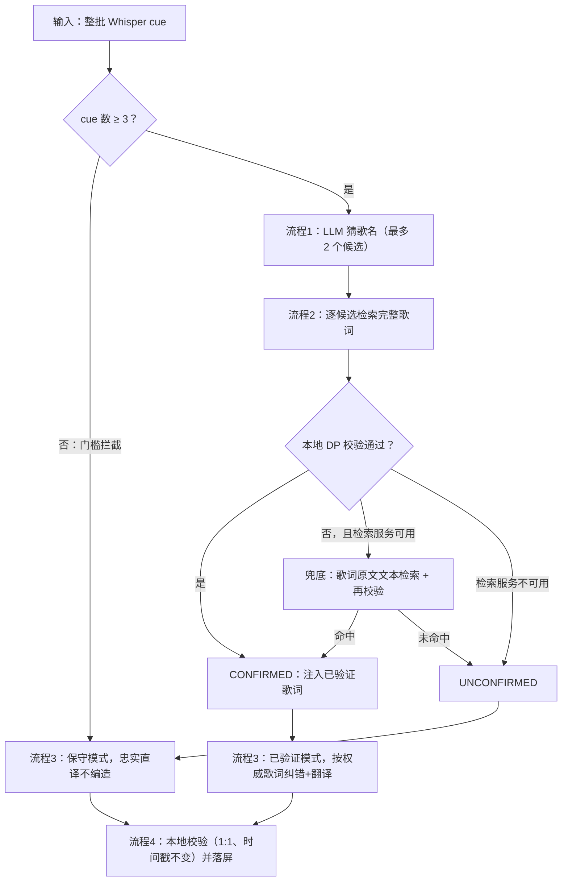

# 三视频本地沙箱重跑（当前策略同步版）

运行时间：2026-08-28T01:40:17.003876，端点 `https://api.deepseek.com/chat/completions`，模型 `deepseek-v4-pro`。
本沙箱与 app 共用同一份 `DeepSeekCaptionEnhancementProvider` / `SongLyricsCandidateVerifier` / `CaptionEnhancementResponseValidator` 源码：在此修改提示词或阈值后重跑，即等同于修改 app 策略。

## 整体触发/拦截策略



## 本地固有规则 / 拦截规则（源码常量同步）

| 规则 | 当前值 | 所在位置 |
|---|---|---|
| 启动门槛：cue 数达到才走歌曲识别 | ≥ 3 | SongLyricsCandidateVerifier.MIN_ELIGIBLE_CUES |
| 候选数上限（流程1） | 2 | DeepSeekCaptionEnhancementProvider.MAX_SONG_CANDIDATES |
| DP 校验确认阈值（常规批） | 0.82 | SongLyricsCandidateVerifier.MIN_CONFIDENCE |
| DP 校验确认阈值（≤5 条小批） | 0.76 | SMALL_BATCH_MIN_CONFIDENCE |
| 最少匹配 cue 数（常规/小批） | 3 / 2 | MIN_MATCHED_CUES / SMALL_BATCH_MIN_MATCHED_CUES |
| 最少覆盖率（常规/小批） | 0.75 / 0.6 | MIN_COVERAGE / SMALL_BATCH_MIN_COVERAGE |
| 单条相似度下限 | 0.62 | MIN_CUE_SIMILARITY |
| 兜底门控 | 无候选通过校验且检索服务可用 → 歌词原文检索 | DeepSeekCaptionEnhancementProvider.findVerifiedLyrics |
| 兜底查询长度上限 | 300 字符 | FALLBACK_QUERY_MAX_CHARS |
| 输出合同 | 输入输出条数 1:1，id 与时间戳不可变，丢弃模型自报 song_match | CaptionEnhancementContract / ResponseValidator |

DP（Dynamic Programming，动态规划）校验在设备本地运行，不消耗任何 API（Application Programming Interface，应用程序接口）费用，是唯一有权"确认歌曲"的环节。

---

## 视频1（5e4c…）

### 输入（Whisper ASR（自动语音识别）结果）

| id | 时间轴 | confidence | 英文原文 |
|---|---|---|---|
| whisper-0-0 | 0..2800 | 0.92 | I have to live without you |
| whisper-1-2800 | 2800..7000 | 0.88 | Nobody could, I need to be around you |
| whisper-2-7000 | 7000..10600 | 0.93 | Watching you, no one else can love you |
| whisper-3-10600 | 10600..12600 | — | Like I do |
| whisper-4-12600 | 12600..17000 | 0.63 | Healing and I'm creeping up on you |
| whisper-5-17000 | 17000..20000 | 0.94 | I know that it won't be right |
| whisper-6-20000 | 20000..25000 | 0.78 | If I stay all night to be among you |
| whisper-7-25000 | 25000..29000 | 0.68 | Creeping my own you |
| whisper-8-30000 | 30000..31400 | 0.77 | (upbeat music) |

### 流程 1 歌曲识别（LLM（大语言模型）调用 #1）

**使用的 Prompt：**

```text
输入是同一首英文歌曲的整批 Whisper 识别字幕，内容可能包含错词、漏词和错误断句。
1.必须综合整批字幕中的多条歌词推断对应歌曲，优先依据整批线索整体判断；线索较少时也必须给出最可能的猜测，不得弃权。
2.Whisper 可能把歌词中的关键词或歌名本身识别错（例如把歌名唱词听成形近词）。识别时必须依据整批歌词的语义、意象、句式和用词推断真实歌曲；不得直接照抄 Whisper 原文中疑似歌名的字面拼写作为候选歌名。
3.单条字幕可能包含同一歌曲的两句歌词，这不是异常输入，综合判断时按两句理解。
4.最多返回 2 个候选，按可能性从高到低排列，每个候选给出歌名及其最知名的原唱歌手（artist），候选不能声称已经确认。
5.禁止返回空 candidates 数组。即使整批证据不足或拿不准，也必须给出你判断中最可能的那首歌；猜错会被下游歌词验证否决，不会造成错误确认，所以宁可给出猜测也不要返回空。
只返回 JSON，格式必须严格为：{"candidates":[{"title":"...","artist":"..."}]}。
```

**输出：** 1 个候选

| # | 歌名 | 歌手 |
|---|---|---|
| 1 | Creepin' Up On You | Darren Hayes |

### 流程 2 歌词检索 + 本地 DP 校验（无 LLM 调用）

| 检索 | 查询 | 命中数 |
|---|---|---|
| 身份检索 | Creepin' Up On You / Darren Hayes | 14 |

songMatch：`SongMatch(status=CONFIRMED, title=Creepin' up on You, artist=Darren Hayes, confidence=0.83574426, source=lrclib:36880595)`

**触发的策略：** 身份检索命中且 DP 校验通过 → CONFIRMED，注入权威歌词。

### 流程 3 双语生成（LLM 调用 #2，verified_complete_lyrics）

**使用的 Prompt：**

```text
输入已经包含由外部歌词检索工具取得并经多条 Whisper 字幕验证的歌曲信息、完整英文歌词和可用的 canonical cue 对齐。
任务必须按以下顺序完成：
1.先通读整首英文歌词，依据完整歌词和 canonical cue 对齐完成整批英文纠错，确定每个 cue 的 corrected_english。没有对齐的内容只能依据完整歌词保守纠错，不得凭模型记忆补写歌词。
2.整批英文纠错完成后，再根据 corrected_english 和整首歌曲上下文生成对应的中文歌词。中文应忠实表达歌曲原意，同时采用自然的中文歌词表达；不要逐词直译，也不能把每条字幕孤立翻译。
3.保持意象、情绪、语气、代词、跨行语义和重复副歌译法一致；不得为了押韵改变原意，不得输出解释、注释或歌词以外的内容。相同 canonical 英文歌词必须返回完全相同的中文。
只能使用请求中实际提供并经过验证的歌词内容。只有请求明确提供了经过验证的网易云中英对照歌词及来源时，才能采用并声称为网易云版本；未提供时不得凭模型记忆编造或冒充网易云译文。
不得增加、删除、拆分、合并、重排字幕或修改时间。每个 cue id 和时间戳必须原样保留。
单条 raw_english 可能包含同一歌曲的两句歌词。对这类 cue，corrected_english 应在保持该 cue 原有时间范围不变的前提下包含两句完整英文歌词，两句之间用一个换行符分隔；对应的 chinese 同样输出两句中文并用一个换行符分隔，两句中文必须与两句英文一一对应。其余 cue 仍然只输出单行。
cues 中的 confidence 是该条 Whisper 识别的置信度：数值越低说明该条错得越多，纠错幅度可以越大；confidence 高的条目应尽量保守。media_duration_ms 是素材总时长。
只返回 JSON，格式必须严格为：
{"schema_version":"<copy input>","job_id":"<copy input>","processing_version":"deepseek-v4-pro-lyrics-search-context.v4","cues":[{"id":"<copy input>","start_ms":0,"end_ms":1,"corrected_english":"complete English line","chinese":"coherent Chinese lyric line"}]}.
每个 cue 必须包含上面展示的全部六个字段。不要返回 song_match。
```

**输入要点：** mode=`verified_complete_lyrics`；已注入歌曲 `Creepin' up on You` / `Darren Hayes`（`lrclib:36880595`）的完整英文歌词与逐 cue canonical 对齐。

**输出：**

| id | 时间轴 | corrected_english | chinese |
|---|---|---|---|
| whisper-0-0 | 0..2800 | I have to live without you | 我不得不没有你而活 |
| whisper-1-2800 | 2800..7000 | Nobody could, I need to be around you | 没有人能做到，我需要在你身边 |
| whisper-2-7000 | 7000..10600 | Watching you, no one else can love you | 注视着你，没有人能像我这样爱你 |
| whisper-3-10600 | 10600..12600 | Like I do | 像我一样 |
| whisper-4-12600 | 12600..17000 | Feel it when I'm creepin' up on you
I'm creepin' up on you | 当我悄悄靠近你时你能感觉到
我正悄悄靠近你 |
| whisper-5-17000 | 17000..20000 | I know that it wouldn't be right | 我知道那是不对的 |
| whisper-6-20000 | 20000..25000 | If I stayed all night just to peek in on you | 如果我整夜不睡只为偷看你 |
| whisper-7-25000 | 25000..29000 | Creepin' up on you | 悄悄靠近你 |
| whisper-8-30000 | 30000..31400 | (upbeat music) | （欢快的音乐） |

### 流程 4 本地校验（无 LLM 调用）

state=`CLOUD_APPLIED` source=`CLOUD_AI` 应用 `9` 条。

| id | 英文 | 中文 |
|---|---|---|
| whisper-0-0 | I have to live without you | 我不得不没有你而活 |
| whisper-1-2800 | Nobody could, I need to be around you | 没有人能做到，我需要在你身边 |
| whisper-2-7000 | Watching you, no one else can love you | 注视着你，没有人能像我这样爱你 |
| whisper-3-10600 | Like I do | 像我一样 |
| whisper-4-12600 | Feel it when I'm creepin' up on you
I'm creepin' up on you | 当我悄悄靠近你时你能感觉到
我正悄悄靠近你 |
| whisper-5-17000 | I know that it wouldn't be right | 我知道那是不对的 |
| whisper-6-20000 | If I stayed all night just to peek in on you | 如果我整夜不睡只为偷看你 |
| whisper-7-25000 | Creepin' up on you | 悄悄靠近你 |
| whisper-8-30000 | (upbeat music) | （欢快的音乐） |

---

## 视频2（6101…）

### 输入（Whisper ASR（自动语音识别）结果）

| id | 时间轴 | confidence | 英文原文 |
|---|---|---|---|
| whisper-0-0 | 0..8000 | 0.63 | It was like we're all who stands apart |
| whisper-1-9000 | 9000..13000 | 0.91 | There's so much space between us |
| whisper-2-13000 | 13000..17000 | 0.68 | Baby, we're already behind |
| whisper-3-17000 | 17000..35840 | 0.81 | And you have given me something that I can't live without. |

### 流程 1 歌曲识别（LLM（大语言模型）调用 #1）

**使用的 Prompt：**

```text
输入是同一首英文歌曲的整批 Whisper 识别字幕，内容可能包含错词、漏词和错误断句。
1.必须综合整批字幕中的多条歌词推断对应歌曲，优先依据整批线索整体判断；线索较少时也必须给出最可能的猜测，不得弃权。
2.Whisper 可能把歌词中的关键词或歌名本身识别错（例如把歌名唱词听成形近词）。识别时必须依据整批歌词的语义、意象、句式和用词推断真实歌曲；不得直接照抄 Whisper 原文中疑似歌名的字面拼写作为候选歌名。
3.单条字幕可能包含同一歌曲的两句歌词，这不是异常输入，综合判断时按两句理解。
4.最多返回 2 个候选，按可能性从高到低排列，每个候选给出歌名及其最知名的原唱歌手（artist），候选不能声称已经确认。
5.禁止返回空 candidates 数组。即使整批证据不足或拿不准，也必须给出你判断中最可能的那首歌；猜错会被下游歌词验证否决，不会造成错误确认，所以宁可给出猜测也不要返回空。
只返回 JSON，格式必须严格为：{"candidates":[{"title":"...","artist":"..."}]}。
```

**输出：** 1 个候选

| # | 歌名 | 歌手 |
|---|---|---|
| 1 | I Knew I Loved You | Savage Garden |

### 流程 2 歌词检索 + 本地 DP 校验（无 LLM 调用）

| 检索 | 查询 | 命中数 |
|---|---|---|
| 身份检索 | I Knew I Loved You / Savage Garden | 20 |
| 文本兜底检索 | It was like we're all who stands apart There's so much space… | 0 |

songMatch：`SongMatch(status=UNCONFIRMED, title=I Knew I Loved You, artist=Savage Garden, confidence=null, source=lyrics-candidate-unverified)`

**触发的策略：** 1 路身份检索 + 1 路文本兜底检索（放宽门控触发） 均未通过 DP 校验 → UNCONFIRMED，走保守翻译（错误歌曲被本地校验拦截）。

### 流程 3 双语生成（LLM 调用 #2，unconfirmed_full_batch）

**使用的 Prompt：**

```text
当前没有从在线歌词来源取得并验证完整歌词，不得声称歌曲已经确认，不得编造 canonical 歌词或网易云中英对照歌词。
必须先综合整批 Whisper 英文字幕进行保守纠错，确定全部 corrected_english；完成后再根据整批上下文生成自然的中文歌词。
中文应忠实表达歌曲原意而不是逐词直译，并保持意象、情绪、语气、代词、跨行语义和重复内容一致；不能把每条字幕孤立翻译，也不得声称为网易云版本。
不得增加、删除、拆分、合并、重排字幕或修改时间。每个 cue id 和时间戳必须原样保留。
单条 raw_english 可能包含同一歌曲的两句歌词。对这类 cue，corrected_english 应在保持该 cue 原有时间范围不变的前提下包含两句完整英文歌词，两句之间用一个换行符分隔；对应的 chinese 同样输出两句中文并用一个换行符分隔，两句中文必须与两句英文一一对应。其余 cue 仍然只输出单行。
cues 中的 confidence 是该条 Whisper 识别的置信度：数值越低说明该条错得越多，纠错幅度可以越大；confidence 高的条目应尽量保守。media_duration_ms 是素材总时长。
只返回 JSON，格式必须严格为：
{"schema_version":"<copy input>","job_id":"<copy input>","processing_version":"deepseek-v4-pro-lyrics-search-context.v4","cues":[{"id":"<copy input>","start_ms":0,"end_ms":1,"corrected_english":"complete English line","chinese":"coherent Chinese lyric line"}]}.
每个 cue 必须包含上面展示的全部六个字段。不要返回 song_match。
```

**输入要点：** mode=`unconfirmed_full_batch`；无权威歌词，仅携带 4 条原始 cue，禁止编造。

**输出：**

| id | 时间轴 | corrected_english | chinese |
|---|---|---|---|
| whisper-0-0 | 0..8000 | It was like we're all who stands apart | 仿佛我们生来就注定分离 |
| whisper-1-9000 | 9000..13000 | There's so much space between us | 我们之间隔着遥远的距离 |
| whisper-2-13000 | 13000..17000 | Baby, we're already behind | 宝贝，我们已经落后了 |
| whisper-3-17000 | 17000..35840 | And you have given me something that I can't live without. | 你给了我生命中不可或缺的东西。 |

### 流程 4 本地校验（无 LLM 调用）

state=`CLOUD_APPLIED` source=`CLOUD_AI` 应用 `4` 条。

| id | 英文 | 中文 |
|---|---|---|
| whisper-0-0 | It was like we're all who stands apart | 仿佛我们生来就注定分离 |
| whisper-1-9000 | There's so much space between us | 我们之间隔着遥远的距离 |
| whisper-2-13000 | Baby, we're already behind | 宝贝，我们已经落后了 |
| whisper-3-17000 | And you have given me something that I can't live without. | 你给了我生命中不可或缺的东西。 |

---

## 视频3（f176…）

### 输入（Whisper ASR（自动语音识别）结果）

| id | 时间轴 | confidence | 英文原文 |
|---|---|---|---|
| whisper-0-0 | 0..6240 | 0.52 | [Music] |
| whisper-1-6240 | 6240..14240 | 0.76 | Take your eyes off of me so I can leave |
| whisper-2-14240 | 14240..23160 | 0.84 | I'm far too ashamed to do it with you watching me |
| whisper-3-23160 | 23160..32160 | 0.8 | This is never ending, we have been here before |
| whisper-4-32160 | 32160..33160 | 0.58 | But I |

### 流程 1 歌曲识别（LLM（大语言模型）调用 #1）

**使用的 Prompt：**

```text
输入是同一首英文歌曲的整批 Whisper 识别字幕，内容可能包含错词、漏词和错误断句。
1.必须综合整批字幕中的多条歌词推断对应歌曲，优先依据整批线索整体判断；线索较少时也必须给出最可能的猜测，不得弃权。
2.Whisper 可能把歌词中的关键词或歌名本身识别错（例如把歌名唱词听成形近词）。识别时必须依据整批歌词的语义、意象、句式和用词推断真实歌曲；不得直接照抄 Whisper 原文中疑似歌名的字面拼写作为候选歌名。
3.单条字幕可能包含同一歌曲的两句歌词，这不是异常输入，综合判断时按两句理解。
4.最多返回 2 个候选，按可能性从高到低排列，每个候选给出歌名及其最知名的原唱歌手（artist），候选不能声称已经确认。
5.禁止返回空 candidates 数组。即使整批证据不足或拿不准，也必须给出你判断中最可能的那首歌；猜错会被下游歌词验证否决，不会造成错误确认，所以宁可给出猜测也不要返回空。
只返回 JSON，格式必须严格为：{"candidates":[{"title":"...","artist":"..."}]}。
```

**输出：** 1 个候选

| # | 歌名 | 歌手 |
|---|---|---|
| 1 | Never Ending | Elvis Presley |

### 流程 2 歌词检索 + 本地 DP 校验（无 LLM 调用）

| 检索 | 查询 | 命中数 |
|---|---|---|
| 身份检索 | Never Ending / Elvis Presley | 20 |
| 文本兜底检索 | [Music] Take your eyes off of me so I can leave I'm far too … | 0 |

songMatch：`SongMatch(status=UNCONFIRMED, title=Never Ending, artist=Elvis Presley, confidence=null, source=lyrics-candidate-unverified)`

**触发的策略：** 1 路身份检索 + 1 路文本兜底检索（放宽门控触发） 均未通过 DP 校验 → UNCONFIRMED，走保守翻译（错误歌曲被本地校验拦截）。

### 流程 3 双语生成（LLM 调用 #2，unconfirmed_full_batch）

**使用的 Prompt：**

```text
当前没有从在线歌词来源取得并验证完整歌词，不得声称歌曲已经确认，不得编造 canonical 歌词或网易云中英对照歌词。
必须先综合整批 Whisper 英文字幕进行保守纠错，确定全部 corrected_english；完成后再根据整批上下文生成自然的中文歌词。
中文应忠实表达歌曲原意而不是逐词直译，并保持意象、情绪、语气、代词、跨行语义和重复内容一致；不能把每条字幕孤立翻译，也不得声称为网易云版本。
不得增加、删除、拆分、合并、重排字幕或修改时间。每个 cue id 和时间戳必须原样保留。
单条 raw_english 可能包含同一歌曲的两句歌词。对这类 cue，corrected_english 应在保持该 cue 原有时间范围不变的前提下包含两句完整英文歌词，两句之间用一个换行符分隔；对应的 chinese 同样输出两句中文并用一个换行符分隔，两句中文必须与两句英文一一对应。其余 cue 仍然只输出单行。
cues 中的 confidence 是该条 Whisper 识别的置信度：数值越低说明该条错得越多，纠错幅度可以越大；confidence 高的条目应尽量保守。media_duration_ms 是素材总时长。
只返回 JSON，格式必须严格为：
{"schema_version":"<copy input>","job_id":"<copy input>","processing_version":"deepseek-v4-pro-lyrics-search-context.v4","cues":[{"id":"<copy input>","start_ms":0,"end_ms":1,"corrected_english":"complete English line","chinese":"coherent Chinese lyric line"}]}.
每个 cue 必须包含上面展示的全部六个字段。不要返回 song_match。
```

**输入要点：** mode=`unconfirmed_full_batch`；无权威歌词，仅携带 5 条原始 cue，禁止编造。

**输出：**

| id | 时间轴 | corrected_english | chinese |
|---|---|---|---|
| whisper-0-0 | 0..6240 | [Music] | [音乐] |
| whisper-1-6240 | 6240..14240 | Take your eyes off of me so I can leave | 别再看我，让我离开 |
| whisper-2-14240 | 14240..23160 | I'm far too ashamed to do it with you watching me | 我羞愧难当，无法在你注视下离去 |
| whisper-3-23160 | 23160..32160 | This is never ending, we have been here before | 这永无止境，我们曾经历过 |
| whisper-4-32160 | 32160..33160 | But I | 但我 |

### 流程 4 本地校验（无 LLM 调用）

state=`CLOUD_APPLIED` source=`CLOUD_AI` 应用 `5` 条。

| id | 英文 | 中文 |
|---|---|---|
| whisper-0-0 | [Music] | [音乐] |
| whisper-1-6240 | Take your eyes off of me so I can leave | 别再看我，让我离开 |
| whisper-2-14240 | I'm far too ashamed to do it with you watching me | 我羞愧难当，无法在你注视下离去 |
| whisper-3-23160 | This is never ending, we have been here before | 这永无止境，我们曾经历过 |
| whisper-4-32160 | But I | 但我 |

---

## 三视频汇总

| 视频 | cue 数 | 流程1候选 | 流程2结论 | 流程3模式 | 触发策略摘要 |
|---|---|---|---|---|---|
| 视频1（5e4c…） | 9 | 1 路检索 | `CONFIRMED` | verified_complete_lyrics | 身份检索命中且 DP 校验通过 → CONFIRMED，注入权威歌词。 |
| 视频2（6101…） | 4 | 1 路检索 | `UNCONFIRMED` | unconfirmed_full_batch | 1 路身份检索 + 1 路文本兜底检索（放宽门控触发） 均未通过 DP 校验 → UNCONFIRMED，走保守翻译（错误歌曲被本地校验拦截）。 |
| 视频3（f176…） | 5 | 1 路检索 | `UNCONFIRMED` | unconfirmed_full_batch | 1 路身份检索 + 1 路文本兜底检索（放宽门控触发） 均未通过 DP 校验 → UNCONFIRMED，走保守翻译（错误歌曲被本地校验拦截）。 |
