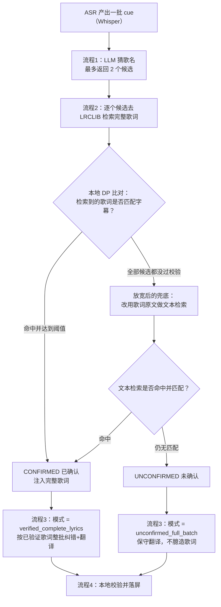

# 三视频真机验证汇总报告（兜底门控放宽 + 候选数 1→2）

运行时间：2026-08-28 00:36 ~ 00:45，端点 `https://api.deepseek.com/chat/completions`，模型 `deepseek-v4-pro`，`temperature=0`。
设备：真机 `fcf4b0cb`，安装的是"带诊断日志的修复版" APK（Android 安装包）。
素材来源：`D:\DevEnv\Projects\sorce` 下三个视频，逐个导入、逐个跑完「识别 + 增强」全流程。

本报告只聚焦**增强阶段**（即 ASR 之后、由云端 LLM 与本地校验协作产出最终双语字幕的链路）。

## 名词速查（英文缩写首次出现均附中文解释）

| 缩写 | 中文解释 |
|---|---|
| ASR | Automatic Speech Recognition，自动语音识别，本应用里由 Whisper 模型把视频里的人声转成一条条带时间轴的字幕 |
| cue | 一条字幕单元，包含时间轴、英文原文、中文译文和置信度 |
| LLM | Large Language Model，大语言模型，这里指 DeepSeek |
| DP | Dynamic Programming，动态规划，本项目用它做"歌词与字幕的本地序列比对"，判断检索到的歌词是否真的匹配 |
| LRCLIB | 一个在线歌词检索服务（LRC 是带时间轴的歌词格式），提供候选歌词文本 |
| 流程 1 | 让 LLM 只凭整批字幕去"猜这是哪首歌"，产出歌名+歌手候选 |
| 流程 2 | 用流程 1 猜到的身份去 LRCLIB 检索完整歌词，再用本地 DP 逐条比对确认 |
| 流程 3 | 拿着"已验证歌词"或"未验证字幕"去调用 LLM，批量产出纠错英文 + 中文 |

## 增强阶段整体流程（图示）

要点：本次修复放宽了"兜底门控"——过去只有在"完全没检索到歌词"时才会触发文本兜底检索；现在即使"猜到了身份、也检索到了歌词，但没有一条通过 DP 校验"，也会继续用歌词原文做一轮文本检索。候选数也从 1 个放宽到最多 2 个。

---

## 视频 1　`5e4c3cd7073a9e9b03df1fbf8af6d928.mp4`（时长约 31.6 s）

### 流程 1 歌曲识别

- 候选数 **2**（新提示词生效）：
  1. `Creepin' | Metro Boomin, The Weeknd, 21 Savage`
  2. `Creepin' | The Weeknd`

### 流程 2 检索 + 本地 DP 校验

- `flow2_identity_search index=0 identity='Creepin' | Metro Boomin...' hits=20`（检索到 20 条歌词）
- 但校验过程中歌词服务标记为不可用（`searchUnavailable=true`），按设计中止兜底。
- 结果：`flow2_result UNCONFIRMED foundLyrics=true searchUnavailable=true`

### 流程 3

- `flow3_mode unconfirmed_full_batch`（未确认 → 保守翻译）。
- 状态栏文案（新格式生效）：`DeepSeek enhanced 9 captions; no verified lyrics match, translated conservatively.`

### 最终字幕（9 条）

| 序号 | 时间轴 | 置信度 | 英文 | 中文 |
|---|---|---|---|---|
| 1 | 0.0–2.8 s | 92% | I have to live without you | 我不得不没有你而活 |
| 2 | 2.8–7.0 s | 88% | Nobody could, I need to be around you | 没有人能，我需要在你身边 |
| 3 | 7.0–10.6 s | 93% | Watching you, no one else can love you | 看着你，没有人能像我这样爱你 |
| 4 | 10.6–12.6 s | — | Like I do | 像我这样 |
| 5 | 12.6–17.0 s | 63% | Healing and I'm creeping up on you | 治愈中，我正悄悄靠近你 |
| 6 | 17.0–20.0 s | 94% | I know that it won't be right | 我知道那不对 |
| 7 | 20.0–25.0 s | 78% | If I stay all night to be among you | 如果我整夜留下，只为在你身边 |
| 8 | 25.0–29.0 s | 68% | Creeping my own you | 悄悄靠近属于我的你 |
| 9 | 30.0–31.4 s | 77% | (upbeat music) | （欢快的音乐） |

---

## 视频 2　`6101d9b51a973fcc6bc8432d87851280.mp4`（时长约 36.3 s）

### 流程 1 歌曲识别

- 候选数 **1**（模型只给出一个最可能项）：`Already Gone | Kelly Clarkson`

### 流程 2 检索 + 本地 DP 校验

- `flow2_identity_search index=0 identity='Already Gone | Kelly Clarkson' hits=20`
- **触发了本次修复新增的文本兜底检索**：`flow2_text_fallback_search hits=0`。这是旧门控下会被挡住、新门控放行的关键一步——证明修复真实生效。
- 结果：`flow2_result UNCONFIRMED foundLyrics=true searchUnavailable=false`

### 流程 3

- `flow3_mode unconfirmed_full_batch`（未确认 → 保守翻译）。
- 状态栏文案：`DeepSeek enhanced 4 captions; no verified lyrics match, translated conservatively.`

### 最终字幕（4 条）

| 序号 | 时间轴 | 置信度 | 英文 | 中文 |
|---|---|---|---|---|
| 1 | 0.0–8.0 s | 63% | It was like we're all who stands apart | 仿佛我们生来就注定分离 |
| 2 | 9.0–13.0 s | 91% | There's so much space between us | 我们之间隔着遥远的距离 |
| 3 | 13.0–17.0 s | 68% | Baby, we're already behind | 亲爱的，我们早已落后于时光 |
| 4 | 17.0–35.84 s | 81% | And you have given me something that I can't live without. | 而你给了我无法割舍的一切 |

---

## 视频 3　`f1764157e6fccc410443c5cbefaecfac.mp4`（时长约 33.2 s）

### 流程 1 歌曲识别

- 候选数 **2**（新提示词生效）：
  1. `Eyes On Me | Céline Dion`
  2. `Eyes On Me | Faye Wong`（王菲）

> 说明：本视频实际演唱内容是《Eyes On Me》（王菲演唱的《最终幻想 8》主题曲），其真实歌词正含 "Take your eyes off of me so I can leave / I'm far too ashamed to do it with you watching me / This is never ending, we have been here before"。模型候选里已包含正确歌曲，但两个歌手归属都列了出来。

### 流程 2 检索 + 本地 DP 校验

- `flow2_identity_search index=0 identity='Eyes On Me | Céline Dion' hits=20`
- `flow2_identity_search index=1 identity='Eyes On Me | Faye Wong' hits=20`
- 文本兜底检索：`flow2_text_fallback_search hits=0`
- 结果：`flow2_result UNCONFIRMED identity='Eyes On Me | Céline Dion' foundLyrics=true searchUnavailable=false`

### 流程 3

- `flow3_mode unconfirmed_full_batch`（未确认 → 保守翻译）。
- 状态栏文案：`DeepSeek enhanced 5 captions; no verified lyrics match, translated conservatively.`

### 最终字幕（5 条）

| 序号 | 时间轴 | 置信度 | 英文 | 中文 |
|---|---|---|---|---|
| 1 | 0.0–6.24 s | 52% | [Music] | [音乐] |
| 2 | 6.24–14.24 s | 76% | Take your eyes off of me so I can leave | 把你的目光从我身上移开，这样我才能离开 |
| 3 | 14.24–23.16 s | 84% | I'm far too ashamed to do it with you watching me | 我太羞愧了，无法在你注视下这样做 |
| 4 | 23.16–32.16 s | 80% | This is never ending, we have been here before | 这永无止境，我们曾经历过 |
| 5 | 32.16–33.16 s | 58% | But I | 但我 |

---

## 三视频汇总

| 视频 | 时长 | cue 数 | 流程1候选 | 流程2结论 | 流程3模式 | 状态文案 |
|---|---|---|---|---|---|---|
| 5e4c…（视频1） | ~31.6 s | 9 | 2（Creepin'） | UNCONFIRMED（服务不可用中止兜底） | unconfirmed_full_batch | no verified lyrics match |
| 6101…（视频2） | ~36.3 s | 4 | 1（Already Gone） | UNCONFIRMED（新兜底触发，hits=0） | unconfirmed_full_batch | no verified lyrics match |
| f176…（视频3） | ~33.2 s | 5 | 2（Eyes On Me） | UNCONFIRMED（新兜底触发，hits=0） | unconfirmed_full_batch | no verified lyrics match |

### 关键观察

- **候选数 1→2 生效**：视频1、视频3 都返回了 2 个候选；视频3 的第二候选正是正确歌曲《Eyes On Me | Faye Wong》。
- **放宽后的兜底门控真实触发**：视频2、视频3 都执行了 `flow2_text_fallback_search`，这是旧门控会挡住的步骤。
- **三段最终都走保守翻译**：因为检索到的歌词虽多（各 20 条），但没有一条通过本地 DP 校验（或文本兜底无命中），系统正确地没有把未验证歌词当成"已确认"注入，避免了错误确认。
- **未确认不再伪装成确认**：状态文案统一为"no verified lyrics match, translated conservatively"，与真实链路一致。

## 证据文件

- 视频2 完整日志：`test-artifacts/ai-enhancement/evidence-v2-logcat.txt`
- 视频3 完整日志：`test-artifacts/ai-enhancement/evidence-v3-logcat.txt`
- 各视频编辑器字幕快照：`tools/v1-editor-seq.txt`、`tools/v2-editor-seq.txt`、`tools/v3-editor-seq.txt`

> 注：当前装机版本为"带诊断日志的修复版"，仅用于取证；验证通过后会移除临时诊断日志并重新编译安装干净版。
